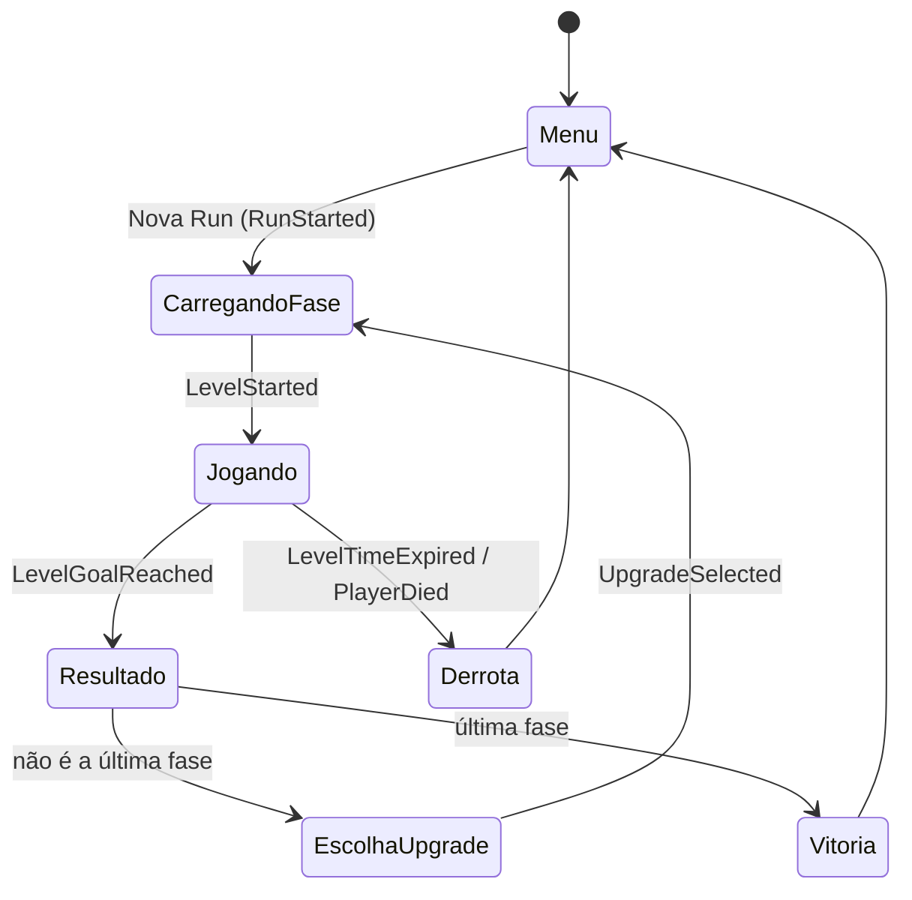
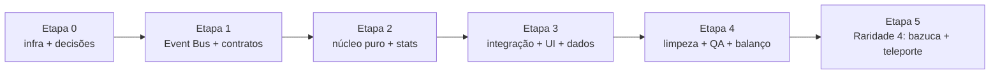

# Plano de refactor — Roguelike + arquitetura event-driven

Projeto: `Projetos Grupo 5` (Unity 6000.1.7f1) · Plano escrito em 28/09/2026 · Base: branch `refactor/roguelike`, criada a partir de `main` @ `8df28c9` (bugfixes do [RELATORIO_BUGS.md](RELATORIO_BUGS.md) já commitados).

---

## 1. De onde para onde

| | Design antigo (inacabado) | Design novo |
|---|---|---|
| Loop | Fase → loja (moedas) → fase | Fase → escolher 1 de 3 upgrades → fase |
| Progressão | Moedas persistentes, compras permanentes | Run roguelike; tudo zera ao fim da run |
| Falha | Timer regressivo por fase | Fase precisa ser concluída abaixo de **x** segundos |
| Recompensa | Preço fixo na loja | 4 raridades; a chance de cada uma depende do desempenho na fase anterior |
| Kit inicial | Pulo duplo, wall jump e gancho liberados | Sem pulo duplo, sem gancho, sem wall grab, sem power-ups |
| Uma run | — | A sequência de fases que existe hoje (hoje: `PrimeiraFase`, `QuartaFase 1`, `QuintaFase`) |

### Fluxo da run



---

## 2. Decisões que precisam ser tomadas antes da Etapa 1

Cada uma tem um padrão recomendado; se o time não decidir, o plano segue com ele.

| # | Decisão | Recomendação |
|---|---------|--------------|
| **D1** | Toda fase tem que ser completável só com o kit base? Se a Quinta exigir o gancho e ele não aparecer nas ofertas, a run fica impossível. | **Sim**: toda fase completável com o kit base; habilidades só deixam mais rápido. Alternativa: garantir uma habilidade de mobilidade nas 2 primeiras ofertas. |
| **D2** | O que fazer com as moedas | **Remover no MVP.** Mais tarde podem virar bônus de tempo (ex.: −0,5 s por moeda). |
| **D3** | Estourar o tempo ou morrer para um inimigo | **Fim da run** (roguelike clássico). Uma "vida extra" pode existir como upgrade Lendário. |
| **D4** | Quais fases e em que ordem | As 3 do build, em ordem fixa. Incluir `SegundaFase`/`TerceiraFase`/`SextaFase` vira só adicionar um asset `LevelDefinition` depois. |
| **D5** | Upgrades acumulam (stack)? | Sim, com `maxStacks` por upgrade. |
| **D6** | Valores de x (limite) e do tempo-alvo por fase | Placeholders: limite = timer atual (20 s / 30 s / 25 s), alvo = 60 % do limite. Ajustar em playtest (Etapa 4). |
| **D7** | Reroll / pular oferta | Fora do MVP. A arquitetura deixa espaço para isso. |

**Decisões abertas pela tabela de raridades do João (28/09/2026, ver §3.5):**

| # | Decisão | Recomendação |
|---|---------|--------------|
| **D8** | Onde fica o **gancho**, que já está implementado e não aparece na tabela nova? | ✅ **Decidido pelo João (28/09): Raridade 3**, junto de Pulo Duplo e Wall Jump. É uma mecânica de travessia, já funciona e completa 3 candidatos no tier. |
| **D9** | Quando entram as mecânicas da Raridade 4 (bazuca, teleporte), que exigem código novo e mudanças nas fases? | **Numa Etapa 5 nova**, depois de a run completa estar jogável (Etapas 3 e 4). Até lá a Raridade 4 existe na tabela sem candidatos, e o sorteio cai para a Raridade 3, que é a mais próxima abaixo (ADR-07). |
| **D10** | Cada raridade tem 2 upgrades, mas a rodada oferece 3 sem repetição. | **Aceitar no MVP.** O fallback preenche o 3º slot com o tier vizinho. Se o playtest achar as ofertas repetitivas, dá para completar só com dados: Raridade 1 "Aumento leve na aceleração", Raridade 2 "+5 s no limite das fases" (o antigo Relógio de Bolso, ADR-12), Raridade 3 o Gancho (D8). |

---

## 3. Arquitetura alvo

### 3.1 Princípios
1. **Eventos para fatos, chamadas diretas para comandos.** Se algo *aconteceu* (fase concluída, jogador morreu), vai pelo Event Bus. Se um sistema *manda* outro fazer algo dentro do mesmo domínio (o RunManager pede ao SceneLoader para carregar uma cena), é chamada direta.
2. **Lógica pura em C# comum; MonoBehaviour só como adaptador.** RunFlow, sorteio de raridade, geração de ofertas e cálculo de stats não dependem de cena, então são testáveis em EditMode e fáceis de delegar a modelos mais baratos.
3. **Dados em ScriptableObject.** Upgrades, raridades, fases e a configuração da run são assets. Criar um upgrade novo não exige código.
4. **Nenhum `FindObjectOfType` para descobrir dependências.** Quem precisa do jogador ouve `PlayerSpawned`.

### 3.2 Onde fica o código novo

```
Assets/_Roguelike/
  Core/                      ← asmdef Roguelike.Core (auto-referenciado pelo Assembly-CSharp)
    EventBus/                  IEvent, EventBus<T>, EventBusRegistry
    Events/                    GameEvents.cs (todos os structs de evento)
    Run/                       RunFlow (máquina de estados), RunState, PerformanceEvaluator
    Upgrades/                  UpgradeDefinition, RarityDefinition, RarityTable,
                               UpgradeOfferGenerator, StatModifier, StatType, AbilityFlags
    Stats/                     PlayerStats (base + modificadores)
    Levels/                    LevelDefinition, RunConfig
  Tests/EditMode/            ← asmdef Roguelike.Tests.EditMode
  Editor/                    ← asmdef Roguelike.Editor (só Editor): TestRunnerBridge e ferramentas
  Data/                      ← assets .asset (Upgrades/, Rarities/, Levels/, RunConfig)
  Prefabs/                   ← RunSystems (DDOL), RunUI
Assets/scripts/              ← MonoBehaviours legados e adaptadores novos continuam no Assembly-CSharp
```

> **Por que só um asmdef:** os MonoBehaviours legados (`characterMovement`, `GrapplingHook`…) estão no Assembly-CSharp, e um asmdef não pode referenciar o Assembly-CSharp. Pôr só a lógica pura em `Roguelike.Core` permite testes EditMode sem mover scripts antigos (mover arrisca os GUIDs dos `.meta` e quebrar referências em cenas).

### 3.3 Event Bus

```csharp
public interface IEvent { }

public static class EventBus<T> where T : struct, IEvent
{
    public static void Subscribe(Action<T> handler);
    public static void Unsubscribe(Action<T> handler);
    public static void Raise(in T evt);   // itera sobre uma cópia; desinscrever durante o Raise é seguro
    internal static void Clear();
}
// EventBusRegistry: [RuntimeInitializeOnLoadMethod(SubsystemRegistration)] limpa todos os barramentos
// (seguro mesmo com "Enter Play Mode Options" ativado). Log opcional "[EventBus] - Raise X" atrás de flag.
```

Regras: assinar em `OnEnable`, desassinar em `OnDisable`. Eventos são `readonly struct`, com nome no passado.

### 3.4 Catálogo de eventos (MVP)

Tipos exatos dos payloads e invariantes: `ARQUITETURA.md` §4 (tarefa 1.1).

| Evento | Payload | Emissor | Ouvintes |
|---|---|---|---|
| `RunStarted` | seed, RunConfig | RunManager | RunUI (o PlayerStats é recriado com o RunState) |
| `LevelStarted` | índice, LevelDefinition, limite efetivo | RunManager | LevelTimer, HUD |
| `PlayerSpawned` | GameObject | Spawner | CameraFollow, LevelTimer, Minimap, RunManager |
| `LevelTimeChanged` | segundos (granularidade de 0,1 s), limite efetivo | LevelTimer | HUD, RunManager (tempo oficial da fase) |
| `LevelTimeExpired` | — | LevelTimer | RunManager, characterMovement (trava, **sem** emitir `PlayerDied`) |
| `PlayerDied` | causa (`DeathCause`) | characterMovement | RunManager, LevelTimer (para) |
| `LevelGoalReached` | — | EndGoal | LevelTimer (para), RunManager |
| `LevelCompleted` | `LevelResult`: índice, tempo, limite, alvo, desempenho 0–1, nota | RunManager | LevelResultView, telemetria |
| `UpgradeOffersGenerated` | índice da fase, 3× (UpgradeDefinition, raridade sorteada) | RunManager | UpgradeSelectionView |
| `UpgradeSelected` | UpgradeDefinition | UpgradeSelectionView | RunManager |
| `PlayerStatsChanged` | snapshot dos stats | RunManager (em nome do PlayerStats) | characterMovement (repassa ao GrapplingHook), HUD |
| `RunEnded` | vitória/derrota, RunSummary | RunManager | RunEndView, telemetria |
| `NewRunRequested` | — | MainMenu ("Nova Run") | RunManager |
| `LevelResultDismissed` | — | LevelResultView | RunManager |
| `RunEndDismissed` | — | RunEndView | RunManager |

Os três últimos (decisões do jogador na UI) e as colunas extras de payload vieram da tarefa 1.1 (ADR-14 e ADR-24 do `ARQUITETURA.md`). Eles fecham as transições do diagrama da §1 sem que as views referenciem o RunManager.

### 3.5 Upgrades, raridade e desempenho

**Desempenho** na fase: `p = clamp01((limite − tempo) / (limite − alvo))`. Terminar no tempo-alvo ou abaixo dá `p = 1`; terminar no limite dá `p = 0`. Nota para a UI: S ≥ 0,9 · A ≥ 0,66 · B ≥ 0,33 · C.

**Raridade**: `RarityTable` guarda uma `AnimationCurve` de peso por raridade em função de `p`, e os pesos são normalizados. Valores iniciais:

| Raridade | Peso com p = 0 (lento) | Peso com p = 1 (perfeito) |
|---|---|---|
| Comum | 70 | 25 |
| Raro | 25 | 40 |
| Épico | 5 | 25 |
| Lendário | 0 | 10 |

**Geração de ofertas** (`UpgradeOfferGenerator`, determinística):
1. `rng = new System.Random(hash(seedDaRun, índiceDaFase))`
2. Para cada um dos 3 slots: sorteia a raridade pelos pesos de `p` e escolhe um upgrade dessa raridade que seja **elegível** (stacks < `maxStacks`, pré-requisitos adquiridos, ainda não oferecido nesta rodada).
3. Se não houver candidato, tenta a raridade abaixo, depois a acima. Se ainda assim não houver, o slot fica vazio.

**Upgrade como dado**: `UpgradeDefinition` = id, nome, descrição, ícone, raridade, `maxStacks`, `prerequisites[]`, `List<StatModifier>` (StatType, Add/Multiply, valor) e `AbilityFlags unlocks`. O ponto de extensão para efeitos especiais no futuro é uma lista opcional de `UpgradeEffect` (ScriptableObject abstrato).

**`StatType`** (mapeia para os campos que já existem): `MaxSpeed`, `Acceleration`, `AirAcceleration`, `JumpHeight`, `CoyoteTime`, `WallSlideSpeed`, `MaxAirJumps`, `GrappleRadius`, `GrappleCooldown`, `GrappleLaunchForce`, `TimeLimitBonus`.
**`AbilityFlags`**: `WallGrab`, `GrapplingHook`. O pulo duplo é `MaxAirJumps` ≥ 1; no kit base `MaxAirJumps = 0`. Planejadas para a Etapa 5: `Bazooka` e `Teleport`, como bits novos no fim do enum (ADR-23).

**Conteúdo** (design do João, 28/09/2026). Cada raridade tem um tipo de habilidade:

| Raridade | Tipo | Upgrade | Efeito (valor placeholder) | Stack | Implementação |
|---|---|---|---|---|---|
| 1 · Comum | Aumento leve | Aumento leve no pulo | +8 % altura do pulo | 3 | `StatModifier` Multiply em `JumpHeight`: **já funciona** |
| 1 · Comum | Aumento leve | Aumento leve na velocidade | +8 % velocidade máxima | 3 | `StatModifier` Multiply em `MaxSpeed`: **já funciona** |
| 2 · Raro | Aumento grande | Aumento grande no pulo | +20 % altura do pulo | 2 | `StatModifier` Multiply em `JumpHeight`: **já funciona** |
| 2 · Raro | Aumento grande | Aumento grande na velocidade | +20 % velocidade máxima | 2 | `StatModifier` Multiply em `MaxSpeed`: **já funciona** |
| 3 · Épico | Mecânica simples de plataforma | Pulo Duplo Habilitado | +1 pulo aéreo | 1 | `MaxAirJumps` +1: **já funciona** |
| 3 · Épico | Mecânica simples de plataforma | Wall Jump Habilitado | deslizar e pular na parede | 1 | flag `WallGrab` (ADR-19): **já funciona** |
| 3 · Épico | Mecânica simples de plataforma | Gancho Habilitado *(D8)* | desbloqueia o gancho | 1 | flag `GrapplingHook`: **já funciona** |
| 4 · Lendário | Mecânica complexa | Bazuca | tiro que destrói blocos marcados do cenário para abrir atalhos | 1 | **código novo** (Etapa 5) |
| 4 · Lendário | Mecânica complexa | Teletransporte | deslocamento curto e instantâneo na direção do input | 1 | **código novo** (Etapa 5) |

- **Raridades 1 a 3** usam só o que as Etapas 1 e 2 já entregaram (`StatModifier`, `MaxAirJumps`, `AbilityFlags`). Criar esses upgrades é criar assets na tarefa 3.3, sem código novo.
- **Stacks se multiplicam.** Com o máximo de leve (1,08³) e de grande (1,2²), o pulo chega a ~1,8× (2,6 → ~4,7). Isso pode pular trechos inteiros das fases, então os valores são placeholders para a Etapa 4.
- **Saíram da tabela antiga**, podendo voltar só como dados, sem código: Arranque, Controle Aéreo, Coyote Estendido, Deslize Lento, Pulo Triplo, os upgrades do gancho (rápido, alcance, impulso) e o Relógio de Bolso (ver D10).
- **Bazuca e D1:** toda fase continua completável sem ela. Os atalhos são opcionais e só aparecem onde o level design colocar blocos destrutíveis.

### 3.6 O que sai
`ShopManager`, `ButtonInfo`, `Item shop.prefab`, a economia de moedas (conforme D2), `PlayerData` (a run vive em memória; persistem só volume, VSync e, opcionalmente, recordes), `SaveManager`/`SaveData`/`PlayerSaveController`, `MovementDiagnostic`, `playerData.prefab`, `SceneController` (substituído pelo `RunManager`), o `Timer` regressivo (substituído pelo `LevelTimer`) e o botão "Continuar".

---

## 4. Modelos, esforço e custo-benefício

### 4.1 Preços (API, por milhão de tokens)

| Modelo | Entrada | Saída | Contexto | Controle de esforço |
|---|---|---|---|---|
| Fable 5.1 | $10 | $50 | 1M | low → max |
| **Opus 5.5** | **$4** | **$20** | 1M | low → max (**padrão `medium`**) |
| Sonnet 5 | $2 | $10 | 1M | low → max |
| Haiku 4.5 | $1 | $5 | 200K | não tem |

No plano de assinatura não há cobrança por token, mas a janela de 5 h e o limite semanal são consumidos mais rápido pelos modelos mais caros. A proporção de preço é uma boa aproximação do quanto cada modelo "pesa".

### 4.2 Por que o Opus 5.5 muda a conta
- Custa **só 2× o Sonnet 5** e 4× o Haiku, e é 20 % mais barato que o Opus 5. Com essa diferença, compensa usar Opus sempre que houver chance real de o Sonnet precisar de retrabalho: uma rodada extra de correção mais a verificação do orquestrador já custam mais que a diferença de preço. O que importa é o **custo por tarefa concluída**, não por requisição.
- Na sessão de ontem, o agente Opus fez a tarefa mais arriscada (cenas + prefabs + singleton; 57 chamadas de ferramenta, 165k tokens) sem retrabalho e ainda encontrou 5 problemas extras. O Sonnet (95k) entregou bem uma tarefa bem especificada. O Haiku (71k) fez o trabalho certo, mas o relatório veio vago e eu tive que conferir tudo de novo, o que comeu parte da economia.
- O esforço padrão do Opus 5.5 é `medium` (um nível abaixo do Opus 5). Para trabalho agêntico de código com risco, use `high`; `xhigh` só para os contratos da arquitetura; `max` nunca neste projeto.
- **Fable 5.1** custa 2,5× o Opus 5.5. Neste escopo (um refactor Unity bem delimitado), o ganho não paga no plano Pro. **Não usar.**

### 4.3 Elenco de agentes
Na ferramenta de delegação só dá para escolher o modelo; **o esforço vem da definição do agente** em `.claude/agents/*.md`. Por isso a Etapa 0 cria estas definições:

| Agente | Modelo · esforço | Quando usar |
|---|---|---|
| `arquiteto` | Opus 5.5 · **xhigh** | Contratos, ADRs e decisões que atravessam o projeto. 1 a 2 vezes no projeto todo. |
| `dev-core` | Opus 5.5 · **high** | Refactors com risco de regressão: movimento, fluxo da run, adaptadores. |
| `integrador-unity` | Opus 5.5 · **medium** | Cenas, prefabs e assets via Unity MCP. Erro ali é caro de achar; `medium` basta porque a tarefa vem especificada. |
| `revisor` | Opus 5.5 · **high** | `/code-review` ao fim de cada etapa. |
| `dev` | Sonnet 5 · **high** | Implementar a partir de contrato + testes (algoritmos, views, EventBus). |
| `mecanico` | Haiku 4.5 · — | Tarefas mecânicas **com verificação automática** (teste, compilação ou script): criar assets a partir de tabela, apagar código morto após checar referências, docs. |
| *Orquestrador* (sessão principal) | Opus 5.5 · **medium** | Lê o plano, dispara os agentes, verifica compilação e testes, atualiza o progresso. |

Exemplo de definição (o campo `effort` foi validado na tarefa 0.3; as definições reais usam IDs completos, como `claude-opus-5-5`, para fixar a versão do modelo):

```markdown
---
name: dev-core
description: Refactors de gameplay com risco de regressão no projeto Unity (movimento, fluxo da run).
model: opus
effort: high
---
Você trabalha num projeto Unity 6 com Event Bus (ver PLANO_REFACTOR_ROGUELIKE.md §3). ...
```

### 4.4 Regras de delegação (valem para toda tarefa)
- **Posse de arquivos:** cada agente recebe a lista exata de arquivos que pode editar. Agentes em paralelo nunca compartilham arquivos.
- **Trava do Editor:** só **um** agente por vez usa o Unity MCP para cenas, prefabs e assets (existe um único Editor aberto). Agentes que só editam `.cs` podem rodar em paralelo.
- **Sem worktrees:** o Editor está preso à pasta principal, então um worktree não compila nem testa.
- **Todo prompt de delegação traz:** contrato/interfaces, arquivos que o agente possui, arquivos proibidos, se usa o Editor, definição de pronto, como verificar, e o formato de relatório (arquivos alterados + saída da verificação + pendências). Isso evita relatórios vagos como o do Haiku ontem.
- **Commits são feitos só por você (João), nunca por um agente.** Isso vale para o orquestrador e para os subagentes: ninguém roda `git commit`, `git push` ou comandos que reescrevam histórico. Ao fim da etapa, o orquestrador entrega o título e a descrição do commit, e você faz o commit.
- **Não é preciso fatiar em commits pequenos.** Um commit por etapa (ou por ponto de corte ✂️) é suficiente, com uma descrição que liste o que mudou.

---

## 5. Etapas (cada uma cabe numa janela de 5 h)

**Orçamento:** medição agora, plano **Pro**: janela de 5 h em 28 %, **semanal em 74 %** (renova em ~1 h). No Pro, o limite semanal aperta antes da janela. Por isso:
- **no máximo 1 etapa por dia**;
- confira a barra de uso do app antes de começar e no meio da etapa. Se passar de **80 %** da janela, pare no ponto de corte ✂️ da etapa e deixe o resto para a próxima;
- **comece cada etapa numa sessão nova.** Esta sessão já tem 234k tokens de contexto, reenviados a cada turno. O plano e o checklist deste arquivo são a memória entre sessões.

Os tokens estimados são somente dos subagentes, com base na calibração de ontem. A Etapa 0 serve para confirmar quanto de uma janela Pro isso representa.

### Etapa 0 — Preparação e infraestrutura (~150k)
| ✓ | # | Tarefa | Agente | Paralelo | Editor | Pronto quando |
|---|---|---|---|---|---|---|
| ☑ | 0.1 | Commitar os bugfixes atuais numa branch `refactor/roguelike` (separar o commit do pacote AI Assistant). Formato `[Tipo] - Título`. | Orquestrador | — | não | `git log` limpo, working tree limpa |
| ☑ | 0.2 | `QuartaFase.unity` tem 34 marcadores de conflito: checar se o GUID é referenciado; se não for, remover; se for, restaurar do git. | `mecanico` | sim | não | Nenhum `<<<<<<<` no repo |
| ☑ | 0.3 | Criar as 6 definições de agente em `.claude/agents/` e confirmar que aparecem com o modelo e o esforço certos. | `mecanico` | sim | não | Agentes listados |
| ☑ | 0.4 | asmdefs `Roguelike.Core` + `Roguelike.Tests.EditMode`; utilitário `TestRunnerBridge` (Editor) que roda os testes EditMode via `TestRunnerApi` e grava `Temp/TestResults.json`; um teste simples passando via MCP. | `dev` | sim | sim | Resultado lido via MCP |
| ☑ | 0.5 | Configurar o Smart Merge do Unity (UnityYAMLMerge) para `.unity`/`.prefab`, para evitar outro `QuartaFase` no trabalho em grupo. | `mecanico` | sim | não | `.gitattributes` + instrução no README |
| ☐ | 0.6 | Registrar as decisões D1–D7 (seção 2). | **Humanos (time)** | — | — | Seção 2 atualizada |

**Notas da execução (28/09/2026):**
- **0.1:** os bugfixes já tinham sido commitados e enviados em `main` (`8df28c9`), junto com o pacote AI Assistant e fora do formato `[Tipo] - Título`. Separar o pacote exigiria reescrever o histórico já publicado, por isso ficou como está. A branch `refactor/roguelike` foi criada a partir de `8df28c9`.
- **0.2:** o GUID `9a0a9620…` tinha zero referências, a cena não estava no build nem era carregada pelo nome. Foi substituída por `QuartaFase 1` (commit `2350525`, "git conflict fix") e removida.
- **0.3:** o campo `effort` foi validado na documentação. Como `.claude/agents/` é uma pasta nova, os agentes só aparecem numa sessão nova. Confirmado na abertura da Etapa 1: os 6 agentes aparecem na lista de tipos de agente.
- **0.4:** foi feita pelo orquestrador, porque as definições de agente ainda não carregam nesta sessão. Foi preciso um terceiro asmdef, `Roguelike.Editor` (só Editor), para o bridge. O caminho de falha foi provado com um teste que falha de propósito (nome, mensagem e stack trace aparecem no JSON), e esse teste foi apagado depois. Estado final: 1/1 verde.
- **0.5:** `.gitattributes` cobre `.unity`, `.prefab` e `.asset`. O driver usa `--fallback none`, porque sem ele um conflito real trava o `git merge` tentando abrir uma ferramenta gráfica. Testado num repositório descartável: dois objetos adicionados no fim da mesma cena são combinados sem conflito; o mesmo campo alterado nos dois lados gera conflito (`UU`) com YAML válido. O driver também foi registrado no `.git/config` deste clone.

### Etapa 1 — Event Bus e contratos (~450k)
| ✓ | # | Tarefa | Agente | Depende | Editor | Pronto quando |
|---|---|---|---|---|---|---|
| ◐ | 1.1 | `ARQUITETURA.md` + esqueletos **compiláveis** de todos os contratos da §3: IEvent, GameEvents, StatType/StatModifier/AbilityFlags, PlayerStats, UpgradeDefinition, RarityDefinition/RarityTable, LevelDefinition, RunConfig, interfaces de RunFlow e OfferGenerator. | `arquiteto` | 0.4 | compilar | Compila; contratos revisados por você |
| ☑ | 1.2 | `EventBus<T>` + `EventBusRegistry` + testes (inscrever/desinscrever durante `Raise`, limpeza, ordem). | `dev` | 1.1 | testes | Testes verdes |
| ✂️ | | *Ponto de corte* | | | | |
| ☑ | 1.3 | Migração gradual para eventos com **o jogo continuando jogável**: EndGoal → `LevelGoalReached`; `characterMovement.Die`/EnemyBullet → `PlayerDied`; Timer → `LevelTimeExpired`; `SceneController.OnPlayerSpawned` → `PlayerSpawned` (CameraFollow e Minimap passam a ouvir; o Timer deixou de precisar do jogador). Remover os `FindFirstObjectByType` que viraram desnecessários. | `dev` | 1.2 | compilar | Fluxo antigo funciona; nenhum acoplamento direto entre esses sistemas |
| ◐ | 1.4 | Revisão da etapa + 10 min de playtest humano. | `revisor` + humano | 1.3 | — | Sem achados críticos |

**Notas da execução (28/09/2026):**
- **1.1 (◐):** compila, sem warnings novos. `ARQUITETURA.md` tem 24 ADRs, e 51 tipos foram criados em `Roguelike.Core`. Custou 254k tokens (Opus xhigh), cerca de 22 % da janela Pro. **Falta a revisão do João**, com prioridade para 4 ADRs:
  - **ADR-12:** o desempenho usa o limite base, então o Relógio de Bolso só adia a derrota.
  - **ADR-18:** o `PlayerBaseStats` usa os valores efetivos 10,5 / 41 / 2,6, e não os do prefab (10 / 40 / 2,5).
  - **ADR-19:** sem o WallGrab, o jogador também não desliza na parede.
  - **ADR-14:** 3 eventos novos de decisão do jogador, já refletidos na §3.4.
- **1.2:** 16 testes novos, 17/17 verdes. O teste de exceção em handler usava `LogAssert` e deixava 2 erros no Console a cada execução, o que quebrava a receita da §6.1. O orquestrador trocou por um `ILogHandler` de captura. A §6.1 agora também explica como limpar o Console via MCP.
- **1.3:** 7 scripts migrados, 17/17 verdes, Console 0/0. Um smoke test em Play Mode via MCP (sem salvar cenas) passou por MainMenu → PrimeiraFase → câmera no jogador → `LevelGoalReached` → QuartaFase 1 → `Die(EnemyProjectile)` → `GameOverBackground` ativo, com o segundo `Die` ignorado. Custou 168k tokens (Sonnet).
  - **Dono da tela de game over:** o `Timer`, que ouve `PlayerDied` e cuida do próprio tempo esgotado. O `delayToLoadNextLevel` saiu do EndGoal e virou `SceneController.nextLevelDelay`, com o mesmo valor de 0,5 s.
  - **Mudanças de comportamento:**
    - o timer para ao tocar o objetivo, e não 0,5 s depois;
    - o timer também para quando o jogador morre por bala (antes continuava contando).
  - **Bug antigo preservado:** com contagem regressiva, o `totalTimePlayed` soma o tempo *restante*. Isso some com o `LevelTimer` na 3.1.
  - **Ficou para depois:** o `FindFirstObjectByType<PlayerData>` do `characterMovement` sai na 2.4.
  - **Campos órfãos no YAML:** `delayToLoadNextLevel` no `EndGoal.prefab` e `gameOverScreen` no `Cyborg.prefab`. São inofensivos e somem quando o prefab for salvo de novo.
- **✂️ Parada:** a janela de 5 h chegou a 85 % ao fim da 1.3, então a 1.4 (revisor Opus high + playtest) ficou para a próxima janela.
- **Dica para a Etapa 2 (do arquiteto):** rodar a 2.1 e a 2.2 em paralelo e a 2.3 depois, ou validar a 2.3 só no fim. Os testes da 2.3 que passam por `StartRun`/`CompleteLevel`/`SelectUpgrade` dependem do `PlayerStats` (2.1) e do `PerformanceEvaluator` (2.2). O ideal é usar um `IUpgradeOfferGenerator` falso.

### Etapa 2 — Núcleo roguelike (~400k)
2.1, 2.2 e 2.3 rodam **em paralelo** (arquivos disjuntos, lógica pura).

| ✓ | # | Tarefa | Agente | Depende | Editor | Pronto quando |
|---|---|---|---|---|---|---|
| ☑ | 2.1 | `PlayerStats` (base + modificadores Add/Multiply, flags) + `PlayerBaseStats` SO com **os valores atuais do Cyborg**. Testes de "valores de referência": `jumpSpeed` e gravidade calculados iguais aos de hoje. | `dev` | 1.1 | testes | Testes verdes |
| ☑ | 2.2 | `PerformanceEvaluator` + `RarityRoller` + `UpgradeOfferGenerator` (com seed) + testes: distribuição com seed fixa, elegibilidade, pré-requisitos, sem duplicatas, fallback de raridade. | `dev` | 1.1 | testes | Testes verdes |
| ☑ | 2.3 | `RunFlow` (máquina de estados pura da §1) + `RunState` + testes de todas as transições, inclusive derrota e última fase. | `dev-core` | 1.1 | testes | Testes verdes |
| ✂️ | | *Ponto de corte* | | | | |
| ☑ | 2.4 | `characterMovement` e `GrapplingHook` passam a ler `PlayerStats` e reagir a `PlayerStatsChanged`; kit base sem pulo duplo, gancho ou wall grab; `RefreshStats` e dependência de `PlayerData` removidos. | `dev-core` | 2.1 | compilar + play | Sensação do movimento base idêntica; habilidades ligam por stats |
| ☑ | 2.5 | Revisão da etapa. | `revisor` | 2.4 | — | Sem achados críticos |

**Notas da execução (28/09/2026):**
- **Ordem real:** 2.1 ∥ 2.2 → 2.3 → 2.4. A 2.3 ficou para depois porque o `RunState`/`RunFlow` chamam `PlayerStats` e `PerformanceEvaluator` em runtime. Para rodar em paralelo sem um agente sobrescrever o resultado do outro, cada um gravou os testes num JSON próprio (`TestRunnerBridge.Run("Temp/TestResults_2_x.json", null)`).
- **2.1:** 27 testes; todos os valores de referência bateram (10,5 / 41 / 2,6; `jumpSpeed` 7,027; `gravMultiplier` 3,872). Novo `JumpPhysics` (Core/Stats) com as fórmulas legadas do `characterMovement`, documentado no `ARQUITETURA.md` §6.1. Custou 109k tokens (Sonnet).
- **2.2:** 49 testes; também criou o `TestFactory` dos testes. O `CombineSeed` usa a mistura `hash*31 + x`, e o fallback percorre as raridades da `RarityTable`. Custou 139k tokens (Sonnet).
- **2.3:** 133 testes, incluindo todos os comandos × todas as fases e 2 testes de integração com o gerador real. A validação dos argumentos vem antes da fase. Exceção de comando é bug: a 3.1 não deve tratá-la como `false`. O teste do limite base fixa a ADR-12 (mudar a decisão muda esse teste). Custou 162k tokens (Opus high).
- **✂️ Ponto de corte:** 28 % da janela de 5 h, então a etapa seguiu para a 2.4. Total verde neste ponto: 226/226.
- **2.4:** custou 171k tokens (Opus high, com a trava do Editor). Criado `Assets/_Roguelike/Data/PlayerBaseStats.asset` (a 3.3 deve reaproveitá-lo no `RunConfig.BaseStats`) e ligado no `Cyborg.prefab`; ao salvar o prefab, os campos órfãos da 1.3 sumiram.
  - **Como os stats chegam:** o `characterMovement` é a única entrada de stats no jogador. Ele aplica o kit base no `Awake`, ouve `PlayerStatsChanged` e repassa ao `GrapplingHook.ApplyStats`.
  - **Smoke test em Play Mode:**
    - kit base: 10,5 / 41 / 2,6, `jumpSpeed` 7,02702665 (idêntico), sem pulo aéreo, sem gancho, sem deslize;
    - um `PlayerStatsChanged` com +1 pulo aéreo e `WallGrab | GrapplingHook` liga tudo, e o kit base de novo desliga.
  - **`gravMultiplier`:** 3,87196000 contra 3,87195945 do legado, diferença de 2 ulps; imperceptível.
  - **Mudanças de comportamento:**
    - a loja não altera mais o movimento (legado, sai na 4.1);
    - saves antigos com agility/strength > 1 são ignorados;
    - o gizmo do raio do gancho fica em 0 fora do Play Mode.
  - **Dicas para quem usar Play Mode via MCP:**
    - o Play Mode suja o atlas dinâmico do TMP (`ModernCosmo-q25Dr SDF.asset`); o agente restaurou com `git checkout`;
    - com o Editor fora de foco, o player loop não avança; `isPaused = true` + `EditorApplication.Step()` resolve.
  - **Risco para playtest antes da Etapa 3 (D1):** com o kit base, fases que exijam pulo duplo, gancho ou wall jump podem ficar impossíveis. Até a 3.1 só dá para ganhar habilidades emitindo `PlayerStatsChanged` à mão.
- **2.5:** o revisor (Opus high, 239k tokens) cobriu `git diff c006590`, ou seja, as Etapas 1 e 2, e com isso a parte de código da 1.4. Veredito: as duas etapas podem fechar com ressalvas; nada crítico ou importante. O orquestrador corrigiu os achados e ficou em 231/231, Console 0/0:
  - **M1:** o `RarityRoller` podia sortear uma raridade de peso 0 por arredondamento (chance ~1e-8 por sorteio). Agora compara `roll × total` com a soma acumulada em double e pula as entradas de peso 0. Ganhou 2 testes de borda.
  - **M3:** o teste de `GetInt` não exercitava o arredondamento, e os de fallback não distinguiam "tier mais próximo" de "menor tier". O primeiro foi corrigido e os outros ganharam 3 testes da ordem da ADR-07.
  - **M4:**
    - comentários desatualizados em `EndGoal`, `characterMovement`, `AbilityFlags` e `GameEvents`;
    - `?.` num `UnityEngine.Object` no `Timer`;
    - condição morta do wall slide;
    - `ARQUITETURA.md` §4.1 e §8 e a linha 1.3 alinhados com a implementação.
  - **Etapa 0:** o `TestRunnerBridge` agora grava `status: "error"` quando roda 0 testes, que é o sintoma de o assembly de testes não ter compilado.
- **Pendências para a Etapa 3:**
  - **M2:** `RunState.AcquireUpgrade` não é atômico. Se um `UpgradeEffect.OnAcquired` lançar, o stack fica aplicado e o flow continua em `UpgradeSelection`; um segundo clique aplicaria outro stack. A 3.1/3.2 deve travar a `UpgradeSelectionView` depois do primeiro `UpgradeSelected`, ou o `RunFlow` deve avançar antes dos efeitos.
  - Logs antigos fora do formato `[Área] - mensagem` em arquivos tocados: `EndGoal`, `SceneController`, `characterMovement`, `GrapplingHook`, `CameraFollow` e `Minimap`.
  - O fallback `CreateInstance<PlayerBaseStats>()` do `characterMovement` não é destruído. Só roda com o campo vazio, o que não é o caso do Cyborg.
- **Continua pendente:** o playtest humano da 1.4 e da 2.4 (sensação do movimento base e fases completáveis com o kit base), e as confirmações do João sobre as ADR-12, 18 e 19.

### Etapa 3 — Integração: run, timer, UI e conteúdo (~450k)
| ✓ | # | Tarefa | Agente | Depende | Editor | Pronto quando |
|---|---|---|---|---|---|---|
| ☑ | 3.1 | `RunManager` (DDOL, adaptador do `RunFlow`; substitui o `SceneController`) + `SceneLoader` + `LevelTimer` (conta para cima com limite, emite eventos, respeita `TimeLimitBonus`). | `dev-core` | 2.3 | compilar | Compila; eventos emitidos na ordem da §3.4 |
| ☑ | 3.2 | Views (código): HUD do timer, `LevelResultView` (tempo, nota), `UpgradeSelectionView` + `UpgradeCardView` (cor por raridade, teclado/gamepad via Input System, tempo não escalado com o jogo pausado), `RunEndView`. Só ouvem e emitem eventos. | `dev` | 1.1 | compilar | Compila; nenhuma referência direta ao RunManager |
| ☑ | 3.3 | Criar os assets via MCP a partir das tabelas da §3.5: 4 raridades, `RarityTable`, os upgrades das Raridades 1 a 3 (6 ou 7, conforme D8), 3 `LevelDefinition` e `RunConfig`, que usa o `PlayerBaseStats.asset` da 2.4. Também o teste `DataValidationTests`: ids únicos, pré-requisitos existem, e toda raridade tem candidatos, **exceto a Lendária até a Etapa 5** (D9). | `mecanico` | 1.1 | **sim** | Teste de validação verde |
| ✂️ | | *Ponto de corte* | | | | |
| ☑ | 3.4 | Montar prefabs e cenas via MCP: prefab `RunSystems` (RunManager, SceneLoader, canvas `RunUI` DDOL com as views); MainMenu com "Nova Run" e sem "Continuar"; fases com `LevelTimer` e referência à `LevelDefinition`, sem o Timer/GameOver antigos; EndGame → RunEnd. | `integrador-unity` | 3.1–3.3 | **sim (trava)** | Run completa jogável do menu à tela final |
| ☐ | 3.5 | Revisão da etapa + playtest humano de uma run completa. | `revisor` + humano | 3.4 | — | Run jogável sem erros no Console |

**Notas da execução (28/09/2026, Etapas 3 e 4 na mesma sessão, a pedido do João):**
- **Unity fechado no início:** 3.1, 3.2 e 4.3 (só código) rodaram em paralelo, verificadas por uma checagem de compilação **fora do Unity**: um script sincroniza os `.csproj` gerados (gitignored) com os `.cs` em disco e compila com `dotnet build`. Pega erros de C#, mas não roda testes nem valida serialização. Os testes EditMode novos ficam para o Editor.
- **3.1** (Opus high, 152k): `RunManager`, `SceneLoader` e `LevelTimer` em `Assets/scripts/Run/`, mais o `LevelClock` puro (Core/Run) com 48 casos de teste, que passaram fora do Unity numa réplica mínima do NUnit.
  - **O `LevelTimer` fica no prefab `RunSystems` (DDOL), não nas cenas.** O `LevelStarted` já traz a fase e o limite efetivo, então a 3.4 não precisa pôr `LevelTimer` nem referência à `LevelDefinition` em cada fase.
  - **Fim da fase:** pausa com `timeScale = 0` até a escolha do upgrade. A derrota não pausa: a animação de morte continua, e a `RunEndView` aparece com atraso em tempo real.
  - **Jogador:** cada fase instancia o seu `Cyborg` no objeto com a tag `SpawnPoint`.
  - **Menu carregado por fora do fluxo** (botões legados até a 4.1): a run é descartada com warning, sem eventos.
- **3.2** (Sonnet high, 149k): 5 views em `Assets/scripts/UI/Run/` e o `TimeFormat` puro (Core/Run), com 8 testes.
  - A `UpgradeSelectionView` trava as cartas antes de emitir o `UpgradeSelected`, o que resolve a M2 da Etapa 2. As teclas 1/2/3 também escolhem.
  - O `MainMenu.PlayGame` só emite `NewRunRequested`. O "Continuar" e o F12 saíram.
  - O orquestrador trocou `EventSystem.current?.` por checagem explícita, o mesmo padrão que o revisor apontou na Etapa 2, e deu texto à vitória na `RunEndView`.
- **4.3 adiantada** (Sonnet high, 157k), porque é só código e assim a 3.4 já liga o componente no `RunSystems`.
  - `RunTelemetryRecorder` puro (Core/Run, sem depender de `Roguelike.Events`), com 15 testes, e o adaptador `RunTelemetry`.
  - Grava uma linha por fase em `persistentDataPath/telemetria_runs.csv`: CSV RFC 4180 com vírgula e decimais com ponto; `death_cause` como número (ADR-23).
- **Com o Unity aberto:** 303/303 verdes antes da 3.3, confirmando a 3.1, a 3.2 e a 4.3 no Editor.
- **3.3** (Haiku, 152k): 4 raridades, `RarityTable`, 7 upgrades (D8: gancho na Raridade 3), 3 `LevelDefinition` (D6: 20/12, 30/18, 25/15 s) e o `RunConfig`, mais os 8 `DataValidationTests`. Ficou em 311/311.
  - O dump do relatório trazia um erro de digitação (`jump_small` como `MaxAirJumps`). O orquestrador conferiu o YAML: está certo, `JumpHeight` × 1,08.
  - A exceção da Lendária no `DataValidationTests` **falha de propósito** quando a Etapa 5 adicionar candidatos (tarefa 5.5).
  - Sem ícones: o campo é opcional e a carta o esconde. Fica para a arte.
- **3.4** (Opus medium, 219k):
  - `RunSystems.prefab` com `RunManager`, `SceneLoader`, `LevelTimer`, `RunTelemetry` e o canvas `RunUI` com as 4 views, mais o `UpgradeCard.prefab` (`Assets/_Roguelike/Prefabs/`). 0 referências nulas.
  - **MainMenu:** `RunSystems` adicionado; `GameController` (o `SceneController`) e o botão "Continuar" removidos.
  - **As 3 fases:** instância do `Canvas.prefab` (Timer e GameOver legados) removida.
  - **Smoke test em Play Mode passou inteiro:**
    - vitória nas 3 fases, com ofertas, escolha e trava do segundo clique;
    - volta ao menu com um único `RunManager`;
    - derrota por tempo e por morte;
    - CSV de telemetria gravado;
    - 0 erros do projeto no Console.
  - **Ajustes do orquestrador:** o HUD mostra "Fase 2 · 2/3", e a `RunEndView` rotula a lista de upgrades.
  - **Não testado ainda** (playtest humano da 3.5): input real (teclado, gamepad, 1/2/3), chegar ao `EndGoal` jogando, a sensação dos upgrades no movimento, a UI em Overlay no Game View e o áudio.

### Etapa 4 — Limpeza, QA e balanceamento (~350k)
| ✓ | # | Tarefa | Agente | Depende | Editor | Pronto quando |
|---|---|---|---|---|---|---|
| ☐ | 4.1 | Remover o legado da §3.6. **Antes de apagar**, um script lista as referências por GUID em cenas e prefabs; só apaga o que tiver zero referências. | `mecanico` | 3.4 | **sim** | Compila; Console limpo; lista do que foi apagado |
| ☐ | 4.2 | Smoke test automatizado via MCP: Nova Run → `LevelGoalReached` simulado → 3 ofertas → `UpgradeSelected` → próxima fase → … → `RunEnded`. | `dev` | 3.4 | sim | Teste passa |
| ☑ | 4.3 | Telemetria de playtest: CSV em `persistentDataPath` com tempo por fase, nota, raridades oferecidas e upgrade escolhido. | `dev` | 3.1 | não | CSV gerado numa run |
| ✂️ | | *Ponto de corte* | | | | |
| ☐ | 4.4 | Playtests do time + ajuste do limite e do alvo por fase e das curvas de raridade (análise do CSV e aplicação nos assets). | Humanos + `integrador-unity` | 4.3 | sim | Valores de D6 definidos |
| ☐ | 4.5 | Revisão final da branch (`/code-review high`) antes do PR. | `revisor` | 4.4 | — | Sem achados críticos |
| ☐ | 4.6 | README: como adicionar upgrade, fase e evento. | `mecanico` | 4.5 | não | Doc revisada |

### Etapa 5 — Habilidades da Raridade 4 (~400k, depende de D9)
Bazuca e teletransporte são mecânicas novas: um componente no jogador ligado por flag, como o `GrapplingHook`, e mudanças nas fases no caso da bazuca. Só começa com a run completa jogável.

| ✓ | # | Tarefa | Agente | Depende | Editor | Pronto quando |
|---|---|---|---|---|---|---|
| ☐ | 5.1 | Contrato das habilidades ativas, com ADR no `ARQUITETURA.md`: bits `Bazooka`/`Teleport` no fim de `AbilityFlags`; repasse **genérico** de stats do `characterMovement` para os componentes de habilidade (ex.: uma interface implementada por `GrapplingHook`, bazuca e teleporte), para que 5.2 e 5.3 não disputem o `characterMovement`; ações novas no Input System; como o cenário marca o que é destrutível (tilemap/layer próprio). | `arquiteto` | 3.4 | compilar | Compila; contrato revisado por você |
| ☐ | 5.2 | Teletransporte: deslocamento curto na direção do input, com checagem de colisão para nunca terminar dentro de parede; cooldown; cancela o gancho; parâmetros em `[SerializeField]`. | `dev-core` | 5.1 | play | Teleporta sem atravessar o chão nem prender o jogador; testes da lógica pura de destino |
| ☐ | 5.3 | Bazuca: projétil + explosão que remove tiles só do tilemap destrutível dentro de um raio; nunca apaga chão normal, EndGoal ou spawn; cooldown. | `dev-core` | 5.1 | play | Abre passagem num bloco destrutível de teste; chão normal intacto |
| ✂️ | | *Ponto de corte* | | | | |
| ☐ | 5.4 | Level design: blocos destrutíveis nas fases criando atalhos **opcionais**. Pela D1, toda fase continua completável sem a bazuca. | Humanos + `integrador-unity` | 5.3 | **sim (trava)** | Cada fase tem ao menos um atalho; completável sem bazuca |
| ☐ | 5.5 | Assets dos 2 upgrades Lendários + ícones; o `DataValidationTests` passa a exigir candidatos também na Raridade 4. | `mecanico` | 5.2, 5.3 | sim | Teste de validação verde |
| ☐ | 5.6 | Revisão + playtest de runs com as lendárias (a bazuca quebra o tempo-alvo? o teleporte atravessa paredes finas?). | `revisor` + humano | 5.4, 5.5 | — | Sem achados críticos; tempos-alvo reavaliados |

5.2 e 5.3 podem rodar em paralelo no código, se a 5.1 fizer o repasse genérico. O Play Mode continua sujeito à trava do Editor, um agente por vez.

### Dependências entre etapas



Distribuição de uso por modelo (aproximada, por número de tarefas): Opus 5.5 ≈ 45 % (arquitetura, núcleo com risco, integração no Editor, revisões), Sonnet 5 ≈ 35 % (implementação a partir de contratos), Haiku 4.5 ≈ 20 % (mecânico com verificação).

---

## 6. Como rodar uma etapa

1. Abra uma **sessão nova** com Opus 5.5 e peça: *"Execute a Etapa N do PLANO_REFACTOR_ROGUELIKE.md"*.
2. O orquestrador lê o plano e o checklist, dispara as tarefas na ordem e no paralelismo das tabelas e respeita a trava do Editor.
3. Depois de cada tarefa, o orquestrador verifica compilação e testes via MCP antes de marcar ☑.
4. Ao fim (ou no ponto de corte ✂️), ele atualiza os ☐ deste arquivo e entrega o título (`[Tipo] - Título`) e a descrição do commit da etapa. **Você faz o commit**; nenhum agente commita (ver §4.4).

### 6.1 Receita de verificação no Editor (Unity MCP)
O `unity-mcp` deste projeto é o relay oficial do Unity AI Assistant. As tools úteis são `Unity_RunCommand` (compila e executa C# de Editor; a classe precisa se chamar `CommandScript` e implementar `IRunCommand`) e `Unity_GetConsoleLogs`. **Não existem** `run_tests`, `execute_menu_item` nem `manage_scene`, que o skill `unity-mcp-skill` descreve para outro servidor. O Editor precisa estar aberto.

1. **Importar o que mudou:** depois de criar ou editar `.cs`/`.asmdef`, rode `Unity_RunCommand` com `AssetDatabase.Refresh()`. Fora de foco, o Editor não faz o refresh sozinho.
2. **Esperar a recompilação:** enquanto a Unity recompila, o MCP responde `Unity not detected (no fresh discovery files found)`. Basta repetir a chamada.
3. **Erros de compilação:** `Unity_GetConsoleLogs` com `logTypes: "error"` deve voltar `errorCount: 0`. O Console **não** se limpa sozinho ao recompilar, então entradas antigas confundem a contagem. Para limpar antes de medir, use `typeof(EditorWindow).Assembly.GetType("UnityEditor.LogEntries").GetMethod("Clear").Invoke(null, null)` dentro do `Unity_RunCommand`. Não dá para fazer `using System.Reflection`, porque o MCP recusa esse namespace.
4. **Testes:** `Unity_RunCommand` chamando `Roguelike.EditorTools.TestRunnerBridge.RunEditModeTests()` (ou `Run(caminho, callback)` para receber o relatório no log do comando). Depois, leia `Temp/TestResults.json` e confira `status: "finished"`, um `startedAt` recente, `total` > 0 e `failed: 0`. Com 0 testes o bridge grava `status: "error"`. Quem roda em paralelo usa `Run("Temp/TestResults_<tarefa>.json", null)`, para ninguém sobrescrever o resultado do outro. A execução é síncrona: testes `[UnityTest]` ficam de fora.
5. **Cenas/prefabs/assets:** C# de Editor via `Unity_RunCommand` (`EditorSceneManager`, `PrefabUtility`, `SerializedObject`, `AssetDatabase`), nunca edição de YAML como texto.

## 7. Convenções (alinhadas ao guideline da equipe)
- Identificadores em inglês; comentários e logs em português, como o código atual.
- Logs no formato `[Área] - mensagem` (ex.: `[RunManager] - Fase 2 concluída em 18.4s`); logs temporários marcados com `// [DEBUG]`.
- Valores de balanceamento em ScriptableObject ou `[SerializeField]`, nunca fixos no código.
- Commits no formato `[Tipo] - Título`, feitos por você; um commit por etapa basta.
- Cada evento novo entra no catálogo da §3.4 no mesmo PR.

## 8. Riscos
| Risco | Mitigação |
|---|---|
| Fase impossível sem a habilidade certa | D1 + teste de playtest com kit base na Etapa 4 |
| O movimento muda de sensação ao migrar para `PlayerStats` | Testes de valores de referência (2.1) e playtest (2.4) |
| Assinantes do Event Bus vazando entre cenas | Regra `OnEnable`/`OnDisable`, limpeza em `SubsystemRegistration`, log de debug |
| Conflitos YAML com colegas em `.unity`/`.prefab` | Smart Merge (0.5) + avisar o time antes das Etapas 3 e 4 sobre quais cenas estão sendo editadas |
| Etapa não cabe na janela Pro | Pontos de corte ✂️; recalibrar depois da Etapa 0 |
| Agente barato devolvendo trabalho incompleto | Toda tarefa de Haiku tem verificação automática; relatório em formato fixo |
