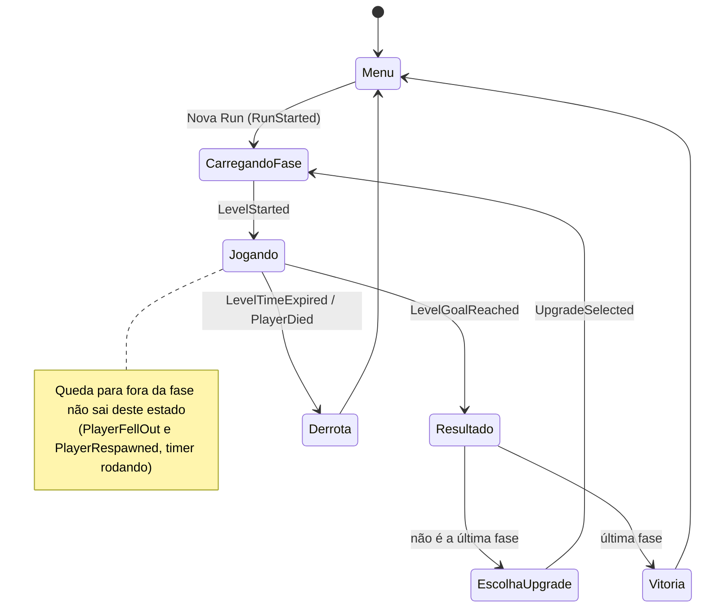
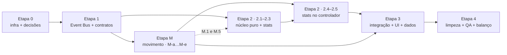

# Plano de refactor — Roguelike + arquitetura event-driven

Projeto: `Projetos Grupo 5` (Unity 6000.1.7f1) · Plano escrito em 28/09/2026, **revisado em 29/09/2026 (versão final, pronta para execução por etapas)** · Base: bugfixes do [RELATORIO_BUGS.md](RELATORIO_BUGS.md) já commitados em `8df28c9` (que está em `main` e `origin/main`); trabalho atual na branch `claude/sleepy-galileo-ovuapo` (`8df28c9` + commits `[Docs]` de pesquisa, auditoria, PRD, SPEC e deste plano).

Documentos do refactor: [PRD.md](PRD.md) (o "o quê" do movimento) · [SPEC.md](SPEC.md) (o "como"; tarefas M.1–M.18) · pesquisa em `docs/pesquisa/`: [auditoria-movimento-atual.md](docs/pesquisa/auditoria-movimento-atual.md) (AUD) · [movimentacao-implementacao.md](docs/pesquisa/movimentacao-implementacao.md) · [movimentacao-gamefeel.md](docs/pesquisa/movimentacao-gamefeel.md).

> **O que mudou desde 28/09:** o refactor do movimento entrou no plano (Etapa M, controlador novo do PRD/SPEC); D1/D3/D6 foram atualizadas e ganharam as decisões Q1–Q15; `StatType`/`AbilityFlags`, eventos e upgrades foram revisados; a Etapa 0 mostra o estado real; o agente `dev` passou para o Sonnet 5.5; o orçamento ficou sem números de uso datados; entraram a §9 (definição de pronto) e a §10 (ordem de execução).

---

## 1. De onde para onde

| | Design antigo (inacabado) | Design novo |
|---|---|---|
| Loop | Fase → loja (moedas) → fase | Fase → escolher 1 de 3 upgrades → fase |
| Progressão | Moedas persistentes, compras permanentes | Run roguelike; tudo zera ao fim da run |
| Falha | Timer regressivo por fase | Fase precisa ser concluída abaixo de **x** segundos, medidos em ticks de simulação (freeze, pausa e loading não contam) |
| Queda num vão | Soft-lock: o jogador espera o timer acabar | Respawn no último chão seguro em ≤ 0,5 s; o timer continua (Q3). Não é derrota |
| Recompensa | Preço fixo na loja | 4 raridades; a chance de cada uma depende do desempenho na fase anterior |
| Movimento | `characterMovement` com `Rigidbody2D` dinâmico (atrito da engine, 50 Hz), pulo "elevador" de 2,67 u, câmera atrasada, só teclado (AUD) | Controlador **cinemático próprio a 60 Hz, estilo Celeste** (PRD, SPEC): metas numéricas congeladas em testes, câmera com look-ahead e look-down, teclado e gamepad |
| Kit inicial | Pulo duplo, wall jump e gancho liberados | **Kit base** (PRD §5.1): corrida, pulo variável (0,9–3,5 u), queda com fast fall e ajudas invisíveis (coyote, buffer, correção de quina); **paredes só bloqueiam**. Pulo Duplo, Salto de Parede, Dash e Gancho só por upgrade |
| Uma run | — | A sequência de fases que existe hoje (hoje: `PrimeiraFase`, `QuartaFase 1`, `QuintaFase`) |

### Fluxo da run



Regras do fluxo que vêm do PRD e do SPEC:
- **Derrota** só por tempo esgotado (`LevelTimeExpired`) ou bala/inimigo (`PlayerDied` com `Cause = Enemy`). Com o tempo esgotado, o movimento também emite `PlayerDied(Time)` (DS-20); o `RunFlow` conta **uma** derrota (2.3). A D3 continua valendo.
- **Queda para fora da fase não é derrota**: respawn no último chão seguro em ≤ 0,5 s, com o timer rodando (Q3, PRD RF-42).
- **"Voltar ao spawn"** (segurar R ou Select por 0,3 s) leva ao spawn da fase **sem** zerar o timer (Q11).
- `LevelGoalReached` trava o movimento (`Disabled`). Se chegar no mesmo tick em que o limite estoura, vale a vitória: o empate favorece o jogador (SPEC §3.4).

---

## 2. Decisões que precisam ser tomadas antes da Etapa 1

Cada uma tem um padrão recomendado; se o time não decidir, o plano segue com ele. **Estado em 29/09:** nada foi registrado pelo time ainda. A tarefa **0.6** cobre as três tabelas desta seção: D1–D7, Q1–Q15 (com a revisão das DS-01…DS-20 do SPEC) e as perguntas abertas da §2.3. Como diz o título, tudo deve estar respondido antes da Etapa 1, porque a 1.1 e a M.1 congelam contratos que dependem dessas respostas. As exceções são a PA1, que depende do relatório da M.12, e os valores numéricos (D6 e os marcados "(inicial — calibrar)" no SPEC), que ficam para os playtests.

### 2.1 Decisões do roguelike (D1–D7)

| # | Decisão | Recomendação |
|---|---------|--------------|
| **D1** | Toda fase tem que ser completável só com o kit base? **Achado da auditoria (AUD §5.3):** com o controlador atual e o kit base, só a Primeira é completável. A Quinta exige pulo duplo, e a Quarta exige pulo duplo + wall jump (com o wall jump recarregando o pulo aéreo). O gancho não é necessário em nenhuma fase. O gargalo é vertical, não horizontal. | **Sim, pela opção B do PRD §10.3** (adotada por padrão no SPEC §1): pulo base de 3,5 u + edição de geometria na Quarta e na Quinta (M.16, via `LevelPatch`), com as rotas atuais virando **atalhos** de Pulo Duplo e Salto de Parede. **Contingência C:** uma flag no `RunConfig` garante uma habilidade de mobilidade na 1ª oferta enquanto a B não termina, e sai depois (ver PA1 na §2.3). **Critério de pronto:** (a) analisador de alcançabilidade ✅ nas 3 fases com o kit base; (b) 3 pessoas completam cada fase com o kit base dentro do limite da D6; (c) cada habilidade Épica encurta em ≥ 10 % a melhor rota do kit base em pelo menos uma fase. (a) sai na M.16, (b) é medido na M.18 e na 4.4, (c) na 4.4. |
| **D2** | O que fazer com as moedas | **Remover no MVP.** Mais tarde podem virar bônus de tempo (ex.: −0,5 s por moeda). O controlador novo já não coleta moedas (SPEC §13.1): a economia fica congelada da M.15 até a loja sair (3.4 e 4.1). |
| **D3** | Estourar o tempo ou morrer para um inimigo | **Fim da run** (roguelike clássico). **Queda para fora da fase não é morte** (Q3): respawn com o timer rodando. Uma "vida extra" pode existir como upgrade Lendário. |
| **D4** | Quais fases e em que ordem | As 3 do build, em ordem fixa. Incluir `SegundaFase`/`TerceiraFase`/`SextaFase` vira só adicionar um asset `LevelDefinition` depois, **desde que a fase siga as métricas de level design (PRD §7.3, SPEC §14.1) e passe no analisador de alcançabilidade** com o kit base. |
| **D5** | Upgrades acumulam (stack)? | Sim, com `maxStacks` por upgrade e **teto por stat** aplicado pelo `PlayerStats` (PRD §9.1). |
| **D6** | Valores de x (limite) e do tempo-alvo por fase | Placeholders: limite = timer atual (20 s / 30 s / 25 s), alvo = 60 % do limite. **Precisam ser remedidos com o controlador novo**: o pulo mais curto, a queda mais rápida, o dash e o respawn mudam os tempos (PRD §10.3-5). Remedição na 4.4, com a telemetria da 4.3 e as métricas do PRD §11. |
| **D7** | Reroll / pular oferta | Fora do MVP. A arquitetura deixa espaço para isso. |

### 2.2 Decisões do movimento (Q1–Q15)

Resumo das perguntas do PRD §12.3. O texto completo, as justificativas e as 20 decisões técnicas DS-01…DS-20 estão no **SPEC §1**.

| ID | Decisão (resumo) | Status |
|---|---|---|
| Q1 | Simulação do jogador a **60 Hz** num loop próprio em `Update` (`SimulationRunner`); `Time.fixedDeltaTime` não muda | adotada por padrão — confirmar |
| Q2 | Controlador **cinemático próprio**, resolução por eixo (X antes de Y), `BoxCast` com skin | adotada por padrão — confirmar |
| Q3 | Queda para fora = **respawn no último chão seguro** em ≤ 0,5 s, timer continua; bala, inimigo e tempo continuam sendo fim de run (D3) | adotada por padrão — confirmar |
| Q4 | **Freeze fora do timer**; tempo de fase em ticks; nunca `Time.timeScale` para freeze | adotada por padrão — confirmar |
| Q5 | **Dash é P1** (Épico), com placeholder visual | adotada por padrão — confirmar |
| Q6 | Paredes invisíveis (layer Default) bloqueiam e contam como teto, sem wall slide/jump | adotada por padrão — confirmar |
| Q7 | Câmera própria evoluída (`CameraFollow` reescrito no mesmo GUID), sem Cinemachine | adotada por padrão — confirmar |
| Q8 | Área visível **20 × 11,25 u** (ortho 5,625); pixel snap adiado | adotada por padrão — confirmar |
| Q9 | Inimigos sólidos (chão, teto, bloqueio), mas não servem para wall jump; dano só das balas | adotada por padrão — confirmar |
| Q10 | Pulo aéreo = **85 %** do pulo do chão (3,0 u) | adotada por padrão — confirmar |
| Q11 | "Voltar ao spawn" **não zera** o timer | adotada por padrão — confirmar |
| Q12 | Wall jump **não** recarrega o dash no kit (vira o upgrade "Recarga na Parede") | adotada por padrão — confirmar |
| Q13 | Input horizontal **digital** (−1/0/+1), zona morta 0,3 no stick | adotada por padrão — confirmar |
| Q14 | Impulso horizontal do pulo (+4 u/s) **no kit base** | adotada por padrão — confirmar |
| Q15 | O refactor é a **Etapa M**: depois da Etapa 1, fechando antes da 2.4 (§5) | adotada por padrão — confirmar |

As DS-01…DS-20 estão como "decisão do SPEC — revisar". As que mais afetam o trabalho em grupo: **DS-01** (asmdefs, §3.2), **DS-03** (o componente `PlayerInput` sai do prefab), **DS-04** (root do `Cyborg.prefab` com escala 1 e origem nos pés), **DS-05** (`characterMovement` vira fachada), **DS-12/DS-13** (`EndGoal` detectado no tick; layer 7 "Wall" vira "KillZone").

### 2.3 Perguntas abertas (não resolvidas pelo SPEC)

| # | Pergunta | Recomendação padrão |
|---|---|---|
| **PA1** | A contingência C da D1 não salva a Quarta se ela ainda exigir Pulo Duplo **e** Salto de Parede com o perfil novo: na ordem da D4 (Primeira → Quarta 1 → Quinta) só existe **uma** oferta antes da Quarta. | Decidir com o relatório da M.12. Se a Quarta exigir as duas habilidades e a opção B atrasar, trocar a ordem para Primeira → Quinta → Quarta 1 (a Quinta só exige Pulo Duplo) e ligar a flag nas 1ª e 2ª ofertas. |
| **PA2** | Quais Épicos contam como "mobilidade" para a flag de contingência? | Pulo Duplo e Salto de Parede. O gancho não é necessário em nenhuma fase (AUD §5.3), e o Dash é P1 e pode ser cortado (Q5). |
| **PA3** | Que `Tick` o `PlayerDied` leva quando é emitido pelo controlador antigo (1.3), antes de o relógio de simulação existir (M.2/M.8)? | `Tick = −1` ("sem relógio") e `Position = transform.position`. O `RunFlow` não depende do `Tick`. |
| **PA4** | Quem produz ou cura os SFX de movimento? Hoje não existem (PRD §12.2-6). | Nomear um responsável na 0.6. Até a M.18, cue sem clipe = silêncio sem erro (SPEC §10.3). |

---

## 3. Arquitetura alvo

### 3.1 Princípios
1. **Eventos para fatos, chamadas diretas para comandos.** Se algo *aconteceu* (fase concluída, jogador morreu), vai pelo Event Bus. Se um sistema *manda* outro fazer algo dentro do mesmo domínio (o RunManager pede ao SceneLoader para carregar uma cena), é chamada direta.
2. **Lógica pura em C# comum; MonoBehaviour só como adaptador.** RunFlow, sorteio de raridade, geração de ofertas, cálculo de stats e o **núcleo do movimento** (`PlayerMotor`, SPEC §2) não dependem de cena, então são testáveis em EditMode e fáceis de delegar a modelos mais baratos.
3. **Dados em ScriptableObject.** Upgrades, raridades, fases, a configuração da run e o perfil de movimento (`MovementProfile`) são assets. Criar um upgrade novo ou ajustar o feel não exige código.
4. **Nenhum `FindObjectOfType` para descobrir dependências.** Quem precisa do jogador ouve `PlayerSpawned`.
5. **Um relógio de simulação.** Jogador, câmera e `LevelTimer` avançam no mesmo tick de 60 Hz (`SimulationRunner`). Nada de gameplay depende do framerate, de `Time.deltaTime` ou de `Random` (PRD RNF-01, RNF-02).

### 3.2 Onde fica o código novo

Árvore completa do movimento no SPEC §2.2.

```
Assets/_Roguelike/
  Core/                      ← asmdef Roguelike.Core (auto-referenciado pelo Assembly-CSharp; só lógica pura)
    EventBus/                  IEvent, EventBus<T>, EventBusRegistry
    Events/                    GameEvents.cs (eventos da run + PlayerDied/DeathCause)
    Run/                       RunFlow (máquina de estados), RunState, PerformanceEvaluator
    Upgrades/                  UpgradeDefinition, RarityDefinition, RarityTable,
                               UpgradeOfferGenerator, StatModifier, StatType, AbilityFlags
    Stats/                     PlayerStats (base + modificadores + tetos), PlayerBaseStats
    Levels/                    LevelDefinition, RunConfig
    Simulation/                SimulationLoop, SimulationClock, ITickable, TickMath      (Etapa M)
    Movement/                  núcleo do controlador (Etapa M): Simulation/ (PlayerMotor…),
                               Collision/, Input/, Data/ (MovementProfile, MovementStats),
                               Events/ (eventos de movimento), Presentation/ (lógica das views),
                               Tools/ (analisador de alcançabilidade, LevelPatch)
    Camera/                    CameraSolver, CameraProfile, CameraBounds                 (Etapa M)
  MovementPhysics/           ← asmdef Roguelike.Movement.Physics (ref. só Core): Physics2DCollisionWorld,
                               MovementLayers, LevelAabbExtractor
  Tests/EditMode/            ← asmdef Roguelike.Tests.EditMode (inclui Movement/)
  Tests/Levels/              ← asmdef Roguelike.Tests.Levels (EditMode, Editor; ref. Core + Movement.Physics)
  Tests/PlayMode/            ← asmdef Roguelike.Tests.PlayMode
  Data/                      ← assets .asset (Upgrades/, Rarities/, Levels/, RunConfig, Movement/)
  Prefabs/                   ← RunSystems (DDOL), RunUI
Assets/scripts/              ← MonoBehaviours legados e adaptadores novos continuam no Assembly-CSharp
  characterMovement.cs         fachada do controlador novo (M.15 → 4.1); fica no lugar para manter o GUID
  Player/                      PlayerController, SimulationRunner, PlayerInputReader, EventBusMovementEvents…
  Player/View/ · Input/ · Feedback/ · Debug/ · Editor/Movement/   (SPEC §2.2)
Assets/Scenes/Dev/MovementGym.unity · Assets/Prefabs/Dev/ (CyborgNext temporário, DevPlayBootstrap)
```

> **Por que tão poucos asmdefs:** os MonoBehaviours legados (`characterMovement`, `GrapplingHook`…) estão no Assembly-CSharp, e um asmdef não pode referenciar o Assembly-CSharp. Pôr a lógica pura em `Roguelike.Core` permite testes EditMode sem mover scripts antigos (mover arrisca os GUIDs dos `.meta` e quebrar referências em cenas). O núcleo do movimento também fica no `Roguelike.Core`, não num asmdef próprio: o `PlayerBaseStats` (2.1) lê bases e tetos do `MovementProfile`, e o movimento usa `StatType` e `IEvent`; em asmdefs separados isso viraria uma dependência circular (SPEC §2.2). A única exceção é o **`Roguelike.Movement.Physics`**: pequeno, referencia só o Core e guarda a implementação Physics2D do mundo de colisão, para que os testes de paridade e de emendas (`Roguelike.Tests.Levels`) rodem sem passar pelo Assembly-CSharp. A pureza do Core é verificável por `grep` (SPEC §2.2).

### 3.3 Event Bus

```csharp
public interface IEvent { }

public static class EventBus<T> where T : struct, IEvent
{
    public static void Subscribe(Action<T> handler);
    public static void Unsubscribe(Action<T> handler);
    public static void Raise(in T evt);   // itera sobre uma cópia em cache (sem alocação); desinscrever durante o Raise é seguro
    internal static void Clear();
}
// EventBusRegistry: [RuntimeInitializeOnLoadMethod(SubsystemRegistration)] limpa todos os barramentos
// (seguro mesmo com "Enter Play Mode Options" ativado). Log opcional "[EventBus] - Raise X" atrás de flag.
```

Regras: assinar em `OnEnable`, desassinar em `OnDisable`. Eventos são `readonly struct`, com nome no passado.

**`Raise` não aloca** (SPEC §9.2): a cópia dos assinantes fica em cache e só é refeita em `Subscribe`/`Unsubscribe`. Sem isso o movimento, que publica vários eventos por tick, estoura a meta de 0 B de GC por tick (PRD RNF-09). O critério de pronto da 1.2 inclui um teste de GC.

O núcleo do movimento **não** chama o Event Bus: grava os fatos do tick numa struct (`TickEvents`), e o adaptador `EventBusMovementEvents` publica depois do tick, em ordem fixa (SPEC §9.2). Se a 1.2 atrasar, o movimento usa `LocalMovementEvents` e a troca é uma linha.

### 3.4 Catálogo de eventos (MVP)

**Run e fase**

| Evento | Payload | Emissor | Ouvintes |
|---|---|---|---|
| `RunStarted` | seed, RunConfig | RunManager | RunUI, PlayerStats (reset) |
| `LevelStarted` | índice, LevelDefinition, limite efetivo | RunManager | LevelTimer, HUD, movimento (reset da fase, re-arma o input) |
| `PlayerSpawned` | GameObject | Spawner | CameraFollow, EnemyAI, LevelTimer, movimento (re-arma o input) |
| `LevelTimeChanged` | tempo decorrido (ticks e segundos), a cada 6 ticks (0,1 s) | LevelTimer | HUD |
| `LevelTimeExpired` | — | LevelTimer (no tick exato do limite) | RunManager, movimento (`Die(Time)`, DS-20) |
| `PlayerDied` | **`Cause`** (`Enemy`, `Time`, `Other`), **`Position`**, **`Tick`** | movimento (`characterMovement` até a M.15; depois `PlayerController`) | RunManager, LevelTimer (para), feedback, RumbleService |
| `LevelGoalReached` | — | EndGoal (varredura no tick, DS-12) | LevelTimer (para), RunManager, movimento (`Disabled`) |
| `LevelCompleted` | índice, tempo, limite, desempenho 0–1, nota | RunManager | LevelResultView, telemetria |
| `UpgradeOffersGenerated` | 3× (UpgradeDefinition, raridade) | RunManager | UpgradeSelectionView |
| `UpgradeSelected` | UpgradeDefinition | UpgradeSelectionView | RunManager, PlayerStats |
| `PlayerStatsChanged` | snapshot dos stats | PlayerStats | movimento (`PlayerController` → `QueueStats`, vale no tick seguinte), HUD |
| `RunEnded` | vitória/derrota, RunSummary | RunManager | RunEndView, telemetria |

`PlayerDied` sai uma única vez por vida (PRD RF-41). `PlayerDied(Time)` + `LevelTimeExpired` contam como uma derrota (2.3).

**Movimento** (SPEC §9.1). Emissor: `PlayerController`, via `EventBusMovementEvents`. Todos carregam `long Tick` e saem no tick em que o fato acontece; os ouvintes de feedback reagem no mesmo frame.

| Evento | Payload (+ `Tick`) | Quando | Ouvintes |
|---|---|---|---|
| `PlayerJumped` | `Kind` (Ground, Coyote, Air, GrappleCancel), `FromBuffer`, `Position`, `Velocity` | pulo aplicado | `PlayerFeedback`, `PlayerAnimatorDriver`, telemetria |
| `PlayerWallJumped` | `Side`, `Neutral`, `Position` | wall jump aplicado | feedback, animação, telemetria |
| `PlayerLanded` | `ImpactSpeed`, `AirTime`, `Position` | 1º tick no chão (contato real) | squash, poeira, rumble, telemetria |
| `PlayerDashed` | `Direction`, `ChargesLeft`, `Position` | fim do freeze (direção fixada) | feedback, shake, afterimage, telemetria |
| `PlayerWallSlideChanged` | `Started`, `Side` | entrar ou sair do wall slide | partículas, loop de áudio, animação |
| `PlayerAbilityRefilled` | `Resource` (AirJump, Dash), `Amount` | recarga que aumentou a carga | indicador no corpo, som |
| `PlayerActionDenied` | `Action` (Dash, AirJump, Grapple), `Reason` (NoCharge, Cooldown, Locked, NoTarget) | DS-17 | som de falha, telemetria |
| `PlayerGrappleFired` / `PlayerGrappleAttached` / `PlayerGrappleReleased` | alvo/âncora; `Released`: `LaunchVelocity`, `Reason` | cada transição do gancho | `GrappleView`, feedback, telemetria |
| `PlayerFellOut` | `Position`, `LastSafeGround` | saída por baixo ou zona de morte | feedback, telemetria (o `LevelTimer` **não** para) |
| `PlayerRespawned` | `Position`, `Reason` (FellOut, ReturnToSpawn) | controle devolvido | câmera (corte), feedback |
| `MovementStatsReported` | `JumpsFromBuffer`, `BufferExpired`, `EatenInputs`, `CoyoteJumps`, `CornerCorrections`, `ActionsDenied`, `FellOuts`, `Ticks` | junto com `LevelGoalReached` ou `PlayerDied` | telemetria (4.3) |

### 3.5 Upgrades, raridade e desempenho

**Desempenho** na fase: `p = clamp01((limite − tempo) / (limite − alvo))`, com o tempo vindo dos ticks do `LevelTimer` (`tempo = ticks / 60`). Terminar no tempo-alvo ou abaixo dá `p = 1`; terminar no limite dá `p = 0`. Nota para a UI: S ≥ 0,9 · A ≥ 0,66 · B ≥ 0,33 · C.

**Raridade**: `RarityTable` guarda uma `AnimationCurve` de peso por raridade em função de `p`, e os pesos são normalizados. Valores iniciais:

| Raridade | Peso com p = 0 (lento) | Peso com p = 1 (perfeito) |
|---|---|---|
| Comum | 70 | 25 |
| Raro | 25 | 40 |
| Épico | 5 | 25 |
| Lendário | 0 | 10 |

**Geração de ofertas** (`UpgradeOfferGenerator`, determinística):
1. `rng = new System.Random(hash(seedDaRun, índiceDaFase))`
2. Para cada um dos 3 slots: sorteia a raridade pelos pesos de `p` e escolhe um upgrade dessa raridade que seja **elegível** (stacks < `maxStacks`, pré-requisitos adquiridos, ainda não oferecido nesta rodada).
3. Se não houver candidato, tenta a raridade abaixo, depois a acima. Se ainda assim não houver, o slot fica vazio.
4. **Contingência D1-C** (flag no `RunConfig`, desligada por padrão): se ligada, a 1ª oferta garante pelo menos um Épico de mobilidade (PA2). Sai quando a opção B da D1 estiver pronta.

**Upgrade como dado**: `UpgradeDefinition` = id, nome, descrição, ícone, raridade, `maxStacks`, `prerequisites[]`, `List<StatModifier>` (StatType, Add/Multiply, valor) e `AbilityFlags unlocks`. O ponto de extensão para efeitos especiais no futuro é uma lista opcional de `UpgradeEffect` (ScriptableObject abstrato).

**`StatType` e `AbilityFlags`** (SPEC §8.2, PRD §9.1–9.2). **Valores explícitos, nunca reordenados**: os `UpgradeDefinition` serializam o int.

```csharp
public enum StatType { MaxSpeed = 0, Acceleration = 1, AirControl = 2 /* ex-AirAcceleration */, JumpHeight = 3,
    CoyoteTime = 4, WallSlideSpeed = 5, MaxAirJumps = 6, GrappleRadius = 7, GrappleCooldown = 8,
    GrappleLaunchSpeed = 9 /* ex-GrappleLaunchForce */, TimeLimitBonus = 10, MaxDashes = 11,
    JumpHorizontalBoost = 12, OverspeedDecay = 13 }
[Flags] public enum AbilityFlags { None = 0, WallJump = 1 /* ex-WallGrab */, GrapplingHook = 2,
    DashRefillOnWallJump = 4, AirJumpRefillOnGrapple = 8, WallGrab = 16 /* reservado: escalada futura */ }
```

| `StatType` | Base (kit) | Teto | Observação |
|---|---|---|---|
| `MaxSpeed` | 10 u/s | 13 u/s (+30 %) | Passos Leves |
| `Acceleration` | 100 u/s² | +30 % | cobre acelerar, frear e virar no chão; sem upgrade no MVP |
| `AirControl` | ×1 | ×1,5 | multiplica **todas** as taxas no ar |
| `JumpHeight` | 3,5 u | 4,2 u | muda só a altura; gravidade e queda ficam fixas; o pulo aéreo acompanha (85 %) |
| `CoyoteTime` | 0,1 s | 0,2 s | — |
| `WallSlideSpeed` | 2,5 u/s | mínimo 1 u/s | — |
| `MaxAirJumps` | 0 | 2 | pulo duplo = `MaxAirJumps ≥ 1` |
| `GrappleRadius` / `GrappleCooldown` | 9 u / 0,5 s | 13,5 u / mínimo 0,2 s | — |
| `GrappleLaunchSpeed` | 34 u/s (DS-08) | +40 % | Δv sem clamp: o "+40 %" passa a valer na vertical |
| `TimeLimitBonus` | 0 | — | não é de movimento |
| `MaxDashes` | 0 | 2 | dash = `MaxDashes ≥ 1` (sem flag separada) |
| `JumpHorizontalBoost` | 4 u/s | 6 u/s | — |
| `OverspeedDecay` | 40 u/s² | mínimo 20 u/s² | freio da sobrevelocidade |

| `AbilityFlags` | Efeito |
|---|---|
| `WallJump` (ex-`WallGrab`) | libera wall slide e wall jump |
| `GrapplingHook` | libera o gancho |
| `DashRefillOnWallJump` | o wall jump recarrega o dash |
| `AirJumpRefillOnGrapple` | prender o gancho recarrega os pulos aéreos |
| `WallGrab` | reservada para uma escalada com estamina futura |

**Kit base:** todos os stats na base e nenhuma flag (`MaxAirJumps = 0`, `MaxDashes = 0`). As bases e os tetos de movimento vêm do `MovementProfile` (SPEC §8.1), que é a fonte única. **Ficam fora de `StatType`** (invariantes de feel, PRD §9.1): gravidade, queda máxima, buffer, trava de input, correção de quina, freeze e parâmetros de câmera.

Conteúdo inicial (placeholder de design; nomes e raridades são ajustáveis; revisado pelo PRD §9.4):

| Raridade | Upgrade | Efeito | Stack | Requer |
|---|---|---|---|---|
| Comum | Passos Leves | +8 % velocidade máxima (`MaxSpeed`) | 3 | — |
| Comum | Mola | +8 % altura do pulo (`JumpHeight`; a queda não fica mais pesada) | 2 | — |
| Comum | Controle Aéreo | +20 % em todas as taxas no ar (`AirControl`) | 2 | — |
| Comum | Embalo | −30 % no freio da sobrevelocidade (`OverspeedDecay`) | 2 | — |
| Comum | Impulso | +1 u/s de impulso horizontal do pulo (`JumpHorizontalBoost`) | 2 | — |
| Raro | Coyote Estendido | +0,08 s de coyote time | 1 | — |
| Raro | Gancho Rápido | −30 % cooldown do gancho | 2 | Gancho |
| Raro | Alcance do Gancho | +25 % raio do gancho | 2 | Gancho |
| Raro | Deslize Lento | −40 % velocidade de deslize na parede | 1 | Salto de Parede |
| Raro | Recarga na Parede | o wall jump recarrega o dash (`DashRefillOnWallJump`) | 1 | Dash |
| Raro | Âncora | prender o gancho recarrega os pulos aéreos (`AirJumpRefillOnGrapple`) | 1 | Gancho |
| Épico | Pulo Duplo | +1 pulo aéreo (`MaxAirJumps`) | 1 | — |
| Épico | Salto de Parede | desbloqueia deslizar e pular na parede (`WallJump`) | 1 | — |
| Épico | Gancho | desbloqueia o gancho (`GrapplingHook`) | 1 | — |
| Épico | Dash | +1 dash (`MaxDashes`; P1) | 1 | — |
| Lendário | Pulo Triplo | +1 pulo aéreo | 1 | Pulo Duplo |
| Lendário | Impulso do Gancho | +40 % velocidade de lançamento (`GrappleLaunchSpeed`) | 1 | Gancho |
| Lendário | Dash Duplo | +1 dash | 1 | Dash |
| Lendário | Relógio de Bolso | +5 s no limite de todas as fases (`TimeLimitBonus`) | 1 | — |

Mudanças em relação à versão de 28/09: sai **Arranque** (+15 % de aceleração seria imperceptível com a base de 0,1 s); entram **Embalo, Impulso, Recarga na Parede, Âncora, Dash e Dash Duplo**; **Wall Grab** vira **Salto de Parede**. São 19 upgrades. Se o Dash for cortado (Q5), saem Dash, Dash Duplo e Recarga na Parede. Regra para upgrades futuros: um upgrade acrescenta um verbo, uma rota ou uma recarga, ou amplia um número dentro do teto; nunca mexe nos invariantes.

### 3.6 O que sai

**Roguelike** (4.1, com checagem de referências por GUID): `ShopManager`, `ButtonInfo`, `Item shop.prefab`, a economia de moedas (conforme D2), `PlayerData` (a run vive em memória; persistem só volume, VSync e, opcionalmente, recordes), `SaveManager`/`SaveData`/`PlayerSaveController`, `playerData.prefab`, `SceneController` (substituído pelo `RunManager`), o `Timer` regressivo (substituído pelo `LevelTimer`) e o botão "Continuar".

**Movimento** (SPEC §13.4):

| Item | Quando | Condição |
|---|---|---|
| `VerticalJumpController.cs` e `MovementDiagnostic.cs` (+ `.meta`), scripts mortos | M.4 | `grep` do GUID sem resultado fora do próprio `.meta` |
| `CharacterAnimator.cs` e `GrapplingHook.cs` separado (+ `.meta`; o gancho vira estado do controlador); no `Cyborg.prefab`, saem também o componente `PlayerInput` e o filho `GroundCheck` (SPEC §13.2) | M.15 | componentes removidos do prefab no mesmo commit (os GUIDs só aparecem nele) |
| `CyborgNext.prefab` e a flag `Legacy` do `DevPlayBootstrap` | M.15 | — |
| `LegacyPlayerDataStatsSource` e `RefreshStats` (na fachada e a chamada no `ShopManager`) | 2.4 | `PlayerStats` ligado ao controlador |
| Fachada `characterMovement`, alvo legado do `CameraFollow`, `Player_Controller.controller` antigo, overrides órfãos em cenas fora do build (`QuartaFase`, `TerceiraFase`, `SextaFase`) | 4.1 | zero referências (script de GUID da 4.1); o `grep` por `characterMovement` só acha a própria fachada |

---

## 4. Modelos, esforço e custo-benefício

### 4.1 Preços (API, por milhão de tokens)

Tabela oficial da API (cache de 25/09/2026).

| Modelo | Entrada | Saída | Contexto | Controle de esforço |
|---|---|---|---|---|
| Fable 5.1 | $10 | $50 | 1M | low → max |
| **Opus 5.5** | **$4** | **$20** | 1M | low → max (**padrão `medium`**) |
| Sonnet 5.5 | $2 | $10 | 1M | low → max (padrão `high`; níveis recalibrados em relação à versão anterior do Sonnet) |
| Haiku 4.5 | $1 | $5 | 200K | não tem |

No plano de assinatura não há cobrança por token, mas a janela de 5 h e o limite semanal são consumidos mais rápido pelos modelos mais caros. A proporção de preço é uma boa aproximação do quanto cada modelo "pesa".

### 4.2 Por que o Opus 5.5 muda a conta
- Custa **só 2× o Sonnet 5.5** e 4× o Haiku, e é 20 % mais barato que o Opus 5. Com essa diferença, compensa usar Opus sempre que houver chance real de o Sonnet precisar de retrabalho: uma rodada extra de correção mais a verificação do orquestrador já custam mais que a diferença de preço. O que importa é o **custo por tarefa concluída**, não por requisição.
- Na sessão de calibração de 27/09, o agente Opus fez a tarefa mais arriscada (cenas + prefabs + singleton; 57 chamadas de ferramenta, 165k tokens) sem retrabalho e ainda encontrou 5 problemas extras. O Sonnet (95k) entregou bem uma tarefa bem especificada. O Haiku (71k) fez o trabalho certo, mas o relatório veio vago e o orquestrador teve que conferir tudo de novo, o que comeu parte da economia.
- O esforço padrão do Opus 5.5 é `medium` (um nível abaixo do Opus 5). Para trabalho agêntico de código com risco, use `high`; `xhigh` só para os contratos da arquitetura; `max` nunca neste projeto.
- O **Sonnet 5.5** é o Sonnet atual, pelo mesmo preço da versão anterior. O padrão continua `high`, mas os níveis foram recalibrados. O `dev` fica em `high`: as tarefas dele vêm com contrato e testes, e um retrabalho custa mais que a economia. Na M-a, rodar uma tarefa com teste automático (ex.: M.2) em `medium` e comparar retrabalho e tokens antes de baixar o padrão.
- **Fable 5.1** custa 2,5× o Opus 5.5. Neste escopo (um refactor Unity bem delimitado), o ganho não paga no plano Pro. **Não usar.**

### 4.3 Elenco de agentes
Na ferramenta de delegação só dá para escolher o modelo; **o esforço vem da definição do agente** em `.claude/agents/*.md`. Por isso a Etapa 0 cria estas definições:

| Agente | Modelo · esforço | Quando usar |
|---|---|---|
| `arquiteto` | Opus 5.5 · **xhigh** | Contratos, ADRs e decisões que atravessam o projeto. 1 a 2 vezes no projeto todo. |
| `dev-core` | Opus 5.5 · **high** | Refactors com risco de regressão: núcleo do movimento, adaptadores, virada do controlador, fluxo da run. |
| `integrador-unity` | Opus 5.5 · **medium** | Cenas, prefabs e assets via Unity MCP. Erro ali é caro de achar; `medium` basta porque a tarefa vem especificada. |
| `revisor` | Opus 5.5 · **high** | `/code-review` ao fim de cada etapa (na Etapa M, na M.18). |
| `dev` | Sonnet 5.5 · **high** | Implementar a partir de contrato + testes (algoritmos, views, EventBus, câmera, feedback). |
| `mecanico` | Haiku 4.5 · — | Tarefas mecânicas **com verificação automática** (teste, compilação ou script): criar assets a partir de tabela, apagar código morto após checar referências, docs. |
| *Orquestrador* (sessão principal) | Opus 5.5 · **medium** | Lê o plano, dispara os agentes, verifica compilação e testes, atualiza o progresso. |

Exemplo de definição (validar na tarefa 0.3 que a versão instalada aceita o campo `effort`):

```markdown
---
name: dev-core
description: Refactors de gameplay com risco de regressão no projeto Unity (movimento, fluxo da run).
model: opus
effort: high
---
Você trabalha num projeto Unity 6 com Event Bus (ver PLANO_REFACTOR_ROGUELIKE.md §3). ...
```

### 4.4 Regras de delegação (valem para toda tarefa)
- **Posse de arquivos:** cada agente recebe a lista exata de arquivos que pode editar. Agentes em paralelo nunca compartilham arquivos. Na Etapa M, a lista de cada tarefa está no **SPEC §17.2**.
- **Trava do Editor:** só **um** agente por vez usa o Unity MCP para cenas, prefabs e assets (existe um único Editor aberto). Agentes que só editam `.cs` podem rodar em paralelo.
- **Sem worktrees:** o Editor está preso à pasta principal, então um worktree não compila nem testa.
- **Todo prompt de delegação traz:** contrato/interfaces, arquivos que o agente possui, arquivos proibidos, se usa o Editor, definição de pronto, como verificar, e o formato de relatório (arquivos alterados + saída da verificação + pendências). Isso evita relatórios vagos como o do Haiku na calibração de 27/09.
- **Nenhum agente faz commit.** O orquestrador propõe os commits ao fim da etapa e você aprova.

---

## 5. Etapas (cada sessão cabe numa janela de 5 h)

**Orçamento** (plano **Pro**; no Pro, o limite semanal costuma apertar antes da janela de 5 h):
- **no máximo 1 sessão por dia**: uma etapa, uma sub-etapa da Etapa M ou uma metade da Etapa 2 (ordem na §10);
- antes de começar, abra a tela de uso do app e confira a janela de 5 h **e** o limite semanal: só comece se a janela estiver folgada e o semanal comportar a sessão inteira (estimativas abaixo). Confira de novo no meio da sessão e a cada ✂️. Se passar de **80 %** da janela, pare no próximo ponto de corte ✂️ e deixe o resto para a sessão seguinte;
- **comece cada sessão numa conversa nova**: o contexto acumulado é reenviado a cada turno. O plano e o checklist deste arquivo são a memória entre sessões;
- ao fechar a Etapa 0 e a M-a, anote ao lado do título o uso real e recalibre as estimativas seguintes.

Os tokens estimados são somente dos subagentes, com base na calibração de 27/09 e nas estimativas do SPEC §17.1. **Total do projeto ≈ 3,6M tokens em 11 sessões.**

### Etapa 0 — Preparação e infraestrutura (~150k)
| ✓ | # | Tarefa | Agente | Paralelo | Editor | Pronto quando |
|---|---|---|---|---|---|---|
| ☑ | 0.1a | Commitar os bugfixes do RELATORIO_BUGS.md. **Feito** em `8df28c9` (28/09), que já está em `main` e `origin/main`. O mesmo commit trouxe o pacote `com.unity.ai.assistant`, o minimapa e as fontes TMP, e a mensagem não segue `[Tipo] - Título`. **Decisão:** não separar nem reescrever. O histórico já está publicado em `main`, e o pacote é o que liga o Editor ao MCP. | Orquestrador | — | não | Feito |
| ☐ | 0.1b | Branch de trabalho: commitar esta revisão do plano (`[Docs] - Plano final do refactor com a Etapa M`), criar `refactor/roguelike` a partir da ponta da `claude/sleepy-galileo-ovuapo` e publicar (`git push -u origin refactor/roguelike`). Em 29/09 os 5 commits de docs ainda não estavam no remoto. Daqui em diante todo trabalho vai na `refactor/roguelike`, e o PR final é `refactor/roguelike → main`. | Orquestrador | — | não | Working tree limpa; `refactor/roguelike` no remoto com `8df28c9` + docs |
| ☐ | 0.2 | `QuartaFase.unity` tem 34 marcadores de conflito (conferido em 29/09; é o único arquivo com marcadores e está **fora** do Build Settings, que usa `QuartaFase 1.unity`): checar se o GUID é referenciado; se não for, remover; se for, restaurar do git. **Obrigatória antes da M.16.** | `mecanico` | sim | não | Nenhum `<<<<<<<` no repo |
| ☐ | 0.3 | Criar as 6 definições de agente em `.claude/agents/` (a pasta ainda não existe) e confirmar que aparecem com o modelo e o esforço certos. O prompt-base de `dev-core`, `dev`, `integrador-unity` e `revisor` aponta para a §7 deste plano e para o SPEC §2, §16 e §17. | `mecanico` | sim | não | Agentes listados |
| ☐ | 0.4 | asmdefs `Roguelike.Core` + `Roguelike.Tests.EditMode` (ainda não existem); utilitário `TestRunnerBridge` (Editor) que roda os testes via `TestRunnerApi`, com filtro por categoria NUnit (`Movement`, `Slow`, `Levels`, `PlayMode`; SPEC §16), e grava `Temp/TestResults.json`; um teste simples passando via MCP. Os asmdefs `Roguelike.Movement.Physics`, `Roguelike.Tests.Levels` e `Roguelike.Tests.PlayMode` nascem na M.8 e na M.13. | `dev` | sim | sim | Resultado lido via MCP, com filtro por categoria |
| ☐ | 0.5 | Configurar o Smart Merge do Unity (UnityYAMLMerge) para `.unity`/`.prefab` (hoje o `.gitattributes` só tem `* text=auto`), para evitar outro `QuartaFase` no trabalho em grupo. **Obrigatória antes da M-d** (prefab) **e da M.16** (fases). | `mecanico` | sim | não | `.gitattributes` + instrução no README |
| ☐ | 0.6 | Registrar as decisões D1–D7 **e** Q1–Q15 (§2.1–2.2), revisar as DS-01…DS-20 (SPEC §1) e responder PA1–PA4 (§2.3). | **Humanos (time)** | — | — | §2 com cada linha marcada como decidida (ou com a mudança anotada) |

### Etapa 1 — Event Bus e contratos (~450k)
| ✓ | # | Tarefa | Agente | Depende | Editor | Pronto quando |
|---|---|---|---|---|---|---|
| ☐ | 1.1 | `ARQUITETURA.md` + esqueletos **compiláveis** de todos os contratos da §3: IEvent, GameEvents (eventos da run da §3.4, com `PlayerDied` já no payload novo: `Cause`/`DeathCause`, `Position`, `Tick`), StatType/StatModifier/AbilityFlags (**lista da §3.5, com valores explícitos**; SPEC §8.2), PlayerStats (com tetos), UpgradeDefinition, RarityDefinition/RarityTable, LevelDefinition, RunConfig (com a flag de contingência D1-C), interfaces de RunFlow e OfferGenerator. Os structs dos eventos de movimento nascem na M.1 (`Core/Movement/Events`), mas o catálogo da §3.4 já os lista. | `arquiteto` | 0.4, 0.6 | compilar | Compila; contratos revisados por você |
| ☐ | 1.2 | `EventBus<T>` + `EventBusRegistry` + testes (inscrever/desinscrever durante `Raise`, limpeza, ordem). **`Raise` sem alocação**: cópia dos assinantes em cache, invalidada em `Subscribe`/`Unsubscribe` (§3.3). | `dev` | 1.1 | testes | Testes verdes, incluindo o de GC (0 B por `Raise` depois do aquecimento) |
| ✂️ | | *Ponto de corte* | | | | |
| ☐ | 1.3 | Migração gradual para eventos com **o jogo continuando jogável**: EndGoal → `LevelGoalReached`; `characterMovement.Die`/EnemyBullet → `PlayerDied` (`Cause = Enemy` na bala, `Time` quando o movimento morre por `LevelTimeExpired`; `Tick = −1` enquanto não existe relógio de simulação, PA3); Timer → `LevelTimeExpired` (o `characterMovement` ouve e morre); `SceneController.OnPlayerSpawned` → `PlayerSpawned` (CameraFollow e Timer passam a ouvir). Remover os `FindFirstObjectByType` que viraram desnecessários. | `dev` | 1.2 | compilar | Fluxo antigo funciona; nenhum acoplamento direto entre esses sistemas |
| ☐ | 1.4 | Revisão da etapa + 10 min de playtest humano. | `revisor` + humano | 1.3 | — | Sem achados críticos |

### Etapa M — Movimento (~1,78M, 5 sessões: M-a…M-e)

Troca completa do controlador do Cyborg pelo modelo do [PRD](PRD.md), implementada conforme o [SPEC](SPEC.md). As tarefas abaixo são as do **SPEC §17.1**, copiadas; as referências "SPEC §x" apontam para lá.
- **Pré-requisitos:** 0.4 (asmdefs + `TestRunnerBridge`) e 1.1 (contratos). A 1.2 é desejável; sem ela, o movimento usa `LocalMovementEvents` (SPEC §9.2). A 0.5 precisa estar feita antes da M-d, e a 0.2 e a 0.5 antes da M.16.
- **Paralelismo com a Etapa 2:** a Etapa M roda em paralelo com a 2.1–2.3 (arquivos disjuntos) e **fecha antes da 2.4**. Na prática, com 1 sessão por dia, a 2.1–2.3 vira uma sessão própria (2a), depois da M-a (§10).
- **Posse de arquivos:** SPEC §17.2 (vale para todo prompt de delegação). **Testes:** SPEC §16. **Rastreabilidade** RF/RNF/M → tarefa → teste: SPEC §18.
- **Até a M.15 o jogo roda com o controlador antigo.** O novo vive no `MovementGym.unity`, com o prefab temporário `CyborgNext.prefab` (SPEC §13.3).
- **Caminho mínimo P0**, se faltar orçamento (SPEC §17.1): M.1–M.3, M.5, M.6, M.7 (só o gancho), M.8, M.9, M.10 (squash, animação, feedback no mesmo frame), M.12, M.13, M.15, M.16, **mais a parte da M.11 de que a M.13 e a M.15 dependem** (`MovementGymBuilder`, `CyborgPrefabValidator`, `DevPlayBootstrap`). A revisão e o playtest da M.18 continuam obrigatórios. Dash, UI de opções e rebinding e o resto do feedback P1 vão para antes da 4.4.
- A soma das linhas dá **1,78M** (o SPEC §17.1 usa o mesmo total).

**Sub-etapa M-a (~390k)** — M.2, M.3 e M.4 rodam em paralelo depois da M.1 (só a M.3 usa o Editor; a M.4 não depende de nada).

| ✓ | # | Tarefa | Agente | Depende | Editor | Tokens | Pronto quando |
|---|---|---|---|---|---|---|---|
| ☐ | M.1 | Contratos e esqueletos **compiláveis** da SPEC §2.3 e §8–§9: `Core/Simulation/*` (tipos), `ICollisionWorld`, `TickInput`/`IInputSource`, `MovementProfile` (todos os campos e valores da SPEC §8.1), `MovementStats`, `IMovementStatInput`, `MovementKit`, `MotorState`, `TickEvents`, `PlayerSnapshot`, eventos e enums, `IPlayerTickTrigger`, `IPlayerSimulationProbe`, `CameraProfile`/`CameraBounds`; revisão de `StatType`/`AbilityFlags` e do payload de `PlayerDied` (só confere, se a 1.1 já aplicou a §3.4 e a §3.5); seção "Movimento" no `ARQUITETURA.md` | `dev-core` | 1.1 (1.2 desejável; sem ela, SPEC §9.2) | compilar | 90k | Compila; `grep` de pureza (SPEC §2.2) vazio; assinaturas iguais às da SPEC §2.3 |
| ☐ | M.2 | `SimulationLoop`, `TickMath`, `MathUtil`, `InputSampler`, `InputRecording`, `AabbCollisionWorld` + `SimulationLoopTests`, `InputSamplerTests`, testes do mundo AABB | `dev` | M.1 | testes | 90k | Testes verdes (inclui 10 000 apertos sem perda) |
| ☐ | M.3 | Input (SPEC §4.1–4.2): actions, bindings e schemes no `PlayerControls.inputactions` pelo Editor; wrapper regenerado; `GameInput` | `integrador-unity` | M.1 | **sim** | 45k | Tabela da SPEC §4.2 conferida; compila; o controlador antigo continua jogável (MainMenu → fase) |
| ☐ | M.4 | Remover `VerticalJumpController` e `MovementDiagnostic` com checagem de GUID | `mecanico` | — | não | 15k | `grep` dos GUIDs vazio; compila |
| ✂️ | | *Ponto de corte interno: se a janela apertar aqui, a M.5 abre a sessão seguinte* | | | | | |
| ☐ | M.5 | Núcleo I: `PlayerMotor` (Tick da SPEC §6.3; partials `Collision` e `Normal`: corrida, pulo, queda, fast fall, coyote, buffer, quina, teto, retenção), `JumpSolver`, `MotorHarness` + `RunTests`, `JumpTests`, `FallTests`, `CollisionTests` | `dev-core` | M.2 | testes | 150k | Testes verdes; M01–M21 congelados |
| ✂️ | | *Ponto de corte — fim da M-a* | | | | | |

**Sub-etapa M-b (~430k)** — sequencial (mesma classe `PlayerMotor`).

| ✓ | # | Tarefa | Agente | Depende | Editor | Tokens | Pronto quando |
|---|---|---|---|---|---|---|---|
| ☐ | M.6 | Núcleo II: paredes, pulo aéreo, prioridade do pulo, `Dead`/`Disabled`/`Respawning`, queda para fora, chão seguro, Restart, `MovementStatsResolver`, hash + `WallTests`, `AirJumpTests`, `JumpPriorityTests`, `LifecycleTests`, `StatsTests`, `DeterminismTests`, `FuzzTests`, `RegressionTests` | `dev-core` | M.5 | testes | 150k | Testes verdes (incluindo `Slow`) |
| ☐ | M.7 | Núcleo III: dash (P1) e gancho como estado + `DashTests`, `GrappleTests` | `dev-core` | M.6 | testes | 130k | Testes verdes; M28–M30 congelados |
| ✂️ | | *Ponto de corte interno: a M.8 pode abrir a sessão seguinte* | | | | | |
| ☐ | M.8 | Adaptadores: asmdef `Roguelike.Movement.Physics` + `Physics2DCollisionWorld`; `SimulationRunner`, `PlayerController`, `PlayerInputReader`, `EventBusMovementEvents`/`LocalMovementEvents`, `LegacyPlayerDataStatsSource`, `TickTriggerScanner`; asmdef `Roguelike.Tests.Levels` + `CollisionParityTests`, `LevelSweepTests` | `dev-core` | M.7, M.3 | compilar + testes | 150k | Compila; paridade e varredura das 3 fases verdes |
| ✂️ | | *Ponto de corte — fim da M-b* | | | | | |

**Sub-etapa M-c (~400k)** — M.9, M.10, M.11 e M.12 em paralelo (arquivos disjuntos; a M.12 só usa o Editor para rodar, no fim).

| ✓ | # | Tarefa | Agente | Depende | Editor | Tokens | Pronto quando |
|---|---|---|---|---|---|---|---|
| ☐ | M.9 | Câmera: `CameraSolver` + `CameraSolverTests`; `CameraFollow` reescrito (mesmo GUID; alvo legado); `CameraBoundary` (kill plane, registro); `ParallaxCamera` em `LateUpdate` | `dev` | M.8 | compilar + testes | 100k | Testes verdes; MainMenu → fase segue o jogador antigo sem erro |
| ☐ | M.10 | Apresentação: `PlayerView`, `PlayerAnimatorDriver`, `PlayerFeedback`, `AfterimagePool`, `ResourceIndicatorView`, `GrappleView`, `AudioCueSet`, `FeedbackTuning`, `RumbleService`, `FeedbackSettings`, `CyborgAnimatorBuilder` (Editor) + `FeedbackLogicTests` | `dev` | M.8 | compilar + testes | 120k | Compila; testes verdes |
| ☐ | M.11 | Debug e dev: overlay, gizmos, `InputRecorder`, `MovementLog`, `DevPlayBootstrap`, `MovementGymBuilder`, `CyborgPrefabValidator` (Editor) | `dev` | M.8 | compilar | 60k | Compila; menus `Tools/Movement/*` aparecem |
| ☐ | M.12 | `ReachabilityModel` (Core), `LevelAabbExtractor` (Physics), `ReachabilityWindow`, `LevelPatch`/`LevelPatcher` (Editor) + relatório das 3 fases com o perfil novo (kit base e 3 kits) | `dev-core` | M.7 | sim (leitura) | 120k | Relatório em `Temp/`; resultado com o controlador **atual** reproduz a AUD §5.3 dentro do esperado |
| ✂️ | | *Ponto de corte — fim da M-c. Com o relatório da M.12, o time responde a PA1* | | | | | |

**Sub-etapa M-d (~310k)** — Editor em sequência. **Avisar o time antes**: mexe no `Cyborg.prefab`, no MainMenu e no gym.

| ✓ | # | Tarefa | Agente | Depende | Editor | Tokens | Pronto quando |
|---|---|---|---|---|---|---|---|
| ☐ | M.13 | Montagem: layer 7 → "KillZone"; assets (`MovementProfile_Default`, `CameraProfile_Default`, `AudioCueSet_Cyborg`, `FeedbackTuning`, `MovementKit_*`); fatias novas da sheet de pulo; `Cyborg_Motor.controller` pelo builder; `CyborgNext.prefab` (SPEC §13.2); `MovementGym.unity` pelo builder; `DevPlayBootstrap.prefab`; asmdef `Roguelike.Tests.PlayMode` + `MovementSmokeTests` | `integrador-unity` | M.9, M.10, M.11 | **sim (trava)** | 140k | Validator verde no `CyborgNext`; smoke verde; gym jogável com teclado e gamepad |
| ☐ | M.14 | Tuning no gym + playtest interno (A/B com a flag `Legacy`); ajustes só nos SOs | humanos + `integrador-unity` | M.13 | sim | 30k | Metas conferidas no overlay; suíte ainda verde |
| ✂️ | | *Ponto de corte interno: a virada só começa com pelo menos 40 % da janela livre, o time avisado e o build Legacy gerado (§6)* | | | | | |
| ☐ | M.15 | **Virada** (SPEC §13.3): fachada `characterMovement`; remove `CharacterAnimator`/`GrapplingHook`; `EndGoal` por tick; `Cyborg.prefab` editado no lugar; MainMenu (`CameraFollow.profile`); gym → `Cyborg.prefab`; apaga `CyborgNext` | `dev-core` (código) → `integrador-unity` (prefab e cenas), sequencial | M.13, M.14 | **sim (trava)** | 140k | GUID/fileID inalterados; validator verde; run MainMenu → 3 fases com o controlador novo; Console limpo; commit isolado |
| ✂️ | | *Ponto de corte — fim da M-d* | | | | | |

**Sub-etapa M-e (~250k)** — **avisar o time antes**: mexe nas 3 fases e na `SettingsMenu`.

| ✓ | # | Tarefa | Agente | Depende | Editor | Tokens | Pronto quando |
|---|---|---|---|---|---|---|---|
| ☐ | M.16 | Edições de fase (SPEC §14.3) via `LevelPatch` (opção B da D1); `KillZone`s; `CameraBoundary`; offset da Primeira; liga `ReachabilityTests` | `integrador-unity` | M.12, M.15, 0.2 e 0.5 | **sim (trava)** | 120k | Analisador ✅ kit base nas 3 fases; `LevelSweepTests` verdes; um commit por cena |
| ☐ | M.17 | UI de opções (`FeedbackOptionsPanel`) e rebinding (`RebindService`, `RebindingPanel`) na `SettingsMenu` + conferência manual de persistência | `dev` (código) → `integrador-unity` (cena) | M.10, M.3 | sim | 70k | Opções e rebinding persistem entre sessões; freeze desligado não muda o tempo |
| ☐ | M.18 | Revisão (`/code-review high`) + playtest humano: teclado e gamepad, kit base nas 3 fases, questionário do PRD §11.1, simulador de daltonismo | `revisor` + humanos | M.16, M.17 | — | 60k | Sem achados críticos; D1 (b) medido; lista de ajustes para a 4.4 |
| ✂️ | | *Ponto de corte — fim da Etapa M* | | | | | |

### Etapa 2 — Núcleo roguelike (~400k: sessão 2a ≈ 250k, sessão 2b ≈ 150k)
2.1, 2.2 e 2.3 rodam **em paralelo** entre si e com a Etapa M (arquivos disjuntos, lógica pura). Formam a sessão **2a**, depois da M-a: a 2.1 precisa da M.1 (`MovementProfile`) e do `JumpSolver` da M.5. A 2.4 e a 2.5 formam a sessão **2b**, só depois da Etapa M inteira.

| ✓ | # | Tarefa | Agente | Depende | Editor | Pronto quando |
|---|---|---|---|---|---|---|
| ☐ | 2.1 | `PlayerStats` (base + modificadores Add/Multiply, flags, **tetos por stat**) + `PlayerBaseStats` SO que **referencia o `MovementProfile`**: bases e tetos de movimento vêm dele (SPEC §8.1); o SO guarda só o que não é de movimento (`TimeLimitBonus`). Os testes de valores de referência congelam o **perfil novo**: `JumpHeight 3,5 → JumpSpeed 13,49 ± 0,01`, gravidade 110 **constante** com `JumpHeight` +20 %, tetos da §3.5. | `dev` | 1.1, M.1, M.5 | testes | Testes verdes |
| ☐ | 2.2 | `PerformanceEvaluator` + `RarityRoller` + `UpgradeOfferGenerator` (com seed) + testes: distribuição com seed fixa, elegibilidade, pré-requisitos, sem duplicatas, fallback de raridade, flag de contingência D1-C (§3.5, passo 4). | `dev` | 1.1 | testes | Testes verdes |
| ☐ | 2.3 | `RunFlow` (máquina de estados pura da §1) + `RunState` + testes de todas as transições, inclusive derrota e última fase. **Derrota idempotente**: `PlayerDied(Time)` + `LevelTimeExpired` no mesmo tick, em qualquer ordem, é uma derrota só; `PlayerFellOut` não muda o estado da run. | `dev-core` | 1.1 | testes | Testes verdes |
| ✂️ | | *Ponto de corte — fim da sessão 2a. A 2b só começa depois da M.18* | | | | |
| ☐ | 2.4 | Ligar o controlador novo ao `PlayerStats`: `PlayerStatsMovementInput : IMovementStatInput` + `PlayerStatsChanged → QueueStats`; remover `LegacyPlayerDataStatsSource` e `RefreshStats` (na fachada e a chamada no `ShopManager`); kit base sem pulo aéreo, Salto de Parede, gancho e dash. O critério antigo "sensação idêntica" **sai**: a sensação nova é intencional e está congelada pelos testes de metas. | `dev-core` | 2.1, Etapa M (M.18) | compilar + play | Suíte de metas verde com o snapshot base e cada habilidade ligando pelo stat/flag |
| ☐ | 2.5 | Revisão da etapa. | `revisor` | 2.4 | — | Sem achados críticos |

### Etapa 3 — Integração: run, timer, UI e conteúdo (~450k)
| ✓ | # | Tarefa | Agente | Depende | Editor | Pronto quando |
|---|---|---|---|---|---|---|
| ☐ | 3.1 | `RunManager` (DDOL, adaptador do `RunFlow`; substitui o `SceneController`) + `SceneLoader` + **`LevelTimer : ITickable`** (`TickOrder 200`, SPEC §3.4): conta os ticks do `SimulationLoop` (`tempo = (Tick − startTick) / 60`), expira no tick exato, emite `LevelTimeChanged` a cada 6 ticks e respeita `TimeLimitBonus`. Freeze, pausa e loading não contam; o respawn de queda conta. | `dev-core` | 2.3, Etapa M | compilar | Compila; eventos emitidos na ordem da §3.4; teste: freeze ligado e desligado dão o mesmo tempo, e `LevelGoalReached` no tick do limite é vitória |
| ☐ | 3.2 | Views (código): HUD do timer, `LevelResultView` (tempo, nota), `UpgradeSelectionView` + `UpgradeCardView` (cor por raridade, teclado/gamepad via Input System, tempo não escalado com o jogo pausado), `RunEndView`. Só ouvem e emitem eventos. | `dev` | 1.1 | compilar | Compila; nenhuma referência direta ao RunManager |
| ☐ | 3.3 | Criar os assets via MCP a partir das tabelas da §3.5: 4 raridades, `RarityTable`, **19 upgrades** (revisados: Embalo, Impulso, Recarga na Parede, Âncora, Dash, Dash Duplo; "Arranque" sai; Salto de Parede no lugar de Wall Grab), 3 `LevelDefinition`, `RunConfig` (flag D1-C desligada, salvo decisão da PA1) + teste `DataValidationTests` (ids únicos, pré-requisitos existem, toda raridade tem candidatos). Se o Dash for cortado (Q5), sem os 3 upgrades de dash. | `mecanico` | 1.1 | **sim** | Teste de validação verde |
| ✂️ | | *Ponto de corte* | | | | |
| ☐ | 3.4 | Montar prefabs e cenas via MCP: prefab `RunSystems` (RunManager, SceneLoader, canvas `RunUI` DDOL com as views; o `SimulationRunner` pode entrar nele ou continuar criado sob demanda); o spawner instancia o `Cyborg.prefab` e o posiciona com `PlayerController.Teleport`; MainMenu com "Nova Run" e sem "Continuar"; fases com `LevelTimer` e referência à `LevelDefinition`, sem o Timer/GameOver antigos; EndGame → RunEnd. | `integrador-unity` | 2.4, 3.1–3.3 | **sim (trava)** | Run completa jogável do menu à tela final |
| ☐ | 3.5 | Revisão da etapa + playtest humano de uma run completa. | `revisor` + humano | 3.4 | — | Run jogável sem erros no Console |

### Etapa 4 — Limpeza, QA e balanceamento (~350k)
**Ordem M.16 × 4.4:** as edições de fase da opção B (M.16) vêm **antes** da 4.4. A 4.4 remede a D6 sobre a geometria já editada. Se o playtest da 4.4 pedir outra edição de fase, ela passa por `LevelPatch` + analisador e a D6 daquela fase é remedida.

| ✓ | # | Tarefa | Agente | Depende | Editor | Pronto quando |
|---|---|---|---|---|---|---|
| ☐ | 4.1 | Remover o legado da §3.6: roguelike antigo, fachada `characterMovement`, alvo legado do `CameraFollow`, `Player_Controller.controller` antigo e overrides órfãos em cenas fora do build. **Antes de apagar**, um script lista as referências por GUID em cenas e prefabs; só apaga o que tiver zero referências. | `mecanico` | 3.4 | **sim** | Compila; Console limpo; lista do que foi apagado |
| ☐ | 4.2 | Smoke test automatizado via MCP: Nova Run → `LevelGoalReached` simulado → 3 ofertas → `UpgradeSelected` → próxima fase → … → `RunEnded`. | `dev` | 3.4 | sim | Teste passa |
| ☐ | 4.3 | Telemetria de playtest: CSV em `persistentDataPath` com tempo por fase (ticks e segundos), nota, raridades oferecidas, upgrade escolhido, causa de `PlayerDied` e os contadores de **`MovementStatsReported`** (pulos do buffer, buffers expirados, inputs comidos, coyote, correções de quina, ações negadas, quedas). | `dev` | 3.1 | não | CSV gerado numa run |
| ✂️ | | *Ponto de corte* | | | | |
| ☐ | 4.4 | Playtests do time + **remedição da D6** com o controlador novo (limite e alvo por fase) + ajuste das curvas de raridade, com o CSV e as métricas do PRD §11 (questionário, falhas injustas, onboarding, inputs comidos, valor dos Épicos). Mede também a D1 (b) com os limites finais e a D1 (c). | Humanos + `integrador-unity` | 4.3, M.16 | sim | Valores de D6 definidos; metas do PRD §11 atingidas ou lista de ajustes com dono |
| ☐ | 4.5 | Revisão final da branch (`/code-review high`) antes do PR. | `revisor` | 4.4 | — | Sem achados críticos |
| ☐ | 4.6 | README: como adicionar upgrade, fase (métricas do PRD §7.3 + analisador de alcançabilidade) e evento; como ajustar o movimento (`MovementProfile`, gym, overlay). | `mecanico` | 4.5 | não | Doc revisada |

### Dependências entre etapas



A Etapa M roda em paralelo com a 2.1–2.3 (a seta tracejada é a única dependência: a 2.1 usa o `MovementProfile` da M.1 e o `JumpSolver` da M.5) e fecha antes da 2.4. A Etapa 3 depende da M porque o `LevelTimer` é um `ITickable` e a 3.4 usa o `Cyborg.prefab` novo.

Distribuição de uso por modelo (aproximada). **Por tokens estimados:** Opus 5.5 ≈ 60 % (núcleo do movimento, virada, integração no Editor, arquitetura, revisões), Sonnet 5.5 ≈ 32 % (implementação a partir de contratos: EventBus, algoritmos, câmera, feedback, views), Haiku 4.5 ≈ 7 % (mecânico com verificação). **Por número de tarefas:** Opus ≈ 52 %, Sonnet ≈ 31 %, Haiku ≈ 17 %. O peso do Opus subiu em relação à versão de 28/09 porque a Etapa M concentra trabalho de risco (`dev-core`) e de Editor (`integrador-unity`).

---

## 6. Como rodar uma etapa

1. Abra uma **sessão nova** com Opus 5.5 e peça: *"Execute a Etapa N do PLANO_REFACTOR_ROGUELIKE.md"* (ou *"a sub-etapa M-b"*, *"a sessão 2a"*; ver a §10).
2. O orquestrador lê o plano e o checklist, dispara as tarefas na ordem e no paralelismo das tabelas e respeita a trava do Editor.
3. Depois de cada tarefa, o orquestrador verifica compilação e testes via MCP antes de marcar ☑.
4. Ao fim (ou no ponto de corte ✂️), ele atualiza os ☐ deste arquivo e propõe os commits (`[Feat] - ...`, `[Refactor] - ...`); você aprova.

**Etapa M (movimento).** Além do roteiro acima:
- **Uma sub-etapa por sessão** (M-a…M-e, §10). O prompt de cada tarefa cita as seções do SPEC que ela implementa, a posse de arquivos do SPEC §17.2, os testes do SPEC §16 e, nas tarefas do núcleo, o `grep` de pureza do SPEC §2.2.
- **Testes por categoria** (via `TestRunnerBridge`): `Movement` em toda tarefa; `Slow` (fuzz e varreduras) no fim de cada tarefa do núcleo; `Levels` a partir da M.8; `PlayMode` a partir da M.13. Gate de cada sub-etapa: tudo verde + Console sem erro.
- **Gym:** `Assets/Scenes/Dev/MovementGym.unity`, gerado na M.13 pelo `MovementGymBuilder` (degraus, vãos, chaminé, tetos, quinas, drones, zona de morte, com as medidas escritas na cena). O tuning da M.14 acontece nele, editando só os SOs em Play Mode. O `DevPlayBootstrap` dá "Play direto" no gym ou numa fase, sem passar pelo MainMenu. Overlay em F1; gravação e replay de input em F5/F6.
- **A/B com o controlador antigo** (SPEC §13.3):
  - até a M.15, a flag `Controller = New | Legacy` do `DevPlayBootstrap` alterna os dois controladores no mesmo cenário do gym;
  - na M.15, **antes** do commit da virada, crie a tag git `pre-movement-refactor` no commit anterior e publique a tag (`git tag pre-movement-refactor` + `git push origin pre-movement-refactor`);
  - no mesmo momento, gere no Editor o build "Legacy" desse commit e guarde-o fora do repositório. O playtest A/B do PRD §11.1 (M.18 e 4.4) compara esse build com o build novo. Se precisar regerar o Legacy depois, abra a tag numa pasta separada, nunca na pasta do Editor principal.
- **Commits:** a M.15 é um commit isolado (`[Refactor] - Virada do controlador de movimento`), com Smart Merge ligado e o time avisado; a M.16 faz um commit por cena. Avise o time antes da M-d e da M-e sobre quais arquivos (`Cyborg.prefab`, MainMenu, fases, `SettingsMenu`) estão sendo editados.

## 7. Convenções (alinhadas ao guideline da equipe)
- Identificadores em inglês; comentários e logs em português, como o código atual.
- Logs no formato `[Área] - mensagem` (ex.: `[RunManager] - Fase 2 concluída em 18.4s`); logs temporários marcados com `// [DEBUG]`. No movimento, `[Movement] - …` atrás da flag `MovementLog.Enabled`, sem log por tick em build normal.
- Valores de balanceamento em ScriptableObject ou `[SerializeField]`, nunca fixos no código. **Valores de movimento só no `MovementProfile`** (câmera no `CameraProfile`, feedback no `FeedbackTuning`), nunca no código nem em campos de componente; upgrades mudam o movimento só via `PlayerStats`.
- **Tempo de gameplay em ticks** (60 Hz; conversão só por `TickMath.ToTicks`). A lógica nunca lê `Time.deltaTime`, `Random` nem pose interpolada; o núcleo passa no `grep` de pureza do SPEC §2.2.
- **Proibido `Time.timeScale` para freeze** (hitstop). Freeze é pedido ao `SimulationLoop`, em ticks; pausa é `timeScale = 0` ou `SimulationLoop.Paused`.
- Enums serializados (`StatType`, `AbilityFlags`) têm valores explícitos e nunca são reordenados.
- `ITickable` e assinantes do Event Bus se registram em `OnEnable` e saem em `OnDisable`. Eventos são `readonly struct`, com nome no passado; os de movimento carregam `Tick`, e nenhum aloca ao ser publicado.
- `Cyborg.prefab` só é editado no lugar (mesmo GUID e fileID), com o `CyborgPrefabValidator` verde e em commit isolado.
- Edições de fase como `LevelPatch` (dados reaplicáveis). Nunca reimportar o `.ldtk` sem reaplicar os patches.
- Commits no formato `[Tipo] - Título`.
- Cada evento novo entra no catálogo da §3.4 no mesmo PR.

## 8. Riscos
| Risco | Mitigação |
|---|---|
| Fase impossível com o kit base (hoje, a Quarta e a Quinta; AUD §5.3) | D1 pela opção B: analisador de alcançabilidade (M.12), edições via `LevelPatch` (M.16) e `ReachabilityTests` ligados; contingência C (PA1); playtest com o kit base na M.18 e na 4.4 |
| **Mudança intencional** de sensação do movimento (controlador novo; PRD §4.1) | Metas numéricas do PRD §7 congeladas em testes EditMode (suíte de metas); tuning só nos SOs; A/B no gym (flag `Legacy`) e playtest A/B com o build da tag `pre-movement-refactor` (PRD §11.1: ≥ +1,5 ponto em responsividade e justiça) |
| Editar o `Cyborg.prefab` no lugar quebra GUID/fileID, filhos, escala ou cenas | Commit isolado com a tag `pre-movement-refactor`; `CyborgPrefabValidator`; `CyborgNext` como molde; Smart Merge (0.5); time avisado |
| API do Unity 6.1 diferente do previsto (`useFullKinematicContacts`, sobrecargas de `BoxCast`) | A M.8 confirma pela compilação; as alternativas (`Rigidbody2D.Cast`, `Physics2D.BoxCast` com `List<RaycastHit2D>`) têm a mesma semântica |
| Corpo cinemático deixa de receber triggers (EndGoal, balas, zona de morte) | Full Kinematic Contacts; `EndGoal` e `KillZone` pela varredura do tick (DS-12); smoke PlayMode com cada trigger (M.13, M.15) |
| Mundo de colisão dos testes diverge do Physics2D | `CollisionParityTests` (± 0,001 u) + `LevelSweepTests` com a física real |
| Reimportar o LDtk apaga as edições de fase | Edições como `LevelPatch`, reaplicáveis pelo `LevelPatcher` (§7) |
| Tempos da D6 ficam obsoletos com o pulo novo | Remedição na 4.4 com a telemetria da 4.3 |
| Orçamento da Etapa M (~1,78M tokens, 5 sessões) | Pontos de corte ✂️ internos; caminho mínimo P0 (Etapa M); Dash, M.17 e o feedback P1 podem ir para antes da 4.4 |
| Assinantes do Event Bus vazando entre cenas, ou `Raise` alocando | Regra `OnEnable`/`OnDisable`, limpeza em `SubsystemRegistration`, log de debug; teste de GC na 1.2 e smoke de GC na M.13 |
| Conflitos YAML com colegas em `.unity`/`.prefab` | Smart Merge (0.5) + avisar o time antes da M-d, da M-e e das Etapas 3 e 4 sobre quais cenas e prefabs estão sendo editados |
| Economia de moedas congelada entre a M.15 e a 3.4 (o controlador novo não coleta moedas) | Consequência aceita da D2; avisar quem testar nesse intervalo |
| Etapa não cabe na janela Pro | Pontos de corte ✂️; recalibrar depois da Etapa 0 e da M-a |
| Agente barato devolvendo trabalho incompleto | Toda tarefa de Haiku tem verificação automática; relatório em formato fixo |

## 9. Definição de pronto do projeto

O refactor está pronto quando **todos** os itens abaixo forem verificados na branch `refactor/roguelike`, antes do PR para `main`:

- ☐ **Run completa jogável** do menu à tela final (Nova Run → 3 fases → ofertas → `RunEnded`) com o controlador novo, uma vez só com teclado e outra só com gamepad.
- ☐ **Suíte verde** via `TestRunnerBridge`: EditMode do roguelike (EventBus com GC, PlayerStats, ofertas, RunFlow, `DataValidationTests`) e do movimento (metas M01–M30 do PRD, invariantes, determinismo, fuzz), `Levels` (paridade, varredura, `ReachabilityTests`) e `PlayMode` (smoke). Gates técnicos do PRD §11.3: 0 B de GC por tick e latência medida ≤ 2 frames.
- ☐ **As 3 fases completáveis com o kit base** (D1): analisador ✅ (a), 3 pessoas completam cada fase dentro do limite da D6 (b) e cada Épico encurta a melhor rota em ≥ 10 % em pelo menos uma fase (c). Flag de contingência D1-C desligada.
- ☐ **Console limpo** (0 erros e 0 avisos do projeto) no Editor e numa build de desenvolvimento; nenhum *Missing Script*; nenhum `<<<<<<<` no repositório.
- ☐ **Legado removido** (§3.6): `grep` pelos nomes e GUIDs sem resultado fora dos `.meta` apagados; fachada `characterMovement` removida.
- ☐ **Decisões fechadas:** D1–D7 e Q1–Q15 marcadas como decididas na §2, DS-01…DS-20 revisadas e PA1–PA4 respondidas.
- ☐ **Playtest com as métricas do PRD §11 atingidas:** questionário com média ≥ 5,5 e nenhum item < 4,5; A/B com ≥ +1,5 ponto em responsividade e justiça; ≤ 10 % de falhas percebidas como injustas; 0 relatos de "comeu meu pulo", "fiquei preso" ou "flutuei"; ≥ 80 % dos novatos completam a Primeira em ≤ 3 tentativas; inputs comidos < 1 % dos apertos; 0 soft-locks; nenhum Épico de movimento escolhido em < 20 % das ofertas.
- ☐ **Balanceamento:** D6 remedida e aplicada nos assets; curvas de raridade ajustadas (4.4).
- ☐ **Requisitos do PRD:** todos os P0 atendidos; P1 atendidos ou adiados com registro explícito (SPEC §18).
- ☐ **Fechamento:** README atualizado (4.6), revisão final sem achados críticos (4.5) e todos os ☐ deste plano marcados.

## 10. Ordem de execução resumida

Uma linha = uma sessão nova, em dia próprio (§5). Os tokens são dos subagentes.

| Sessão | Conteúdo | Tokens | Antes de começar |
|---|---|---|---|
| 1 | **Etapa 0** (0.1b–0.5) | ~150k | Marcar a reunião do time para a 0.6 (tem de acontecer antes da sessão 2) |
| 2 | **Etapa 1** (1.1–1.4) | ~450k | 0.4 feita; 0.6 registrada |
| 3 | **M-a** (M.1–M.5) | ~390k | 1.1 feita (1.2 desejável) |
| 4 | **Etapa 2a** (2.1–2.3) | ~250k | M-a feita. Pode ir para qualquer ponto entre a M-a e a sessão 9 |
| 5 | **M-b** (M.6–M.8) | ~430k | — |
| 6 | **M-c** (M.9–M.12) | ~400k | — (no fim, o time responde a PA1 com o relatório da M.12) |
| 7 | **M-d** (M.13–M.15, virada) | ~310k | 0.5 feita; time avisado; build Legacy e tag antes da M.15 |
| 8 | **M-e** (M.16–M.18) | ~250k | 0.2 e 0.5 feitas; time avisado; 3 pessoas para o playtest |
| 9 | **Etapa 2b** (2.4–2.5) | ~150k | Etapa M fechada. Se a M-e terminar com a janela folgada, a 2b pode entrar na mesma sessão |
| 10 | **Etapa 3** (3.1–3.5) | ~450k | 2b feita; time avisado (MainMenu, fases) |
| 11 | **Etapa 4** (4.1–4.6) | ~350k | 3.5 feita; playtesters marcados para a 4.4. Se os playtests levarem mais de um dia, a 4.5 e a 4.6 fecham numa sessão curta extra |

Total ≈ 3,6M tokens em 11 sessões (12, se a 4.4 se estender). Ao fim de cada sessão: checklist atualizado, commits aprovados e, se houver ☐ restante, anotação de onde parou (✂️).
