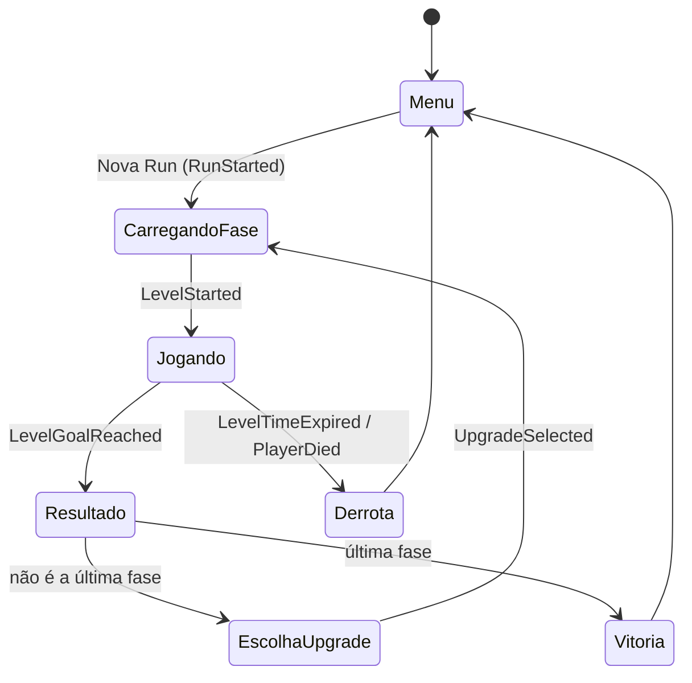
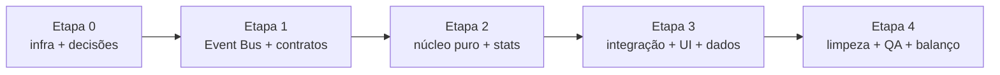

# Plano de refactor — Roguelike + arquitetura event-driven

Projeto: `Projetos Grupo 5` (Unity 6000.1.7f1) · Plano escrito em 28/09/2026 · Base: branch `refactor/roguelike`, criada a partir de `main` @ `8df28c9` (bugfixes do [RELATORIO_BUGS.md](RELATORIO_BUGS.md) já commitados).

---

## 1. De onde para onde

| | Design antigo (inacabado) | Design novo |
|---|---|---|
| Loop | Fase → loja (moedas) → fase | Fase → escolher 1 de 3 upgrades → fase |
| Progressão | Moedas persistentes, compras permanentes | Run roguelike; tudo zera ao fim da run |
| Falha | Timer regressivo por fase | Fase precisa ser concluída abaixo de **x** segundos |
| Recompensa | Preço fixo na loja | 4 raridades; a chance de cada uma depende do desempenho na fase anterior |
| Kit inicial | Pulo duplo, wall jump e gancho liberados | Sem pulo duplo, sem gancho, sem wall grab, sem power-ups |
| Uma run | — | A sequência de fases que existe hoje (hoje: `PrimeiraFase`, `QuartaFase 1`, `QuintaFase`) |

### Fluxo da run



---

## 2. Decisões que precisam ser tomadas antes da Etapa 1

Cada uma tem um padrão recomendado; se o time não decidir, o plano segue com ele.

| # | Decisão | Recomendação |
|---|---------|--------------|
| **D1** | Toda fase tem que ser completável só com o kit base? Se a Quinta exigir o gancho e ele não aparecer nas ofertas, a run fica impossível. | **Sim**: toda fase completável com o kit base; habilidades só deixam mais rápido. Alternativa: garantir uma habilidade de mobilidade nas 2 primeiras ofertas. |
| **D2** | O que fazer com as moedas | **Remover no MVP.** Mais tarde podem virar bônus de tempo (ex.: −0,5 s por moeda). |
| **D3** | Estourar o tempo ou morrer para um inimigo | **Fim da run** (roguelike clássico). Uma "vida extra" pode existir como upgrade Lendário. |
| **D4** | Quais fases e em que ordem | As 3 do build, em ordem fixa. Incluir `SegundaFase`/`TerceiraFase`/`SextaFase` vira só adicionar um asset `LevelDefinition` depois. |
| **D5** | Upgrades acumulam (stack)? | Sim, com `maxStacks` por upgrade. |
| **D6** | Valores de x (limite) e do tempo-alvo por fase | Placeholders: limite = timer atual (20 s / 30 s / 25 s), alvo = 60 % do limite. Ajustar em playtest (Etapa 4). |
| **D7** | Reroll / pular oferta | Fora do MVP. A arquitetura deixa espaço para isso. |

---

## 3. Arquitetura alvo

### 3.1 Princípios
1. **Eventos para fatos, chamadas diretas para comandos.** Se algo *aconteceu* (fase concluída, jogador morreu), vai pelo Event Bus. Se um sistema *manda* outro fazer algo dentro do mesmo domínio (o RunManager pede ao SceneLoader para carregar uma cena), é chamada direta.
2. **Lógica pura em C# comum; MonoBehaviour só como adaptador.** RunFlow, sorteio de raridade, geração de ofertas e cálculo de stats não dependem de cena, então são testáveis em EditMode e fáceis de delegar a modelos mais baratos.
3. **Dados em ScriptableObject.** Upgrades, raridades, fases e a configuração da run são assets. Criar um upgrade novo não exige código.
4. **Nenhum `FindObjectOfType` para descobrir dependências.** Quem precisa do jogador ouve `PlayerSpawned`.

### 3.2 Onde fica o código novo

```
Assets/_Roguelike/
  Core/                      ← asmdef Roguelike.Core (auto-referenciado pelo Assembly-CSharp)
    EventBus/                  IEvent, EventBus<T>, EventBusRegistry
    Events/                    GameEvents.cs (todos os structs de evento)
    Run/                       RunFlow (máquina de estados), RunState, PerformanceEvaluator
    Upgrades/                  UpgradeDefinition, RarityDefinition, RarityTable,
                               UpgradeOfferGenerator, StatModifier, StatType, AbilityFlags
    Stats/                     PlayerStats (base + modificadores)
    Levels/                    LevelDefinition, RunConfig
  Tests/EditMode/            ← asmdef Roguelike.Tests.EditMode
  Editor/                    ← asmdef Roguelike.Editor (só Editor): TestRunnerBridge e ferramentas
  Data/                      ← assets .asset (Upgrades/, Rarities/, Levels/, RunConfig)
  Prefabs/                   ← RunSystems (DDOL), RunUI
Assets/scripts/              ← MonoBehaviours legados e adaptadores novos continuam no Assembly-CSharp
```

> **Por que só um asmdef:** os MonoBehaviours legados (`characterMovement`, `GrapplingHook`…) estão no Assembly-CSharp, e um asmdef não pode referenciar o Assembly-CSharp. Pôr só a lógica pura em `Roguelike.Core` permite testes EditMode sem mover scripts antigos (mover arrisca os GUIDs dos `.meta` e quebrar referências em cenas).

### 3.3 Event Bus

```csharp
public interface IEvent { }

public static class EventBus<T> where T : struct, IEvent
{
    public static void Subscribe(Action<T> handler);
    public static void Unsubscribe(Action<T> handler);
    public static void Raise(in T evt);   // itera sobre uma cópia; desinscrever durante o Raise é seguro
    internal static void Clear();
}
// EventBusRegistry: [RuntimeInitializeOnLoadMethod(SubsystemRegistration)] limpa todos os barramentos
// (seguro mesmo com "Enter Play Mode Options" ativado). Log opcional "[EventBus] - Raise X" atrás de flag.
```

Regras: assinar em `OnEnable`, desassinar em `OnDisable`. Eventos são `readonly struct`, com nome no passado.

### 3.4 Catálogo de eventos (MVP)

| Evento | Payload | Emissor | Ouvintes |
|---|---|---|---|
| `RunStarted` | seed, RunConfig | RunManager | RunUI, PlayerStats (reset) |
| `LevelStarted` | índice, LevelDefinition, limite efetivo | RunManager | LevelTimer, HUD |
| `PlayerSpawned` | GameObject | Spawner | CameraFollow, EnemyAI, LevelTimer |
| `LevelTimeChanged` | segundos (granularidade de 0,1 s) | LevelTimer | HUD |
| `LevelTimeExpired` | — | LevelTimer | RunManager, characterMovement |
| `PlayerDied` | causa | characterMovement | RunManager, LevelTimer (para) |
| `LevelGoalReached` | — | EndGoal | LevelTimer (para), RunManager |
| `LevelCompleted` | índice, tempo, limite, desempenho 0–1, nota | RunManager | LevelResultView, telemetria |
| `UpgradeOffersGenerated` | 3× (UpgradeDefinition, raridade) | RunManager | UpgradeSelectionView |
| `UpgradeSelected` | UpgradeDefinition | UpgradeSelectionView | RunManager, PlayerStats |
| `PlayerStatsChanged` | snapshot dos stats | PlayerStats | characterMovement, GrapplingHook, HUD |
| `RunEnded` | vitória/derrota, RunSummary | RunManager | RunEndView, telemetria |

### 3.5 Upgrades, raridade e desempenho

**Desempenho** na fase: `p = clamp01((limite − tempo) / (limite − alvo))`. Terminar no tempo-alvo ou abaixo dá `p = 1`; terminar no limite dá `p = 0`. Nota para a UI: S ≥ 0,9 · A ≥ 0,66 · B ≥ 0,33 · C.

**Raridade**: `RarityTable` guarda uma `AnimationCurve` de peso por raridade em função de `p`, e os pesos são normalizados. Valores iniciais:

| Raridade | Peso com p = 0 (lento) | Peso com p = 1 (perfeito) |
|---|---|---|
| Comum | 70 | 25 |
| Raro | 25 | 40 |
| Épico | 5 | 25 |
| Lendário | 0 | 10 |

**Geração de ofertas** (`UpgradeOfferGenerator`, determinística):
1. `rng = new System.Random(hash(seedDaRun, índiceDaFase))`
2. Para cada um dos 3 slots: sorteia a raridade pelos pesos de `p` e escolhe um upgrade dessa raridade que seja **elegível** (stacks < `maxStacks`, pré-requisitos adquiridos, ainda não oferecido nesta rodada).
3. Se não houver candidato, tenta a raridade abaixo, depois a acima. Se ainda assim não houver, o slot fica vazio.

**Upgrade como dado**: `UpgradeDefinition` = id, nome, descrição, ícone, raridade, `maxStacks`, `prerequisites[]`, `List<StatModifier>` (StatType, Add/Multiply, valor) e `AbilityFlags unlocks`. O ponto de extensão para efeitos especiais no futuro é uma lista opcional de `UpgradeEffect` (ScriptableObject abstrato).

**`StatType`** (mapeia para os campos que já existem): `MaxSpeed`, `Acceleration`, `AirAcceleration`, `JumpHeight`, `CoyoteTime`, `WallSlideSpeed`, `MaxAirJumps`, `GrappleRadius`, `GrappleCooldown`, `GrappleLaunchForce`, `TimeLimitBonus`.
**`AbilityFlags`**: `WallGrab`, `GrapplingHook`. O pulo duplo é `MaxAirJumps` ≥ 1; no kit base `MaxAirJumps = 0`.

Conteúdo inicial (placeholder de design; nomes e raridades são ajustáveis):

| Raridade | Upgrade | Efeito | Stack | Requer |
|---|---|---|---|---|
| Comum | Passos Leves | +8 % velocidade máxima | 3 | — |
| Comum | Arranque | +15 % aceleração | 3 | — |
| Comum | Mola | +8 % altura do pulo | 2 | — |
| Comum | Controle Aéreo | +20 % aceleração no ar | 2 | — |
| Raro | Coyote Estendido | +0,08 s de coyote time | 1 | — |
| Raro | Gancho Rápido | −30 % cooldown do gancho | 2 | Gancho |
| Raro | Alcance do Gancho | +25 % raio do gancho | 2 | Gancho |
| Raro | Deslize Lento | −40 % velocidade de deslize na parede | 1 | Wall Grab |
| Épico | Pulo Duplo | +1 pulo aéreo | 1 | — |
| Épico | Wall Grab | desbloqueia deslizar e pular na parede | 1 | — |
| Épico | Gancho | desbloqueia o gancho | 1 | — |
| Lendário | Pulo Triplo | +1 pulo aéreo | 1 | Pulo Duplo |
| Lendário | Impulso do Gancho | +40 % força de lançamento | 1 | Gancho |
| Lendário | Relógio de Bolso | +5 s no limite de todas as fases | 1 | — |

### 3.6 O que sai
`ShopManager`, `ButtonInfo`, `Item shop.prefab`, a economia de moedas (conforme D2), `PlayerData` (a run vive em memória; persistem só volume, VSync e, opcionalmente, recordes), `SaveManager`/`SaveData`/`PlayerSaveController`, `MovementDiagnostic`, `playerData.prefab`, `SceneController` (substituído pelo `RunManager`), o `Timer` regressivo (substituído pelo `LevelTimer`) e o botão "Continuar".

---

## 4. Modelos, esforço e custo-benefício

### 4.1 Preços (API, por milhão de tokens)

| Modelo | Entrada | Saída | Contexto | Controle de esforço |
|---|---|---|---|---|
| Fable 5.1 | $10 | $50 | 1M | low → max |
| **Opus 5.5** | **$4** | **$20** | 1M | low → max (**padrão `medium`**) |
| Sonnet 5 | $2 | $10 | 1M | low → max |
| Haiku 4.5 | $1 | $5 | 200K | não tem |

No plano de assinatura não há cobrança por token, mas a janela de 5 h e o limite semanal são consumidos mais rápido pelos modelos mais caros. A proporção de preço é uma boa aproximação do quanto cada modelo "pesa".

### 4.2 Por que o Opus 5.5 muda a conta
- Custa **só 2× o Sonnet 5** e 4× o Haiku, e é 20 % mais barato que o Opus 5. Com essa diferença, compensa usar Opus sempre que houver chance real de o Sonnet precisar de retrabalho: uma rodada extra de correção mais a verificação do orquestrador já custam mais que a diferença de preço. O que importa é o **custo por tarefa concluída**, não por requisição.
- Na sessão de ontem, o agente Opus fez a tarefa mais arriscada (cenas + prefabs + singleton; 57 chamadas de ferramenta, 165k tokens) sem retrabalho e ainda encontrou 5 problemas extras. O Sonnet (95k) entregou bem uma tarefa bem especificada. O Haiku (71k) fez o trabalho certo, mas o relatório veio vago e eu tive que conferir tudo de novo, o que comeu parte da economia.
- O esforço padrão do Opus 5.5 é `medium` (um nível abaixo do Opus 5). Para trabalho agêntico de código com risco, use `high`; `xhigh` só para os contratos da arquitetura; `max` nunca neste projeto.
- **Fable 5.1** custa 2,5× o Opus 5.5. Neste escopo (um refactor Unity bem delimitado), o ganho não paga no plano Pro. **Não usar.**

### 4.3 Elenco de agentes
Na ferramenta de delegação só dá para escolher o modelo; **o esforço vem da definição do agente** em `.claude/agents/*.md`. Por isso a Etapa 0 cria estas definições:

| Agente | Modelo · esforço | Quando usar |
|---|---|---|
| `arquiteto` | Opus 5.5 · **xhigh** | Contratos, ADRs e decisões que atravessam o projeto. 1 a 2 vezes no projeto todo. |
| `dev-core` | Opus 5.5 · **high** | Refactors com risco de regressão: movimento, fluxo da run, adaptadores. |
| `integrador-unity` | Opus 5.5 · **medium** | Cenas, prefabs e assets via Unity MCP. Erro ali é caro de achar; `medium` basta porque a tarefa vem especificada. |
| `revisor` | Opus 5.5 · **high** | `/code-review` ao fim de cada etapa. |
| `dev` | Sonnet 5 · **high** | Implementar a partir de contrato + testes (algoritmos, views, EventBus). |
| `mecanico` | Haiku 4.5 · — | Tarefas mecânicas **com verificação automática** (teste, compilação ou script): criar assets a partir de tabela, apagar código morto após checar referências, docs. |
| *Orquestrador* (sessão principal) | Opus 5.5 · **medium** | Lê o plano, dispara os agentes, verifica compilação e testes, atualiza o progresso. |

Exemplo de definição (o campo `effort` foi validado na tarefa 0.3; as definições reais usam IDs completos, como `claude-opus-5-5`, para fixar a versão do modelo):

```markdown
---
name: dev-core
description: Refactors de gameplay com risco de regressão no projeto Unity (movimento, fluxo da run).
model: opus
effort: high
---
Você trabalha num projeto Unity 6 com Event Bus (ver PLANO_REFACTOR_ROGUELIKE.md §3). ...
```

### 4.4 Regras de delegação (valem para toda tarefa)
- **Posse de arquivos:** cada agente recebe a lista exata de arquivos que pode editar. Agentes em paralelo nunca compartilham arquivos.
- **Trava do Editor:** só **um** agente por vez usa o Unity MCP para cenas, prefabs e assets (existe um único Editor aberto). Agentes que só editam `.cs` podem rodar em paralelo.
- **Sem worktrees:** o Editor está preso à pasta principal, então um worktree não compila nem testa.
- **Todo prompt de delegação traz:** contrato/interfaces, arquivos que o agente possui, arquivos proibidos, se usa o Editor, definição de pronto, como verificar, e o formato de relatório (arquivos alterados + saída da verificação + pendências). Isso evita relatórios vagos como o do Haiku ontem.
- **Commits são feitos só por você (João), nunca por um agente.** Isso vale para o orquestrador e para os subagentes: ninguém roda `git commit`, `git push` ou comandos que reescrevam histórico. Ao fim da etapa, o orquestrador entrega o título e a descrição do commit, e você faz o commit.
- **Não é preciso fatiar em commits pequenos.** Um commit por etapa (ou por ponto de corte ✂️) é suficiente, com uma descrição que liste o que mudou.

---

## 5. Etapas (cada uma cabe numa janela de 5 h)

**Orçamento:** medição agora, plano **Pro**: janela de 5 h em 28 %, **semanal em 74 %** (renova em ~1 h). No Pro, o limite semanal aperta antes da janela. Por isso:
- **no máximo 1 etapa por dia**;
- confira a barra de uso do app antes de começar e no meio da etapa. Se passar de **80 %** da janela, pare no ponto de corte ✂️ da etapa e deixe o resto para a próxima;
- **comece cada etapa numa sessão nova.** Esta sessão já tem 234k tokens de contexto, reenviados a cada turno. O plano e o checklist deste arquivo são a memória entre sessões.

Os tokens estimados são somente dos subagentes, com base na calibração de ontem. A Etapa 0 serve para confirmar quanto de uma janela Pro isso representa.

### Etapa 0 — Preparação e infraestrutura (~150k)
| ✓ | # | Tarefa | Agente | Paralelo | Editor | Pronto quando |
|---|---|---|---|---|---|---|
| ☑ | 0.1 | Commitar os bugfixes atuais numa branch `refactor/roguelike` (separar o commit do pacote AI Assistant). Formato `[Tipo] - Título`. | Orquestrador | — | não | `git log` limpo, working tree limpa |
| ☑ | 0.2 | `QuartaFase.unity` tem 34 marcadores de conflito: checar se o GUID é referenciado; se não for, remover; se for, restaurar do git. | `mecanico` | sim | não | Nenhum `<<<<<<<` no repo |
| ◐ | 0.3 | Criar as 6 definições de agente em `.claude/agents/` e confirmar que aparecem com o modelo e o esforço certos. | `mecanico` | sim | não | Agentes listados |
| ☑ | 0.4 | asmdefs `Roguelike.Core` + `Roguelike.Tests.EditMode`; utilitário `TestRunnerBridge` (Editor) que roda os testes EditMode via `TestRunnerApi` e grava `Temp/TestResults.json`; um teste simples passando via MCP. | `dev` | sim | sim | Resultado lido via MCP |
| ☑ | 0.5 | Configurar o Smart Merge do Unity (UnityYAMLMerge) para `.unity`/`.prefab`, para evitar outro `QuartaFase` no trabalho em grupo. | `mecanico` | sim | não | `.gitattributes` + instrução no README |
| ☐ | 0.6 | Registrar as decisões D1–D7 (seção 2). | **Humanos (time)** | — | — | Seção 2 atualizada |

**Notas da execução (28/09/2026):**
- **0.1:** os bugfixes já tinham sido commitados e enviados em `main` (`8df28c9`), junto com o pacote AI Assistant e fora do formato `[Tipo] - Título`. Separar o pacote exigiria reescrever o histórico já publicado, por isso ficou como está. A branch `refactor/roguelike` foi criada a partir de `8df28c9`.
- **0.2:** o GUID `9a0a9620…` tinha zero referências, a cena não estava no build nem era carregada pelo nome. Foi substituída por `QuartaFase 1` (commit `2350525`, "git conflict fix") e removida.
- **0.3 (◐):** o campo `effort` foi validado na documentação. Como `.claude/agents/` é uma pasta nova, os agentes **só aparecem numa sessão nova**. Confirmar na abertura da Etapa 1 e então marcar ☑.
- **0.4:** foi feita pelo orquestrador, porque as definições de agente ainda não carregam nesta sessão. Foi preciso um terceiro asmdef, `Roguelike.Editor` (só Editor), para o bridge. O caminho de falha foi provado com um teste que falha de propósito (nome, mensagem e stack trace aparecem no JSON), e esse teste foi apagado depois. Estado final: 1/1 verde.
- **0.5:** `.gitattributes` cobre `.unity`, `.prefab` e `.asset`. O driver usa `--fallback none`, porque sem ele um conflito real trava o `git merge` tentando abrir uma ferramenta gráfica. Testado num repositório descartável: dois objetos adicionados no fim da mesma cena são combinados sem conflito; o mesmo campo alterado nos dois lados gera conflito (`UU`) com YAML válido. O driver também foi registrado no `.git/config` deste clone.

### Etapa 1 — Event Bus e contratos (~450k)
| ✓ | # | Tarefa | Agente | Depende | Editor | Pronto quando |
|---|---|---|---|---|---|---|
| ☐ | 1.1 | `ARQUITETURA.md` + esqueletos **compiláveis** de todos os contratos da §3: IEvent, GameEvents, StatType/StatModifier/AbilityFlags, PlayerStats, UpgradeDefinition, RarityDefinition/RarityTable, LevelDefinition, RunConfig, interfaces de RunFlow e OfferGenerator. | `arquiteto` | 0.4 | compilar | Compila; contratos revisados por você |
| ☐ | 1.2 | `EventBus<T>` + `EventBusRegistry` + testes (inscrever/desinscrever durante `Raise`, limpeza, ordem). | `dev` | 1.1 | testes | Testes verdes |
| ✂️ | | *Ponto de corte* | | | | |
| ☐ | 1.3 | Migração gradual para eventos com **o jogo continuando jogável**: EndGoal → `LevelGoalReached`; `characterMovement.Die`/EnemyBullet → `PlayerDied`; Timer → `LevelTimeExpired`; `SceneController.OnPlayerSpawned` → `PlayerSpawned` (CameraFollow e Timer passam a ouvir). Remover os `FindFirstObjectByType` que viraram desnecessários. | `dev` | 1.2 | compilar | Fluxo antigo funciona; nenhum acoplamento direto entre esses sistemas |
| ☐ | 1.4 | Revisão da etapa + 10 min de playtest humano. | `revisor` + humano | 1.3 | — | Sem achados críticos |

### Etapa 2 — Núcleo roguelike (~400k)
2.1, 2.2 e 2.3 rodam **em paralelo** (arquivos disjuntos, lógica pura).

| ✓ | # | Tarefa | Agente | Depende | Editor | Pronto quando |
|---|---|---|---|---|---|---|
| ☐ | 2.1 | `PlayerStats` (base + modificadores Add/Multiply, flags) + `PlayerBaseStats` SO com **os valores atuais do Cyborg**. Testes de "valores de referência": `jumpSpeed` e gravidade calculados iguais aos de hoje. | `dev` | 1.1 | testes | Testes verdes |
| ☐ | 2.2 | `PerformanceEvaluator` + `RarityRoller` + `UpgradeOfferGenerator` (com seed) + testes: distribuição com seed fixa, elegibilidade, pré-requisitos, sem duplicatas, fallback de raridade. | `dev` | 1.1 | testes | Testes verdes |
| ☐ | 2.3 | `RunFlow` (máquina de estados pura da §1) + `RunState` + testes de todas as transições, inclusive derrota e última fase. | `dev-core` | 1.1 | testes | Testes verdes |
| ✂️ | | *Ponto de corte* | | | | |
| ☐ | 2.4 | `characterMovement` e `GrapplingHook` passam a ler `PlayerStats` e reagir a `PlayerStatsChanged`; kit base sem pulo duplo, gancho ou wall grab; `RefreshStats` e dependência de `PlayerData` removidos. | `dev-core` | 2.1 | compilar + play | Sensação do movimento base idêntica; habilidades ligam por stats |
| ☐ | 2.5 | Revisão da etapa. | `revisor` | 2.4 | — | Sem achados críticos |

### Etapa 3 — Integração: run, timer, UI e conteúdo (~450k)
| ✓ | # | Tarefa | Agente | Depende | Editor | Pronto quando |
|---|---|---|---|---|---|---|
| ☐ | 3.1 | `RunManager` (DDOL, adaptador do `RunFlow`; substitui o `SceneController`) + `SceneLoader` + `LevelTimer` (conta para cima com limite, emite eventos, respeita `TimeLimitBonus`). | `dev-core` | 2.3 | compilar | Compila; eventos emitidos na ordem da §3.4 |
| ☐ | 3.2 | Views (código): HUD do timer, `LevelResultView` (tempo, nota), `UpgradeSelectionView` + `UpgradeCardView` (cor por raridade, teclado/gamepad via Input System, tempo não escalado com o jogo pausado), `RunEndView`. Só ouvem e emitem eventos. | `dev` | 1.1 | compilar | Compila; nenhuma referência direta ao RunManager |
| ☐ | 3.3 | Criar os assets via MCP a partir das tabelas da §3.5: 4 raridades, `RarityTable`, 14 upgrades, 3 `LevelDefinition`, `RunConfig` + teste `DataValidationTests` (ids únicos, pré-requisitos existem, toda raridade tem candidatos). | `mecanico` | 1.1 | **sim** | Teste de validação verde |
| ✂️ | | *Ponto de corte* | | | | |
| ☐ | 3.4 | Montar prefabs e cenas via MCP: prefab `RunSystems` (RunManager, SceneLoader, canvas `RunUI` DDOL com as views); MainMenu com "Nova Run" e sem "Continuar"; fases com `LevelTimer` e referência à `LevelDefinition`, sem o Timer/GameOver antigos; EndGame → RunEnd. | `integrador-unity` | 3.1–3.3 | **sim (trava)** | Run completa jogável do menu à tela final |
| ☐ | 3.5 | Revisão da etapa + playtest humano de uma run completa. | `revisor` + humano | 3.4 | — | Run jogável sem erros no Console |

### Etapa 4 — Limpeza, QA e balanceamento (~350k)
| ✓ | # | Tarefa | Agente | Depende | Editor | Pronto quando |
|---|---|---|---|---|---|---|
| ☐ | 4.1 | Remover o legado da §3.6. **Antes de apagar**, um script lista as referências por GUID em cenas e prefabs; só apaga o que tiver zero referências. | `mecanico` | 3.4 | **sim** | Compila; Console limpo; lista do que foi apagado |
| ☐ | 4.2 | Smoke test automatizado via MCP: Nova Run → `LevelGoalReached` simulado → 3 ofertas → `UpgradeSelected` → próxima fase → … → `RunEnded`. | `dev` | 3.4 | sim | Teste passa |
| ☐ | 4.3 | Telemetria de playtest: CSV em `persistentDataPath` com tempo por fase, nota, raridades oferecidas e upgrade escolhido. | `dev` | 3.1 | não | CSV gerado numa run |
| ✂️ | | *Ponto de corte* | | | | |
| ☐ | 4.4 | Playtests do time + ajuste do limite e do alvo por fase e das curvas de raridade (análise do CSV e aplicação nos assets). | Humanos + `integrador-unity` | 4.3 | sim | Valores de D6 definidos |
| ☐ | 4.5 | Revisão final da branch (`/code-review high`) antes do PR. | `revisor` | 4.4 | — | Sem achados críticos |
| ☐ | 4.6 | README: como adicionar upgrade, fase e evento. | `mecanico` | 4.5 | não | Doc revisada |

### Dependências entre etapas



Distribuição de uso por modelo (aproximada, por número de tarefas): Opus 5.5 ≈ 45 % (arquitetura, núcleo com risco, integração no Editor, revisões), Sonnet 5 ≈ 35 % (implementação a partir de contratos), Haiku 4.5 ≈ 20 % (mecânico com verificação).

---

## 6. Como rodar uma etapa

1. Abra uma **sessão nova** com Opus 5.5 e peça: *"Execute a Etapa N do PLANO_REFACTOR_ROGUELIKE.md"*.
2. O orquestrador lê o plano e o checklist, dispara as tarefas na ordem e no paralelismo das tabelas e respeita a trava do Editor.
3. Depois de cada tarefa, o orquestrador verifica compilação e testes via MCP antes de marcar ☑.
4. Ao fim (ou no ponto de corte ✂️), ele atualiza os ☐ deste arquivo e entrega o título (`[Tipo] - Título`) e a descrição do commit da etapa. **Você faz o commit**; nenhum agente commita (ver §4.4).

### 6.1 Receita de verificação no Editor (Unity MCP)
O `unity-mcp` deste projeto é o relay oficial do Unity AI Assistant. As tools úteis são `Unity_RunCommand` (compila e executa C# de Editor; a classe precisa se chamar `CommandScript` e implementar `IRunCommand`) e `Unity_GetConsoleLogs`. **Não existem** `run_tests`, `execute_menu_item` nem `manage_scene`, que o skill `unity-mcp-skill` descreve para outro servidor. O Editor precisa estar aberto.

1. **Importar o que mudou:** depois de criar ou editar `.cs`/`.asmdef`, rode `Unity_RunCommand` com `AssetDatabase.Refresh()`. Fora de foco, o Editor não faz o refresh sozinho.
2. **Esperar a recompilação:** enquanto a Unity recompila, o MCP responde `Unity not detected (no fresh discovery files found)`. Basta repetir a chamada.
3. **Erros de compilação:** `Unity_GetConsoleLogs` com `logTypes: "error"` deve voltar `errorCount: 0`.
4. **Testes:** `Unity_RunCommand` chamando `Roguelike.EditorTools.TestRunnerBridge.RunEditModeTests()` (ou `Run(caminho, callback)` para receber o relatório no log do comando). Depois, leia `Temp/TestResults.json` e confira `status: "finished"`, um `startedAt` recente e `failed: 0`. A execução é síncrona: testes `[UnityTest]` ficam de fora.
5. **Cenas/prefabs/assets:** C# de Editor via `Unity_RunCommand` (`EditorSceneManager`, `PrefabUtility`, `SerializedObject`, `AssetDatabase`), nunca edição de YAML como texto.

## 7. Convenções (alinhadas ao guideline da equipe)
- Identificadores em inglês; comentários e logs em português, como o código atual.
- Logs no formato `[Área] - mensagem` (ex.: `[RunManager] - Fase 2 concluída em 18.4s`); logs temporários marcados com `// [DEBUG]`.
- Valores de balanceamento em ScriptableObject ou `[SerializeField]`, nunca fixos no código.
- Commits no formato `[Tipo] - Título`, feitos por você; um commit por etapa basta.
- Cada evento novo entra no catálogo da §3.4 no mesmo PR.

## 8. Riscos
| Risco | Mitigação |
|---|---|
| Fase impossível sem a habilidade certa | D1 + teste de playtest com kit base na Etapa 4 |
| O movimento muda de sensação ao migrar para `PlayerStats` | Testes de valores de referência (2.1) e playtest (2.4) |
| Assinantes do Event Bus vazando entre cenas | Regra `OnEnable`/`OnDisable`, limpeza em `SubsystemRegistration`, log de debug |
| Conflitos YAML com colegas em `.unity`/`.prefab` | Smart Merge (0.5) + avisar o time antes das Etapas 3 e 4 sobre quais cenas estão sendo editadas |
| Etapa não cabe na janela Pro | Pontos de corte ✂️; recalibrar depois da Etapa 0 |
| Agente barato devolvendo trabalho incompleto | Toda tarefa de Haiku tem verificação automática; relatório em formato fixo |
