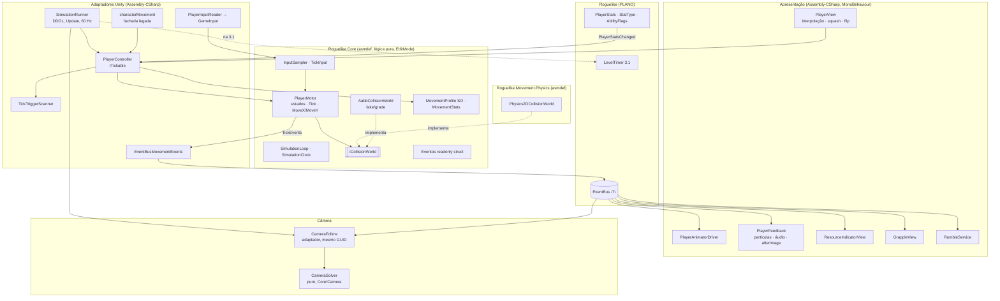
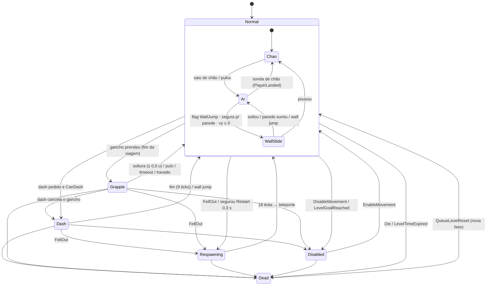

# SPEC — Controlador de movimento do Cyborg (refactor completo)

| | |
|---|---|
| **Status** | Rascunho para revisão do time · 29/09/2026 |
| **Documento anterior** | [PRD.md](PRD.md) (o "o quê": RF-01…RF-68, RNF-01…RNF-12, M01–M34) |
| **Base** | [PLANO_REFACTOR_ROGUELIKE.md](PLANO_REFACTOR_ROGUELIKE.md) (PLANO) · [auditoria-movimento-atual.md](docs/pesquisa/auditoria-movimento-atual.md) (AUD) · [movimentacao-implementacao.md](docs/pesquisa/movimentacao-implementacao.md) (IMP) · [movimentacao-gamefeel.md](docs/pesquisa/movimentacao-gamefeel.md) (GF) |
| **Quem executa** | Agentes do elenco do PLANO §4.3, pelas tarefas **M.1…M.18** da §17 |
| **Projeto** | Unity 6000.1.7f1 · URP 2D · Input System 1.14.2 · LDtk 6.11.2 · Test Framework 1.5.1 |

**Convenções.**
- **u** = unidade Unity (1 tile = 1 u). **tick** = 1 passo da simulação do jogador, a **60 Hz** (`dt = 1/60 s`).
- Conversão de tempo para ticks, em todo o código: `TickMath.ToTicks(s) = max(1, (int)Math.Round(s · 60, MidpointRounding.AwayFromZero))` para durações positivas. Tabela usada no SPEC: 0,05 s = 3 · 0,06 s = 4 · 0,1 s = 6 · 0,15 s = 9 · 0,16 s = 10 · 0,2 s = 12 · 0,3 s = 18 · 0,5 s = 30 · 3 s = 180.
- Valores marcados **(inicial — calibrar)** são novos, não vêm do PRD, e devem ser ajustados em playtest. Todo o resto vem do PRD §7.2/§9.1 ou das simulações do §7 deste SPEC.
- Identificadores em inglês; comentários e logs em português; logs no formato `[Movement] - …` (PLANO §7).
- "Pronto quando" de cada tarefa está na §17; a rastreabilidade RF/RNF/M → seção → tarefa → teste está na §18.
- As simulações citadas (sim.) foram feitas com a mesma ordem de operações da §6.3, a 60 Hz. Os testes EditMode congelam esses números.

---

## 1. Decisões

As recomendações do PRD §12.3 valem como decisão até o time dizer o contrário. As decisões **DS-xx** são deste SPEC (interpretações e escolhas técnicas que o PRD deixou em aberto).

| ID | Decisão | Estado |
|---|---|---|
| Q1 | Simulação do jogador a **60 Hz**, num loop próprio em `Update` (§3). `Time.fixedDeltaTime` do projeto **não muda** (0,02) | adotada por padrão — confirmar |
| Q2 | Controlador **cinemático próprio**, resolução por eixo (X antes de Y), `BoxCast` com *skin* (§5) | adotada por padrão — confirmar |
| Q3 | Queda para fora da fase = **respawn no último chão seguro** em ≤ 0,5 s; o timer continua. Morte por bala/inimigo/tempo continua fim de run (D3) | adotada por padrão — confirmar |
| Q4 | **Freeze fora do timer**; tempo de fase em ticks; freeze em ticks, nunca `Time.timeScale` | adotada por padrão — confirmar |
| Q5 | **Dash é P1** (Épico), com placeholder visual | adotada por padrão — confirmar |
| Q6 | Paredes invisíveis (layer Default) **bloqueiam e contam como teto**, sem wall slide/jump | adotada por padrão — confirmar |
| Q7 | **Câmera própria evoluída** (`CameraFollow` reescrito no mesmo arquivo/GUID) | adotada por padrão — confirmar |
| Q8 | Área visível **20 × 11,25 u** (ortho 5,625 em 16:9); **pixel snap adiado** (RNF-12, P2) | adotada por padrão — confirmar |
| Q9 | Inimigos sólidos: servem de chão, teto e bloqueio lateral, **não** de parede para wall jump; dano só das balas | adotada por padrão — confirmar |
| Q10 | Pulo aéreo = **85 %** da altura do pulo do chão (3,0 u) | adotada por padrão — confirmar |
| Q11 | "Voltar ao spawn" **não zera** o timer | adotada por padrão — confirmar |
| Q12 | Wall jump **não** recarrega o dash no kit (upgrade "Recarga na Parede") | adotada por padrão — confirmar |
| Q13 | Input horizontal **digital** (−1/0/+1), zona morta 0,3 no stick | adotada por padrão — confirmar |
| Q14 | Impulso horizontal do pulo (+4 u/s) **no kit base** | adotada por padrão — confirmar |
| Q15 | Refactor = **Etapa M**, depois da Etapa 1, fechando **antes da 2.4** (§17.3) | adotada por padrão — confirmar |
| D1 | **Opção B** do PRD §10.3 (pulo base 3,5 u + edição de geometria; C só como contingência) | adotada por padrão — confirmar |
| DS-01 | Núcleo puro em `Assets/_Roguelike/Core/Movement/` (asmdef **`Roguelike.Core`**); adaptador Physics2D num asmdef pequeno **`Roguelike.Movement.Physics`** (§2.2) | decisão do SPEC — revisar |
| DS-02 | `SimulationRunner` (DDOL, `Update`, ordem −50) avança jogador, câmera e (na 3.1) `LevelTimer` no mesmo relógio | decisão do SPEC — revisar |
| DS-03 | Input pela **classe gerada `PlayerControls`** via serviço `GameInput`; o componente `PlayerInput` sai do prefab (§4) | decisão do SPEC — revisar |
| DS-04 | Root do `Cyborg.prefab` com **escala 1** e **origem nos pés**; a escala 1,7 fica só no sprite filho (§13.2) | decisão do SPEC — revisar |
| DS-05 | `characterMovement.cs` (mesmo GUID) vira **fachada**; lógica nova em `PlayerController`; `CharacterAnimator` e `GrapplingHook` são removidos na virada (§13) | decisão do SPEC — revisar |
| DS-06 | Prioridade do pulo: **no chão, o pulo do chão vence o wall jump**; no ar vale a ordem do PRD §5.2 (parede → coyote → aéreo) (§7.5) | decisão do SPEC — revisar |
| DS-07 | `JumpHeight` é o parâmetro primário; `JumpSpeed` é **derivado por solver** com gravidade fixa (§8.3) | decisão do SPEC — revisar |
| DS-08 | Lançamento do gancho **34 u/s** (o "~33" do PRD dá 4,68 u no integrador discreto; M30 exige 5 ± 0,3) | decisão do SPEC — revisar |
| DS-09 | A regra "dash nunca reduz X maior no mesmo sentido" vale **no início e na saída** do dash (RF-25) | decisão do SPEC — revisar |
| DS-10 | Wall slide usa freio próprio de **150 u/s²** (com a gravidade de 110 o teto de 2,5 u/s levaria 0,13 s; RF-17 pede ≤ 0,1 s) | decisão do SPEC — revisar |
| DS-11 | Colisor de inimigo que **já sobrepõe** o jogador no início de um cast é ignorado (inimigo andando não prende nem empurra) | decisão do SPEC — revisar |
| DS-12 | `EndGoal` e `KillZone` são detectados por **varredura no tick** (não por `OnTriggerEnter2D`), para o tempo de fase ser determinístico | decisão do SPEC — revisar |
| DS-13 | A layer 7 "Wall" (sem uso, AUD §3) é renomeada para **"KillZone"** | decisão do SPEC — revisar |
| DS-14 | A câmera é **simulada no tick** e interpolada no render (única forma de cumprir o ± 0,01 u do RF-46) | decisão do SPEC — revisar |
| DS-15 | Animator dirigido por **um parâmetro `State` (int)** + transições Any State de 0 s, sem exit time e sem triggers | decisão do SPEC — revisar |
| DS-16 | Gancho: o botão é **toque**; "lança ao soltar" = soltura automática ao chegar a ≤ 0,5 u da âncora; cooldown conta **do disparo** (PRD §5.2) | decisão do SPEC — revisar |
| DS-17 | `PlayerActionDenied` sai **quando o aperto expira do buffer** (motivo `NoCharge`/`Cooldown`) ou **na hora** (`Locked`/`NoTarget`) | decisão do SPEC — revisar |
| DS-18 | Velocidade horizontal do wall jump **fixa em 14 u/s** (invariante; não acompanha upgrades de `MaxSpeed`/impulso) | decisão do SPEC — revisar |
| DS-19 | Teto global de velocidade **48 u/s por eixo** (inicial — calibrar); cobre o gancho com +40 % (47,6 u/s) | decisão do SPEC — revisar |
| DS-20 | `LevelGoalReached` → movimento entra em `Disabled`; `LevelTimeExpired` → `Die(Time)` → `PlayerDied(Time)` uma vez | decisão do SPEC — revisar |

---

## 2. Visão geral da arquitetura

### 2.1 Camadas



- **Núcleo** (`PlayerMotor`, `InputSampler`, `SimulationLoop`, `CameraSolver`, `JumpSolver`): C# puro, sem `Physics2D`, `Transform`, `Time`, `Input`, `Random` nem `GetComponent`. Recebe o mundo por `ICollisionWorld` e o input por `TickInput`. Testável em EditMode sem cena.
- **Adaptadores**: ligam o núcleo ao Unity (loop de frame, input, física, transform, EventBus). Não têm regra de gameplay.
- **Apresentação**: só reage a eventos e ao `PlayerSnapshot`. Nunca escreve no estado do núcleo.
- **Roguelike**: o movimento consome `PlayerStatsChanged`, `LevelStarted`, `PlayerSpawned`, `LevelTimeExpired`, `LevelGoalReached` e emite os eventos da §9.

### 2.2 Onde fica o código (DS-01)

```
Assets/_Roguelike/
  Core/                                  ← asmdef Roguelike.Core (PLANO 0.4)
    Simulation/   SimulationClock.cs, SimulationLoop.cs, ITickable.cs, TickMath.cs, MathUtil.cs
    Movement/
      Simulation/ PlayerMotor.cs (+ .Normal/.Walls/.Dash/.Grapple/.Collision/.Lifecycle.cs, partial),
                  MotorState.cs, MotorStateHash.cs, TickEvents.cs, JumpSolver.cs, PlayerSnapshot.cs
      Collision/  ICollisionWorld.cs, AabbCollisionWorld.cs
      Input/      TickInput.cs, InputSampler.cs, InputRecording.cs, IInputSource.cs
      Data/       MovementProfile.cs (SO), MovementStats.cs, MovementStatsResolver.cs,
                  IMovementStatInput.cs, MovementKit.cs (SO: kit de dev/legado)
      Events/     MovementEvents.cs, MovementEnums.cs, IMovementEvents.cs
      Presentation/ SquashModel.cs, AnimStateSelector.cs, ShakeModel.cs, RumblePolicy.cs, FeedbackCue.cs (lógica pura das views)
      Tools/      ReachabilityModel.cs (BFS do analisador), LevelPatch.cs (SO)
      IPlayerTickTrigger.cs, IPlayerSimulationProbe.cs, IPlayerFeedbackProbe.cs
    Camera/       CameraSolver.cs, CameraProfile.cs (SO), CameraBounds.cs
  MovementPhysics/                       ← asmdef Roguelike.Movement.Physics (ref: Roguelike.Core)
    Physics2DCollisionWorld.cs, MovementLayers.cs, LevelAabbExtractor.cs (Tilemap/colisores → AABBs)
  Tests/EditMode/Movement/               ← no asmdef existente Roguelike.Tests.EditMode
  Tests/Levels/                          ← asmdef Roguelike.Tests.Levels (EditMode, Editor, ref: Core + Movement.Physics)
  Tests/PlayMode/                        ← asmdef Roguelike.Tests.PlayMode (ref: Core)
  Data/Movement/                         ← MovementProfile_Default.asset, CameraProfile_Default.asset,
                                            AudioCueSet_Cyborg.asset, MovementKit_*.asset, LevelPatch_*.asset
Assets/scripts/Player/                   ← PlayerController, SimulationRunner, PlayerInputReader,
                                            EventBusMovementEvents, LegacyPlayerDataStatsSource,
                                            TickTriggerScanner
Assets/scripts/characterMovement.cs      ← fachada; NÃO mover (mantém arquivo, .meta e GUID 07cf…, §13.2)
Assets/scripts/Player/View/              ← PlayerView, PlayerAnimatorDriver, PlayerFeedback, AfterimagePool,
                                            ResourceIndicatorView, GrappleView, AudioCueSet
Assets/scripts/Input/                    ← GameInput, RebindService, RebindingPanel
Assets/scripts/Feedback/                 ← RumbleService, FeedbackSettings, FeedbackOptionsPanel
Assets/scripts/Debug/                    ← MovementDebugOverlay, MovementGizmos, InputRecorder, DevPlayBootstrap
Assets/scripts/Editor/Movement/          ← MovementGymBuilder, CyborgAnimatorBuilder, CyborgPrefabValidator,
                                            ReachabilityWindow, LevelPatcher
Assets/Scenes/Dev/MovementGym.unity · Assets/Prefabs/Dev/CyborgNext.prefab (temporário) · DevPlayBootstrap.prefab
```

**Por que no `Roguelike.Core` e não num asmdef `Movement.Core` próprio.**
1. `PlayerBaseStats` (2.1, Core) precisa ler as bases de movimento do `MovementProfile` (fonte única, RNF-05). Com um asmdef separado haveria ciclo (Movement precisa de `StatType`/`IEvent` do Core; o Core precisaria do profile).
2. Os testes entram no `Roguelike.Tests.EditMode`, que já referencia o Core. Ninguém edita asmdef compartilhado.
3. Segue a regra do PLANO §3.2 ("só um asmdef" para lógica).

**Por que um asmdef extra só para o `Physics2DCollisionWorld`.** O Core é "só lógica pura" (PLANO). Mas os testes de paridade e de emendas (RF-38) precisam da implementação Physics2D sem passar pelo Assembly-CSharp (asmdef não referencia Assembly-CSharp). `Roguelike.Movement.Physics` referencia só o Core e é auto-referenciado pelo Assembly-CSharp.

**Regra para testabilidade**: asmdefs de teste não enxergam o Assembly-CSharp. Toda lógica que precisa de teste automático (squash, seleção de estado de animação, shake, política do rumble, mapa de cues, BFS do analisador) mora no Core; os MonoBehaviours só a chamam.

**Regra verificável de pureza** (critério de pronto das tarefas do núcleo):
`grep -rnE "Physics2D|UnityEngine\.Time|Time\.(delta|fixed|time)|GetComponent|Transform|UnityEngine\.Input|Random" Assets/_Roguelike/Core/Movement Assets/_Roguelike/Core/Simulation Assets/_Roguelike/Core/Camera` → vazio (comentários à parte). `Vector2`/`Mathf`/`ScriptableObject` são permitidos.

### 2.3 Contratos centrais

```csharp
namespace Roguelike.Movement
{
    // ---- Mundo de colisão (implementado por Physics2DCollisionWorld e AabbCollisionWorld) ----
    public enum QueryLayer : byte
    {
        Solids,          // bloqueia movimento: Ground(6) + Default(0) + Enemy(10), sem triggers
        WallJumpable,    // wall slide / wall jump: só Ground(6)
        SafeGround,      // último chão seguro: só Ground(6)
        GrappleObstacle, // linha de visão do gancho: só Ground(6)
        KillZones,       // triggers na layer 7 "KillZone"
    }

    public readonly struct BoxHit
    {
        public readonly float Distance;   // distância percorrida pela caixa até o contato (≥ 0)
        public readonly Vector2 Normal;
        public BoxHit(float distance, Vector2 normal) { Distance = distance; Normal = normal; }
    }

    public interface ICollisionWorld
    {
        // Cast de caixa alinhada aos eixos. dir ∈ {±X, ±Y}. Retorna o contato mais próximo.
        // Colisores de inimigo que já sobrepõem a caixa no início são ignorados (DS-11).
        bool CastBox(Vector2 center, Vector2 size, Vector2 dir, float distance, QueryLayer layer, out BoxHit hit);
        bool OverlapBox(Vector2 center, Vector2 size, QueryLayer layer);
        bool Raycast(Vector2 origin, Vector2 dir, float distance, QueryLayer layer, out BoxHit hit);
        // Alvos do gancho (layer 8, triggers) no raio; escreve centros em 'results'; nunca aloca.
        int FindGrappleTargets(Vector2 center, float radius, Vector2[] results);
    }

    // ---- Input de um tick (determinístico, 4 bytes, gravável) ----
    [System.Flags] public enum ButtonBits : byte { None = 0, Jump = 1, Dash = 2, Grapple = 4, Restart = 8 }
    public struct TickInput
    {
        public sbyte MoveX;          // −1, 0, +1 (já quantizado)
        public sbyte MoveY;          // −1, 0, +1 (↑ = +1)
        public ButtonBits Pressed;   // aperto consumido neste tick
        public ButtonBits Held;      // estado lógico neste tick
    }
    public interface IInputSource { TickInput NextTick(); }   // InputSampler, InputRecording, scripts de teste

    // ---- Stats vindos do roguelike (snapshot do PlayerStats, ou MovementKit em dev/legado) ----
    public interface IMovementStatInput
    {
        float Get(StatType stat);          // valor final, já com teto (PlayerStats aplica; o resolver re-aplica)
        bool Has(AbilityFlags flag);
    }

    // ---- Núcleo ----
    public sealed partial class PlayerMotor
    {
        public PlayerMotor(MovementProfile profile, ICollisionWorld world, in MovementStats stats,
                           Vector2 spawnFeet, int tickRate = 60);
        public ref readonly MotorState State { get; }      // estado completo (hash, snapshot, testes)
        public ref readonly TickEvents Events { get; }     // fatos do último tick (§9)
        public int FreezeRequestTicks { get; }             // pedido de freeze feito no último tick
        public void Tick(in TickInput input, long tick);   // §6.3
        // Comandos: enfileirados e aplicados no passo 3 do próximo tick (ordem fixa).
        public void QueueDie(DeathCause cause);
        public void QueueDisabled(bool disabled);
        public void QueueTeleport(Vector2 feet, bool asRespawn, RespawnReason reason);
        public void QueueStats(in MovementStats stats);
        public void QueueLevelReset(Vector2 spawnFeet, float killPlaneY);
        public ulong ComputeHash();                        // FNV-1a sobre MotorState (RNF-02)
    }
}

namespace Roguelike.Simulation
{
    public readonly struct TickContext { public readonly long Tick; public readonly float Dt; }
    public interface ITickable
    {
        int TickOrder { get; }          // jogador 0 · câmera 100 · LevelTimer 200 (3.1)
        void OnFrameStart();            // leitura de input do frame (antes dos ticks)
        void Tick(in TickContext ctx);
        void OnResume();                // saída de pausa: re-arma o input (RF-63)
    }
}
```

`IPlayerTickTrigger` (Core): `void OnPlayerTickEnter(Component player, long tick);` implementado por `EndGoal` (DS-12). `IPlayerSimulationProbe` (Core): acesso de testes PlayMode ao `MotorState`, ao `Tick` e à injeção de um `IInputSource` (asmdef de teste não enxerga o Assembly-CSharp).

### 2.4 Mundo fake e paridade

- `AabbCollisionWorld` (Core): lista de AABBs com tipo (`Ground`, `Boundary`, `Enemy`, `KillZone`) e pontos de gancho, com grade uniforme de 4 u para broadphase. Implementa `CastBox` analítico (varredura de AABB em um eixo), `OverlapBox`, `Raycast` (slab) e a regra DS-11. Usado por **todos** os testes do núcleo, pelo analisador de alcançabilidade (§14) e pelo fuzz.
- `Physics2DCollisionWorld` (asmdef Physics): `ContactFilter2D` por `QueryLayer` (`useLayerMask = true`, `useTriggers` explícito, sobrescreve o `queriesHitTriggers = 1` do projeto), buffers pré-alocados (`RaycastHit2D[8]`, `Collider2D[16]`), escolhe o menor `distance` válido (não confia na ordem do array).
- **Teste de paridade** (`Roguelike.Tests.Levels`): gera 2 000 casts/overlaps aleatórios (seed fixa, `System.Random` só no teste) numa cena gerada com os mesmos AABBs e compara os dois mundos (± 0,001 u). Garante que o que os testes EditMode medem é o que o jogo faz.

---

## 3. Loop de simulação e tempo

### 3.1 Decisão (Q1, DS-02)

**Acumulador próprio em `Update` a 60 Hz** (`SimulationRunner`), sem mudar `Time.fixedDeltaTime`.

| Critério | `fixedDeltaTime = 1/60` + `FixedUpdate` | **Acumulador em `Update` (escolhido)** |
|---|---|---|
| Latência (M34) | O Input System processa eventos no `PreUpdate`, **depois** do `FixedUpdate` do mesmo frame: o aperto só é aplicado no frame seguinte (2 frames) | O aperto processado no `PreUpdate` é aplicado no `Update` do mesmo frame (meta de 1 frame) |
| Freeze local | Possível | Trivial: o loop pula passos sem avançar o relógio |
| Resto do projeto | Muda a física de tudo (inimigos cinemáticos, balas dinâmicas) | Nada muda. `EnemyAI` e `EnemyBullet` já andam em `Update` com `Time.deltaTime` (AUD §1.8); a física 2D continua a 50 Hz só para triggers de balas |
| Gancho | Hoje é outro componente em `FixedUpdate` | Vira estado do `PlayerMotor` (§7.7): mesmo relógio |
| Determinismo | Igual (passo fixo) | Igual; o frame só decide **quantos** ticks rodam |

O risco do PRD §12.1 ("60 Hz afeta inimigos e balas") não se aplica: nada fora do jogador passa a depender do tick.

### 3.2 `SimulationLoop` (puro) e `SimulationRunner` (adaptador)

```csharp
public sealed class SimulationLoop                      // Core/Simulation, testável
{
    public const int TickRate = 60;
    public const float Dt = 1f / TickRate;
    public int MaxStepsPerFrame = 8;                     // evita "espiral da morte"; o excesso é descartado
    public long Tick { get; private set; }               // SimulationClock: só avança em tick real
    public bool Paused;                                  // menus/pausa (além de timeScale = 0)
    public bool FreezeEnabled = true;                    // opção de acessibilidade (RF-65)
    float acc; int freezeSteps;

    public void BeginFrame(float scaledDeltaTime)        // Time.deltaTime (timeScale 0 = pausa)
    {
        if (Paused) return;
        acc = MathF.Min(acc + scaledDeltaTime, Dt * MaxStepsPerFrame);
    }
    public StepKind NextStep()
    {
        if (Paused || acc < Dt) return StepKind.None;
        acc -= Dt;
        if (freezeSteps > 0) { freezeSteps--; return StepKind.Frozen; }   // fora da simulação e do timer
        Tick++;
        return StepKind.Tick;
    }
    public void RequestFreeze(int ticks) { if (FreezeEnabled) freezeSteps = Math.Max(freezeSteps, ticks); }
    public float Alpha => freezeSteps > 0 ? 1f : acc / Dt;                // interpolação de render
}

[DefaultExecutionOrder(-50)]
public sealed class SimulationRunner : MonoBehaviour      // DDOL, criado sob demanda (bootstrap estático)
{
    void Update()
    {
        foreach (var t in tickables) t.OnFrameStart();                   // input do frame
        loop.BeginFrame(Time.deltaTime);
        bool synced = false; StepKind k;
        while ((k = loop.NextStep()) != StepKind.None)
        {
            if (k != StepKind.Tick) continue;
            if (!synced) { Physics2D.SyncTransforms(); synced = true; }    // inimigos movidos por transform
            var ctx = new TickContext(loop.Tick, SimulationLoop.Dt);
            for (int i = 0; i < tickables.Count; i++) tickables[i].Tick(ctx); // ordenado por TickOrder
        }
        Alpha = loop.Alpha;
    }
}
```

- `SimulationRunner.Instance` é criado por `[RuntimeInitializeOnLoadMethod(AfterSceneLoad)]` se não existir (funciona no "Play direto" e no gym); estáticos zerados em `SubsystemRegistration`. Na 3.4 ele pode ir para o prefab `RunSystems` sem mudar o contrato.
- `ITickable` se registra em `OnEnable` e sai em `OnDisable`. Lista ordenada por `TickOrder`, sem alocação por frame.
- Um pedido de freeze (`PlayerMotor.FreezeRequestTicks > 0`) é repassado ao `SimulationLoop.RequestFreeze` pelo `PlayerController` ao fim do tick.

### 3.3 Interpolação (render ≠ simulação)

- O `PlayerController` guarda `PrevPosition` e `Position` do núcleo. **Render**: `RenderPosition = Vector2.LerpUnclamped(PrevPosition, Position, runner.Alpha)`.
- O **root** do `Cyborg` é posto em `Position` a cada tick (física e triggers veem a pose de simulação). O filho `VisualRoot` recebe `localPosition = RenderPosition − Position` no `LateUpdate`. Com escala 1 no root (DS-04), a conta é direta.
- Teleporte/respawn: `PrevPosition = Position` no mesmo tick (sem rastro de lerp).
- A câmera faz o mesmo com o estado dela (DS-14, §11). Com o jogador e a câmera interpolados pelo **mesmo** `Alpha`, as restrições lineares (pés na tela) valem também no quadro renderizado.
- A lógica **nunca** lê a pose interpolada (RNF-02).

### 3.4 Relógio de simulação e `LevelTimer`

- `SimulationLoop.Tick` é o relógio de simulação (monotônico, `long`), exposto como `ISimulationClock { long Tick; float Dt; }` (`SimulationClock.cs`). **Freeze e pausa não o avançam.**
- Contrato para a 3.1: `LevelTimer : ITickable` com `TickOrder = 200`; guarda `startTick` no `LevelStarted`; `tempo = (Tick − startTick) / 60`; checa o limite **no tick** e emite `LevelTimeExpired` no tick exato; emite `LevelTimeChanged` a cada 6 ticks (0,1 s). O `LevelGoalReached` disparado pelo tick do jogador (DS-12) acontece **antes** da checagem do timer no mesmo tick: empate favorece o jogador.
- Respawn de queda conta (o estado `Respawning` é simulado). Menus e loading não contam (`Paused`/`timeScale 0`).
- Até a 3.1, o `Timer` legado continua com `Time.deltaTime` (inclui os 3 ticks de freeze do dash). É aceitável como transição e não é alterado aqui.

### 3.5 Freeze (hitstop local)

- Só o **dash** pede freeze no MVP: `DashFreeze = 0,05 s = 3 ticks` (M29). O pedido sai no tick em que o dash começa; a direção é lida no primeiro tick depois do freeze (RF-27).
- Durante o freeze: nenhum `ITickable` roda (jogador, câmera, timer); input continua sendo amostrado e fica pendente no `InputSampler`; buffers não envelhecem (idade em ticks); partículas e shake continuam no tempo de render.
- Com a opção "freeze desligado", `RequestFreeze` é ignorado: **a sequência de ticks é idêntica**, logo o tempo final também (RNF-04, RF-65).
- Proibido: `Time.timeScale` para freeze (GF §10.2).

### 3.6 Pausa, menus e troca de cena

- Pausa = `Time.timeScale = 0` (views do PLANO 3.2 rodam em tempo não escalado) **ou** `SimulationLoop.Paused = true`. Os dois param o loop.
- Ao sair da pausa, o runner chama `OnResume()` de cada tickable → `InputSampler.Rearm()` (§4.3).
- `PlayerSpawned`, `LevelStarted` e `EnableMovement` também re-armam o input. Resultado: o botão que confirmou o upgrade não gera pulo no 1º tick (RF-63).

---

## 4. Input

### 4.1 Arquitetura (DS-03)

- **`GameInput`** (estático, Assembly-CSharp): instancia uma vez a **classe gerada `PlayerControls`** (`Assets/PlayerControls.cs`, `generateWrapperCode: 1`), carrega os overrides de binding do `PlayerPrefs` (`"input.bindingOverrides"`) e habilita o mapa `Player`. Estáticos zerados em `SubsystemRegistration`.
- O componente **`PlayerInput` sai do prefab** (junto com o listener órfão `OnMovement`, AUD §1.9). Motivos: nomes de action verificados em compilação; nenhuma referência serializada a manter; rebinding aplicado numa única instância; o jogo é single-player e não precisa da troca automática de esquema.
- **`PlayerInputReader`** (adaptador): no `OnFrameStart` monta um `FrameSample` com `WasPressedThisFrame()`, `WasReleasedThisFrame()` e `IsPressed()` de cada botão e os valores brutos de `Movement`/`Vertical`, e o entrega ao `InputSampler` do jogador.
- **`InputSampler`** (Core): converte amostras de frame em `TickInput` por tick, sem perder apertos (RF-62).
- Até a virada (M.15), o `characterMovement` antigo continua lendo `Movement`/`Jump`/`Grapple` pelo `PlayerInput` do prefab antigo. Por isso **os nomes e o tipo de `Movement` não mudam**.

### 4.2 Actions e bindings finais (`Assets/PlayerControls.inputactions`, mapa `Player`)

| Action | Tipo | Teclado | Gamepad | Obs. |
|---|---|---|---|---|
| `Movement` | Value · Axis | 1D ←/→ · 1D A/D | `<Gamepad>/leftStick/x` · `<Gamepad>/dpad/x` | mantém nome e tipo (compatível com o controlador antigo) |
| `Vertical` (nova) | Value · Axis | 1D ↓/↑ · 1D S/W | `<Gamepad>/leftStick/y` · `<Gamepad>/dpad/y` | fast fall e mira do dash |
| `Jump` | **Button** (era Value/Axis) | Space · C | `<Gamepad>/buttonSouth` | `WasPressedThisFrame` continua valendo no código antigo |
| `Dash` (nova) | Button | X · Left Shift | `<Gamepad>/buttonWest` · `<Gamepad>/rightShoulder` | |
| `Grapple` | Button | G · Z | `<Gamepad>/buttonEast` · `<Gamepad>/rightTrigger` | |
| `Restart` (nova) | Button | R | `<Gamepad>/select` | segurar 0,3 s é contado em ticks no núcleo, não por `Hold` interaction |

- Control schemes: **`Keyboard`** (`<Keyboard>`) e **`Gamepad`** (`<Gamepad>`), com `groups` preenchidos em cada binding (necessário para o rebinding por dispositivo). Sem processors: a zona morta é aplicada no `InputSampler`.
- Sem `interactions` em nenhuma action (o buffer e os "segurar" são do núcleo, em ticks).
- O asset `InputSystem_Actions.inputactions` (project-wide, AUD §1.9) **não é usado nem alterado**.

### 4.3 Amostragem, buffers e consumo

```csharp
public struct FrameSample { public float RawX, RawY; public ButtonBits PressedThisFrame, ReleasedThisFrame, HeldNow; }

public sealed class InputSampler : IInputSource
{
    const int MaxPendingPresses = 2;                  // por botão; mais que isso em 1 tick é descartado
    readonly byte[] pending = new byte[4];            // apertos ainda não entregues a um tick
    ButtonBits held, needsRelease;                    // needsRelease: segurado desde o Rearm → ignorado
    sbyte moveX, moveY; float deadzone;               // deadzone do perfil (0,3)

    public void PushFrame(in FrameSample s)
    {
        for (int b = 0; b < 4; b++)
        {
            var bit = (ButtonBits)(1 << b);
            if ((s.ReleasedThisFrame & bit) != 0 || (s.HeldNow & bit) == 0) needsRelease &= ~bit;
            if ((s.PressedThisFrame & bit) != 0 && (needsRelease & bit) == 0 && pending[b] < MaxPendingPresses)
                pending[b]++;
        }
        held = s.HeldNow & ~needsRelease;
        moveX = Quantize(s.RawX); moveY = Quantize(s.RawY);   // |v| < deadzone → 0; senão sinal
    }

    public TickInput NextTick()
    {
        var t = new TickInput { MoveX = moveX, MoveY = moveY };
        for (int b = 0; b < 4; b++)
        {
            var bit = (ButtonBits)(1 << b);
            if (pending[b] > 0)
            {
                t.Pressed |= bit; pending[b]--;
                // se ainda há outro aperto na fila, este já foi solto: tick com Held = false (pulo mínimo)
                if (pending[b] == 0 && (held & bit) != 0) t.Held |= bit;
            }
            else if ((held & bit) != 0) t.Held |= bit;
        }
        return t;
    }

    public void Rearm(ButtonBits physicallyHeld) { Array.Clear(pending, 0, 4); needsRelease = physicallyHeld; held = 0; }
}
```

Propriedades garantidas (testadas na §16):
- **Nenhum aperto perdido**: todo frame com `PressedThisFrame` gera exatamente um tick com `Pressed` (até 2 apertos pendentes por botão; 3+ apertos do mesmo botão entre dois ticks são fisicamente improváveis e o excedente é descartado).
- **Apertar e soltar no mesmo frame** → um tick com `Pressed = true, Held = false` → pulo mínimo (RF-62).
- Com 2+ ticks no mesmo frame (30 fps), só o primeiro recebe o `Pressed`; todos recebem o `Held` do frame.

**Buffers no núcleo** (`BufferedPress` para `Jump`, `Dash`, `Grapple`):

```csharp
public struct BufferedPress { public bool Active; public int Age; public long PressTick; }
// Passo 4.3 do tick (§6.3):
if ((input.Pressed & bit) != 0) press = new BufferedPress { Active = true, Age = 0, PressTick = tick };
else if (press.Active && state != MotorStateId.Dash && ++press.Age > bufferTicks) Expire(ref press); // DS-17
// Consumo: a ação que usa o aperto faz press.Active = false (um aperto = uma ação, RF-10).
```

- O buffer **não depende do botão estar pressionado**: o pulo sai com o `Held` atual; se o botão já foi solto, sai o pulo mínimo (corrige P03).
- `Age` conta ticks: não envelhece no freeze (não há tick) nem durante o `Dash` (PRD §5.2: "o pulo fica no buffer e sai ao fim do dash").
- `PressTick` alimenta `PlayerJumped.FromBuffer` (`tick > PressTick`) e a telemetria.

### 4.4 Rebinding (RF-64, P1)

- `RebindService` (estático): `StartRebind(InputAction action, int bindingIndex, Action<bool> done)` com `PerformInteractiveRebinding()`, `.WithControlsExcluding("<Mouse>")`, `.WithCancelingThrough("<Keyboard>/escape")`, `.OnMatchWaitForAnother(0.1f)`; `Save()` = `GameInput.Controls.asset.SaveBindingOverridesAsJson()` → `PlayerPrefs`; `ResetAll()`; o mapa `Player` é desabilitado durante a captura.
- `RebindingPanel` (UI na cena `SettingsMenu`): linhas Esquerda/Direita/Cima/Baixo (partes dos composites), Pulo (primária **e alternativa**), Dash, Gancho, Voltar ao spawn; colunas Teclado/Gamepad (por `groups`).

---

## 5. Colisão

### 5.1 Corpo físico do jogador (Q2)

| Componente (root do `Cyborg`) | Valor |
|---|---|
| `Rigidbody2D` | **Kinematic** · Simulated ✔ · **Use Full Kinematic Contacts ✔** (triggers com `EndGoal`/moedas estáticos e contatos com inimigos cinemáticos) · Interpolate **None** (a interpolação é própria, §3.3) · Collision Detection Discrete · Gravity Scale 0 · Freeze Rotation Z |
| `BoxCollider2D` | size **(0,51; 1,26)** · offset **(0; 0,63)** (origem nos pés, simétrico: RF-40) · não-trigger · sem material |
| Posição | escrita em `transform.position` a cada tick (a física sincroniza antes do próximo passo; balas `Dynamic` disparam `OnTriggerEnter2D` normalmente) |

Nenhuma força da engine toca a velocidade do jogador: o `Rigidbody2D` não integra nada (RF-02). A caixa lógica do núcleo (`MovementProfile.BodySize`) **tem de ser igual** ao `BoxCollider2D` (checado pelo `CyborgPrefabValidator`).

### 5.2 Layers e consultas

| Layer | Nº | `Solids` | `WallJumpable` | `SafeGround` | `GrappleObstacle` | Outros |
|---|---|---|---|---|---|---|
| Ground (tiles, placa do hotel) | 6 | ✔ | ✔ | ✔ | ✔ | |
| Default (paredes invisíveis, não-trigger) | 0 | ✔ (teto e bloqueio) | — (RF-22) | — | — | |
| Enemy (corpo do inimigo) | 10 | ✔ (chão, teto, lateral; DS-11) | — (Q9) | — | — | |
| KillZone (ex-"Wall", DS-13) | 7 | — | — | — | — | `KillZones` (triggers) |
| Gancho (alvos) | 8 | — | — | — | — | `FindGrappleTargets` (triggers) |
| Player / Decorations / triggers em Default | 3 / 9 / 0 | — | — | — | — | varredura de tick (`EndGoal`) |

- **Triggers nunca contam** como chão, parede ou teto: `ContactFilter2D.useTriggers = false` em `Solids`/`WallJumpable`/`SafeGround`/`GrappleObstacle` (corrige P04: moedas e `EndGoal` não cortam o pulo).
- Decorations (9) fica fora de `Solids`. A M.16 lista colisores não-trigger na layer 9 das 3 fases; se algum for plataforma de fato, vai para a layer 6.
- **One-way platforms, rampas e plataformas móveis: não existem** (AUD §5.1) e ficam fora do escopo. O desenho por eixo aceita one-way depois (regra "estava inteiramente acima antes do movimento", IMP §8.3).

### 5.3 `MoveX` / `MoveY` e callbacks

Resolução por eixo, **X antes de Y** (IMP §2.5). Caixa de cast = corpo encolhido por `Skin` em todos os lados; o cast anda `|amount| + Skin`; o deslocamento livre é `hit.Distance − Skin`. Como a caixa encolhida nunca encosta no chão ao andar (nem na parede ao cair), as emendas dos composites não geram contato fantasma (RF-38).

```csharp
Vector2 BodyCenter => s.Position + new Vector2(0f, p.BodySize.y * 0.5f);   // Position = centro dos pés
Vector2 CastSize   => p.BodySize - new Vector2(2f * p.Skin, 2f * p.Skin);

void MoveX(float amount)
{
    if (amount == 0f) return;
    float dir = Math.Sign(amount), dist = Math.Abs(amount);
    if (world.CastBox(BodyCenter, CastSize, new Vector2(dir, 0f), dist + p.Skin, QueryLayer.Solids, out var hit))
    {
        float free = Math.Max(0f, hit.Distance - p.Skin);
        if (free < dist) { s.Position.x += dir * free; OnCollideH(dir, dist - free); return; }
    }
    s.Position.x += amount;
}

void MoveY(float amount)   // idêntico no eixo Y; chama OnCollideV(dir, restante)

void OnCollideH(float dir, float remaining)
{
    if (s.State == MotorStateId.Dash && s.DashDir.y == 0f && TryDashCornerCorrection(dir, remaining)) return; // RF-28
    if (s.RetentionTicks == 0) { s.RetainedVx = s.Velocity.x; s.RetentionTicks = stats.RetentionTicks; }   // RF-04
    s.Velocity.x = 0f;
}

void OnCollideV(float dir, float remaining)
{
    if (dir > 0f)                                                          // teto
    {
        if (s.State != MotorStateId.Grapple && TryUpwardCornerCorrection()) return;   // RF-35: mantém vy
        if (currentTick - s.JumpStartTick >= stats.CeilingGraceTicks) s.VarJumpTicks = 0;  // RF-36
        s.Velocity.y = 0f;
    }
    else                                                                   // chão
    {
        s.LandingImpact = -s.Velocity.y;                                   // para PlayerLanded
        s.Velocity.y = 0f;
    }
}
```

### 5.4 Sondas

| Sonda | Quando | Consulta | Regra |
|---|---|---|---|
| **Chão** | passo 8 (pós-movimento) e após teleporte | `CastBox(BodyCenter, CastSize, down, Skin + GroundProbeDistance, Solids)` | `Grounded = vy ≤ 0 && (hit.Distance − Skin) ≤ 0,02 u` (RF-37). Se o vão for > 0, encosta (`Position.y −= gap`). Transição ar→chão = `PlayerLanded` **neste** tick |
| **Contato de parede** (slide) | passo 5 | `CastBox(BodyCenter, WallBox, (±1,0), Skin + 0,02, WallJumpable)` | `WallBox = (W − 2·Skin, H − 2·WallCheckInset)`: cobre a lateral exceto 0,1 u em cada ponta (RF-21) |
| **Parede para wall jump** | passo 5 (pulo pedido) | mesmo box, distância `Skin + WallJumpDistance (0,3)` | direita primeiro, depois esquerda (ordem do Celeste) |
| **Chão seguro** | passo 8, se `Grounded` | `CastBox(... SafeGround)` + 2 raycasts para baixo em `x ± (W/2 + SafeGroundEdgeMargin)`, 0,1 u | todos acertam por 2 ticks seguidos em `Normal` → `LastSafeGround = Position` |
| **Zona de morte** | passo 8 | `OverlapBox(BodyCenter, CastSize, KillZones)` ou `Position.y < KillPlaneY` | → `FellOut` (§12) |

### 5.5 Ajudas invisíveis de colisão

- **Correção de quina ao subir (RF-35, M21)**: em `OnCollideV` subindo. Passo `CornerCorrectionStep = 1/32 u`, até `CornerCorrection = 0,25 u` (8 passos). Ordem do Celeste: se `vx ≤ 0` tenta para a esquerda (`−k·step`), se `vx ≥ 0` para a direita (com `vx = 0`, esquerda primeiro). Candidato válido se `!OverlapBox(BodyCenter + (±k·step, step), CastSize, Solids)`. Aplica `Position += (±k·step, step)`, **mantém `vy`** e descarta o resto do movimento vertical do tick. Cabeça 0,2 u sobre a quina → corrige; 0,3 u → bate.
- **Correção de quina no dash horizontal (RF-28, P1)**: em `OnCollideH` com `DashDir.y == 0`: para `k = 1..8` tenta `+k·step` (cima) e depois `−k·step` (baixo); se `!OverlapBox(BodyCenter + (dir·step, ±k·step))`, desloca em Y e chama `MoveX(dir·remaining)` uma única vez (guarda contra recursão).
- **Tolerância de teto (RF-36, P1)**: bater a cabeça até `CeilingGraceTicks = 3` ticks depois do início do pulo não zera `VarJumpTicks`. No tick seguinte o *hold* volta a impor `vy = VarJumpSpeed`, e a correção de quina é tentada de novo enquanto o jogador anda de lado.
- **Retenção de velocidade (RF-04, P1)**: `OnCollideH` guarda `RetainedVx` por `RetentionTicks = 4`. No passo 4.2: se o jogador inverteu (`sign(vx) == −sign(RetainedVx)`) cancela; senão, se `!OverlapBox(BodyCenter + (sign(RetainedVx)·step, 0))`, restaura `vx = RetainedVx`; senão decrementa.
- **Wall jump a distância (M25)**: parede a ≤ 0,3 u, subindo ou descendo (§7.4).

### 5.6 Precisão, anti-tunneling, sobreposição e orçamento

- **Precisão**: posição em `float` sem grade (fases até ~130 u: erro ~1e-5 u). Sem subpixel de render na simulação. `Skin = 0,01 u` (inicial — calibrar).
- **Anti-tunneling (RF-39)**: todo movimento é varrido por cast; a velocidade máxima prática (dash 27 u/s = 0,45 u/tick; teto global 48 u/s = 0,8 u/tick) nunca atravessa a placa de 0,15 u nem paredes de 1 u.
- **Sobreposição inicial**: depois de `Teleport`/spawn, se `OverlapBox(Solids)`, sobe em passos de 1/32 u até 2 u; se não resolver, loga `[Movement] - Spawn dentro do cenário em (x, y)`. Inimigo sobreposto no início de um cast é ignorado (DS-11).
- **Teleporte externo**: se no `OnFrameStart` o `transform.position` do root diferir da última posição escrita por mais de 0,001 u (ex.: `SceneController.MovePlayerToSpawnPoint`), o `PlayerController` chama `QueueTeleport` e loga um aviso. Nenhum script legado precisa mudar.
- **Orçamento de consultas por tick (RNF-09)**: típico ≤ 10 (chão 1, MoveX 1, MoveY 1, paredes ≤ 2 com a flag, zona de morte 1, varredura de triggers 1, preview do gancho 1 + ≤ 4 raycasts com a flag); pico ≤ 40 em ticks com correção de quina (≤ 16 overlaps) e chão seguro (2 raycasts). Documentado no overlay (§15).

---

## 6. Máquina de estados

### 6.1 Diagrama



`WallSlide` é **sub-modo** do `Normal` (flag `WallSlideSide ≠ 0`), como no Celeste: controle aéreo, pulos e dash são os mesmos. A viagem da ponta do gancho (`GrapplePhase.Travel`) também acontece dentro do `Normal` (o jogador mantém o controle até a ponta prender).

**Prioridade das transições** (checadas nesta ordem no passo 3/5): `Dead` > `Disabled` > `Respawning` > transições do estado atual (Dash: wall jump > fim; Normal: dash > gancho > pulo; Grapple: dash > pulo > soltura > timeout/travado).

### 6.2 O que cada estado faz por tick

| Estado | Gravidade | Controle horizontal | Move (passo 7) | Buffers envelhecem | Ações aceitas | Saída |
|---|---|---|---|---|---|---|
| `Normal` | sim (meia no ápice, fast fall, slide) | sim (`forceMoveX` na trava) | sim | sim | dash, gancho, pulo (§7.5), Restart | ver diagrama |
| `Dash` | não | não | sim (velocidade do dash) | **não** | wall jump (com a flag); pulo e gancho ficam no buffer | 9 ticks de movimento → velocidade de saída → `Normal` |
| `Grapple` | não | não | sim (puxão 20 u/s) | sim | pulo (cancela, pulo do chão), dash (cancela) | soltura/lançamento, timeout 180 ticks, travado |
| `Respawning` | não (`v = 0`, sprite oculto) | não | não | sim (buffer de reinício) | — | 18 ticks → teleporte, recarga, `PlayerRespawned` |
| `Disabled` | não (`v = 0`: corrige P23) | não | não | limpos | — | `EnableMovement` |
| `Dead` | não (`v = 0`) | não | não | limpos | — (gancho cancelado, RF-30) | só `QueueLevelReset` |

### 6.3 Ordem exata de operações por tick

Inspirada em IMP §2.5. **Esta ordem é contrato**: testes e replays dependem dela.

0. *(fora do núcleo)* `SimulationLoop.NextStep()`: se há freeze, o passo é consumido sem tick e nada abaixo roda.
1. `PrevPosition = Position`; zera `TickEvents`; `currentTick = tick`.
2. `input = source.NextTick()` (sampler, gravação ou script); se a gravação estiver ligada, anexa o `TickInput`.
3. **Comandos pendentes**, em ordem fixa: `Die` → `Disabled/Enabled` → `LevelReset` → `Teleport/Respawn` → `Stats` (novo `MovementStats`; ações em curso mantêm os valores capturados, RNF-07).
4. **Timers e variáveis** (pula em `Dead`/`Disabled`):
   1. `if (!Grounded) TicksSinceGrounded++` (todos os contadores `TicksSince*` saturam em `TickMath.Never = 1 000 000`); se `Grounded`: `TicksSinceGrounded = 0`, `CoyoteArmed = true`, `AirJumpsLeft = MaxAirJumps` (evento de recarga se subiu); dash recarrega se `DashRefillCooldownTicks == 0`.
   2. Decrementa `VarJumpTicks`, `ForceMoveXTicks`, `DashCooldownTicks`, `DashRefillCooldownTicks`, `GrappleCooldownTicks`; `TicksSinceWallSlide++`; checagem da retenção de velocidade (§5.5).
   3. Buffers (§4.3): registra `Pressed` com idade 0; envelhece (exceto em `Dash`); expira → contadores e `PlayerActionDenied` (DS-17).
   4. `moveX = ForceMoveXTicks > 0 ? ForceMoveX : input.MoveX`; `Facing` (se `moveX ≠ 0`, fora de wall slide e dash); teto de queda (fast fall, §7.3); contagem do `Restart` segurado.
5. **Atualização do estado** (`NormalUpdate`/`DashUpdate`/`GrappleUpdate`/`RespawnUpdate`): calcula `Velocity` e decide transições. No `Normal`, nesta ordem: dash → disparo do gancho → horizontal → vertical (gravidade/slide) → *hold* do pulo → pulo (§7.5).
6. **Teto global**: `vx, vy = Clamp(±GlobalSpeedCap)`.
7. **Movimento**: `MoveX(vx·dt)` → `OnCollideH`; depois `MoveY(vy·dt)` → `OnCollideV` (não roda em `Dead`/`Disabled`/`Respawning`).
8. **Pós-movimento**: fim do dash (se `DashTicksLeft` chegou a 0: velocidade de saída, `Normal`); viagem da ponta do gancho (prende → `Grapple`); sonda de chão (`Grounded`, encosta ≤ 0,02 u, `PlayerLanded`); `KillPlaneY`/`KillZones` → `FellOut`; chão seguro.
9. Contadores de telemetria; `FreezeRequestTicks`. **Depois do núcleo** o `PlayerController` publica os `TickEvents` (ordem da §9.2), escreve `transform.position` e roda a varredura de triggers de tick (`EndGoal`). Em seguida o runner roda a câmera (100) e o `LevelTimer` (200).

---

## 7. Mecânicas

Notação: `s` = `MotorState`, `st` = `MovementStats` resolvido (§8.2), `p` = `MovementProfile`, `Approach(v, alvo, passo)` = aproxima sem ultrapassar (`MathUtil`). Os valores iniciais estão na tabela da §8.1.

### 7.1 Corrida (RF-01…RF-04, M01–M08)

```csharp
float mult = s.Grounded ? 1f : st.AirMult;                 // AirMult = 0,65 × AirControl
float max  = st.MaxSpeed;                                   // lido a cada tick (RNF-07: vale na hora)
if (Math.Abs(s.Velocity.x) > max && Math.Sign(s.Velocity.x) == moveX)
    s.Velocity.x = Approach(s.Velocity.x, max * moveX, st.OverspeedDecay * mult * dt);  // teto macio
else
    s.Velocity.x = Approach(s.Velocity.x, max * moveX, st.GroundAccel * mult * dt);     // acelera, freia e vira
```

| Resultado (sim., 60 Hz) | Valor | Meta |
|---|---|---|
| 0 → 10 u/s no chão / parar / virar | 0,10 s (0,5 u) / 0,10 s (0,5 u) / 0,20 s | M02 · M03 · M04 |
| 0 → 10 u/s no ar / parar / virar | 0,154 s / 0,154 s (0,77 u) / 0,31 s | M05 · M06 · M07 |
| 17 → 10 segurando (chão) / 17 → 0 soltando | 0,175 s / 0,17 s | RF-03 |
| Freio de sobrevelocidade chão / ar | 40 / 26 u/s² | M08 |

Casos de borda: `moveX` vem digital (Q13): stick a 0,5 = teclado. Contra parede: `OnCollideH` zera `vx` todo tick (a animação usa `vx` real, P17). Retenção: §5.5.

### 7.2 Pulo do chão (RF-05…RF-10, M09–M15, M19–M20)

```csharp
void Jump(JumpKind kind)                       // Ground ou Coyote (também GrappleCancel, §7.7)
{
    Consume(ref s.JumpBuffer);
    s.CoyoteArmed = false;                     // um coyote nunca dá dois pulos (bug 6)
    s.Velocity.x += st.JumpHBoost * moveX;     // aditivo: 10 → 14 u/s; parado → 4 u/s (RF-08)
    s.Velocity.y  = st.JumpSpeed;              // ≈ 13,49 u/s (derivado de JumpHeight, §8.3)
    s.VarJumpSpeed = st.JumpSpeed; s.VarJumpTicks = st.VarJumpTicks;   // 12 ticks = 0,2 s
    s.JumpStartTick = currentTick;
    Emit(PlayerJumped(kind, fromBuffer: currentTick > s.JumpBuffer.PressTick, s.Position, s.Velocity));
}

// Vertical no Normal (passo 5), depois da horizontal:
if (!s.Grounded && s.WallSlideSide == 0)
{
    bool held = (input.Held & ButtonBits.Jump) != 0;
    float g = (Math.Abs(s.Velocity.y) < p.HalfGravThreshold && held) ? p.HalfGravMult : 1f;   // RF-07
    s.Velocity.y = Approach(s.Velocity.y, -s.MaxFallCurrent, p.Gravity * g * dt);             // RF-06/13
}
if (s.VarJumpTicks > 0)
{
    if ((input.Held & ButtonBits.Jump) != 0) s.Velocity.y = Math.Max(s.Velocity.y, s.VarJumpSpeed); // hold
    else s.VarJumpTicks = 0;                   // soltar só encerra o hold; vy não é zerado (RF-05)
}
```

| Botão segurado (ticks) | Ápice | Tempo até o ápice | Tempo no ar |
|---|---|---|---|
| 1 (toque) | 0,944 u | 0,133 s | 0,267 s |
| 5 | 1,84 u | 0,20 s | 0,40 s |
| 10 | 2,97 u | 0,283 s | 0,533 s |
| ≥ 30 (máximo) | **3,50 u** | **0,35 s** | **0,683 s** |

Sim. com `JumpSpeed = 13,492`, gravidade 110, limiar 5, `HalfGravMult 0,5`: M10 ✔, M11 ✔, M13 ✔, M14 ✔; faixa 3,7:1, **monotônica** de 1 a 30 ticks (RF-05); distância correndo 7,18 u (M15 ✔).

- **Coyote (RF-09, M19)**: pulo do chão permitido se `CoyoteArmed && TicksSinceGrounded ≤ st.CoyoteTicks (6)`. O 1º tick no ar tem `TicksSinceGrounded = 1`; pular no 6º funciona, no 7º não.
- **Buffer (RF-10, M20)**: aperto válido enquanto `Age ≤ 6`. "Distância do pouso" = (1º tick que **começa** `Grounded`) − `PressTick`: de 1 a 6 → pula (com o `Held` do momento; toque = pulo mínimo); 7 → não pula. Um aperto = uma ação.
- **Chão sobe/`vy > 0`**: a sonda de chão exige `vy ≤ 0` (RF-37), então o tick do pulo nunca re-arma o coyote.
- Casos de borda: pular sob teto baixo → §5.5; pulo no mesmo tick de um dash → o dash tem prioridade e o pulo fica no buffer.

### 7.3 Queda e fast fall (RF-13…RF-15, M16–M18)

```csharp
float cap = (moveY == -1 && s.Velocity.y <= -p.MaxFall && !s.Grounded && s.WallSlideSide == 0)
            ? p.FastMaxFall : p.MaxFall;                                   // só sobe o teto já em queda máxima
s.MaxFallCurrent = Approach(s.MaxFallCurrent, cap, p.FastFallCapAccel * dt); // 17 ↔ 24 em 0,2 s, nos dois sentidos
```

- Queda aproxima `−MaxFallCurrent` pela gravidade (sem arrasto por passo): 0 → 17 u/s em 0,155 s (M18); terminal 17 u/s igual a 50 Hz e a 60 Hz (RF-13, teste com `tickRate: 50`).
- `|Δvy| ≤ g·dt` em voo livre por construção (RF-06); o teto que desce não cria salto de `vy` porque `vy` é aproximado, não atribuído.
- Gravidade e queda são invariantes (fora de `StatType`); `JumpHeight` muda só `JumpSpeed` (RF-15, §8.3).

### 7.4 Paredes — habilidade Salto de Parede (RF-16…RF-22, M22–M25)

```csharp
// Passo 5, Normal, antes da gravidade:
int side = 0;
if (st.Has(AbilityFlags.WallJump) && !s.Grounded && s.Velocity.y <= 0f && moveX != 0 && WallContact(moveX))
    side = moveX;                                                          // RF-17: segurando p/ a parede
if (side != 0)
{
    float rate = s.Velocity.y < -st.WallSlideSpeed ? p.WallSlideBrake : p.Gravity;  // DS-10: 17 → 2,5 em 0,097 s
    s.Velocity.y = Approach(s.Velocity.y, -st.WallSlideSpeed, rate * dt);
}
if (side != s.WallSlideSide)                                               // PlayerWallSlideChanged
{
    if (s.WallSlideSide != 0) { s.LastWallSlideSide = s.WallSlideSide; s.TicksSinceWallSlide = 0; }  // wall coyote
    Emit(PlayerWallSlideChanged(started: side != 0, side != 0 ? side : s.WallSlideSide));
    s.WallSlideSide = (sbyte)side;
}

void WallJump(int jumpDir)                        // jumpDir aponta para LONGE da parede
{
    Consume(ref s.JumpBuffer); s.CoyoteArmed = false; s.TicksSinceWallSlide = TickMath.Never;  // 1 000 000
    bool neutral = input.MoveX == 0;
    if (!neutral) { s.ForceMoveX = (sbyte)jumpDir; s.ForceMoveXTicks = st.WallJumpForceTicks; } // 10 ticks, RF-18
    s.Velocity = new Vector2(p.WallJumpHSpeed * jumpDir, st.JumpSpeed);   // (14; ≈13,49) M23, DS-18
    s.VarJumpSpeed = st.JumpSpeed; s.VarJumpTicks = st.VarJumpTicks; s.JumpStartTick = currentTick;
    RefillAirJumps();                                                     // RF-19
    if (st.Has(AbilityFlags.DashRefillOnWallJump)) RefillDash();          // upgrade "Recarga na Parede"
    s.Facing = (sbyte)jumpDir;
    Emit(PlayerWallJumped(side: -jumpDir, neutral, s.Position));
}
```

- **Sem a flag** a parede só bloqueia: nada de slide nem wall jump (RF-16). Queda encostada = queda livre ± 2 %.
- **Distância**: parede a ≤ `WallJumpDistance = 0,3 u` pela sonda da §5.4, subindo ou descendo (M25). **Wall coyote** (RF-20, P1): se não há parede no alcance mas `TicksSinceWallSlide ≤ 6`, wall jump a partir de `LastWallSlideSide`.
- **Neutral jump**: sem direção não há trava; o jogador pode voltar à parede no tick seguinte. Chaminé de 3 u (2,49 u livres): o wall jump atravessa em ~12 ticks ainda subindo; novo wall jump na parede oposta sobe ~2,7 u por travessia (teste "chaminé da Quarta").
- **Paredes que não valem**: Default (RF-22) e Enemy (Q9) ficam fora de `WallJumpable`.

### 7.5 Pulo aéreo e prioridade do pulo (RF-11, RF-12, RF-23, RF-24, M26–M27)

```csharp
void AirJump()
{
    Consume(ref s.JumpBuffer); s.AirJumpsLeft--;
    s.Velocity.y = st.AirJumpSpeed;             // substitui vy, mesmo caindo a 24 u/s; ≈ 11,77 u/s → 2,975 u
    s.VarJumpSpeed = st.AirJumpSpeed; s.VarJumpTicks = st.VarJumpTicks; s.JumpStartTick = currentTick;
    Emit(PlayerJumped(JumpKind.Air, ...));      // sem impulso horizontal (RF-08 vale só para pulos do chão)
}

// Passo 5, último item do NormalUpdate (DS-06):
if (s.JumpBuffer.Active)
{
    if (s.Grounded)                                                         Jump(JumpKind.Ground);
    else if (st.Has(AbilityFlags.WallJump) && TryFindWall(out int dir))     WallJump(dir);
    else if (st.Has(AbilityFlags.WallJump) && s.TicksSinceWallSlide <= st.WallCoyoteTicks) WallJump(-s.LastWallSlideSide);
    else if (s.CoyoteArmed && s.TicksSinceGrounded <= st.CoyoteTicks)       Jump(JumpKind.Coyote);
    else if (s.AirJumpsLeft > 0)                                           AirJump();
    // senão: continua no buffer (RF-24); com MaxAirJumps = 0, vy não muda
}
```

| Caso (teste de tabela, RF-12) | Resultado |
|---|---|
| No chão, encostado numa parede, com a flag | pulo do chão (DS-06) |
| No ar, parede a 0,2 u, com a flag, coyote ativo | wall jump |
| No ar, parede a 0,4 u, com a flag, coyote ativo | pulo de coyote |
| No ar, sem parede, sem coyote, `AirJumpsLeft = 1` | pulo aéreo |
| No ar, nada disponível | fica no buffer; pousa em ≤ 6 ticks → pulo do chão |
| Durante o dash, parede a 0,2 u, com a flag | wall jump (encerra o dash) |
| Durante o dash, sem parede | buffer congelado; sai no 1º tick do `Normal` |
| Durante o puxão do gancho | cancela o gancho + pulo do chão, sem gastar aéreo (§7.7) |

- Recarga de aéreos: chão, wall jump, respawn e (flag `AirJumpRefillOnGrapple`) ao prender o gancho (PRD §5.2). Aumentar `MaxAirJumps` no meio do ar não cria carga até a próxima recarga.
- Alcance vertical com 1 aéreo no ápice: 6,48 u (M27).
- **Nunca "flutuar" (RF-11)**: em `Normal` no ar a gravidade roda todo tick; os únicos estados sem gravidade são `Dash`, `Grapple`, `Respawning`, `Dead` e `Disabled`. O fuzz da §16 verifica.

### 7.6 Dash — P1 (RF-25…RF-28, M28–M29)

```csharp
bool CanDash => st.MaxDashes > 0 && s.DashesLeft > 0 && s.DashCooldownTicks == 0;

MotorStateId StartDash()                                  // tick t (o do aperto)
{
    Consume(ref s.DashBuffer); s.DashesLeft--;
    s.DashCooldownTicks = st.DashCooldownTicks;           // 12
    s.DashRefillCooldownTicks = st.DashRefillCooldownTicks; // 6 (o chão só recarrega depois)
    s.BeforeDashVelocity = s.Velocity; s.Velocity = Vector2.zero;
    s.DashPhase = DashPhase.AwaitingDirection;
    CancelGrapple(GrappleReleaseReason.CancelledByDash);  // se estava no gancho
    FreezeRequestTicks = st.DashFreezeTicks;              // 3 ticks fora da simulação (M29)
    return MotorStateId.Dash;
}

MotorStateId DashUpdate()
{
    if (s.DashPhase == DashPhase.AwaitingDirection)       // tick t+1: primeiro tick depois do freeze
    {
        s.DashDir = AimDirection(input.MoveX, input.MoveY, s.Facing);   // 8 direções, normalizado (RF-27)
        var v = s.DashDir * p.DashSpeed;                                 // 27 u/s
        if (Math.Sign(s.BeforeDashVelocity.x) == Math.Sign(v.x) && Math.Abs(s.BeforeDashVelocity.x) > Math.Abs(v.x))
            v.x = s.BeforeDashVelocity.x;                                // nunca reduz X maior (RF-25)
        s.Velocity = v; s.DashTicksLeft = st.DashTicks;                  // 9 ticks × 0,45 u ≈ 4,05 u
        s.DashPhase = DashPhase.Moving;
        Emit(PlayerDashed(s.DashDir, s.DashesLeft, s.Position));
    }
    if (s.JumpBuffer.Active && st.Has(AbilityFlags.WallJump) && TryFindWall(out int dir)) { WallJump(dir); return MotorStateId.Normal; }
    return MotorStateId.Dash;                                            // fim tratado no passo 8
}

void ApplyDashExit()                                      // passo 8, quando DashTicksLeft chega a 0
{
    if (s.DashDir.y >= 0f)                                // horizontal ou para cima
    {
        var v = s.DashDir * p.EndDashSpeed;               // 17 u/s
        if (Math.Sign(s.BeforeDashVelocity.x) == Math.Sign(v.x) && Math.Abs(s.BeforeDashVelocity.x) > Math.Abs(v.x))
            v.x = s.BeforeDashVelocity.x;                 // DS-09: 20 u/s antes → 20 u/s depois
        s.Velocity = v;
    }                                                     // para baixo: mantém a velocidade do dash
    if (s.Velocity.y > 0f) s.Velocity.y *= p.EndDashUpMult;   // 0,75
    s.State = MotorStateId.Normal;
}
```

- Sem direção → `Facing`. Mira = `MoveX`/`MoveY` digitais (zona morta 0,3 por eixo); diagonais normalizadas (19,09 u/s por eixo).
- Recarga no chão só com `DashRefillCooldownTicks == 0` (dash no chão recarrega ~6 ticks depois do início, ainda durante o dash). Cooldown 12 ticks. Buffer 6 ticks.
- Aperto sem carga ou em cooldown: fica no buffer; se expirar, `PlayerActionDenied(Dash, NoCharge|Cooldown)`. Com `MaxDashes = 0`: `Denied(Dash, Locked)` na hora, sem buffer.
- Dash para baixo que encosta no chão: `vy = 0`, o resto do dash continua na horizontal. Sem "dash slide ×1,2" e sem *super* (P2, RF-29 adiado).
- Colisão lateral: correção de quina no dash horizontal (§5.5); falhando, `vx = 0` e o dash continua até o fim do tempo.

### 7.7 Gancho como estado do controlador (RF-30…RF-34, M30)

```csharp
// Normal, passo 5 (depois do dash): disparo
if (s.GrappleBuffer.Active)
{
    if (!st.Has(AbilityFlags.GrapplingHook)) { Drop(ref s.GrappleBuffer); Emit(Denied(Grapple, Locked)); }
    else if (s.GrappleCooldownTicks == 0 && s.GrapplePhase == GrapplePhase.None)
    {
        if (TryPickTarget(out Vector2 anchor))                           // mira automática (abaixo)
        {
            Consume(ref s.GrappleBuffer);
            s.GrappleAnchor = anchor; s.GrapplePhase = GrapplePhase.Travel;
            s.HookTravelTicksLeft = s.HookTravelTotal = CeilToTicks(Distance(BodyCenter, anchor) / p.HookTravelSpeed); // 40 u/s
            s.GrappleCooldownTicks = st.GrappleCooldownTicks;             // 30, conta do disparo (DS-16)
            s.GrappleLaunchSpeedCaptured = st.GrappleLaunchSpeed;         // RNF-07
            Emit(PlayerGrappleFired(anchor));
        }
        else { Drop(ref s.GrappleBuffer); Emit(Denied(Grapple, NoTarget)); }
    }                                                                    // em cooldown: fica no buffer (RF-34)
}
// Passo 8: viagem (jogador continua no Normal com controle total)
if (s.GrapplePhase == GrapplePhase.Travel && --s.HookTravelTicksLeft == 0)
{
    s.GrapplePhase = GrapplePhase.Pull; s.State = MotorStateId.Grapple; s.GrappleTicks = 0;
    if (st.Has(AbilityFlags.AirJumpRefillOnGrapple)) RefillAirJumps();   // upgrade "Âncora"
    Emit(PlayerGrappleAttached(s.GrappleAnchor));
}

MotorStateId GrappleUpdate()                                             // sem gravidade, sem controle
{
    if (s.DashBuffer.Active && CanDash) return StartDash();              // dash cancela
    if (s.JumpBuffer.Active)                                             // pulo cancela (RF-33)
    {
        EndGrapple(GrappleReleaseReason.CancelledByJump, launch: false);
        Jump(JumpKind.GrappleCancel);                                    // regra de pulo do chão; vx preservado + impulso
        return MotorStateId.Normal;
    }
    Vector2 toAnchor = s.GrappleAnchor - BodyCenter; float d = toAnchor.magnitude;
    if (d <= p.GrappleReleaseDistance)                                   // soltura (0,5 u)
    {
        s.Velocity = (d > 1e-4f ? toAnchor / d : s.LastPullDir) * s.GrappleLaunchSpeedCaptured; // 34 u/s, sem clamp vertical
        EndGrapple(GrappleReleaseReason.Launched, launch: true); return MotorStateId.Normal;
    }
    if (++s.GrappleTicks >= st.GrappleMaxTicks || Stuck(d)) { EndGrapple(GrappleReleaseReason.Interrupted, false); return MotorStateId.Normal; }
    s.LastPullDir = toAnchor / d; s.Velocity = s.LastPullDir * p.GrapplePullSpeed;   // 20 u/s, com colisão normal
    return MotorStateId.Grapple;
}
```

- **Mira (RF-32, P1)**: `FindGrappleTargets(BodyCenter, st.GrappleRadius)` → descarta sem linha de visão (`Raycast` em `GrappleObstacle`) → se `(moveX, moveY) ≠ 0`, candidatos com `dot(dirAlvo, dirInput) ≥ 0,5` (cone de 60°) têm prioridade; entre eles, o mais próximo; desempate por `x` e depois `y` (determinístico). Sem candidato no cone → o mais próximo geral.
- **Preview/retícula**: com a flag, cooldown 0 e estado `Normal`, o mesmo cálculo roda todo tick e vai para `PlayerSnapshot.GrappleTarget` (a `GrappleView` desenha a retícula).
- **Travado**: a cada 18 ticks, se a distância à âncora caiu menos de 0,05 u → `Interrupted`. Timeout: 180 ticks (valores atuais, AUD §2.2).
- **Morte/`Disabled`**: `EndGrapple(Interrupted)` no passo 3; nenhum disparo é aceito (RF-30, corrige P14).
- **Resultado (sim.)**: lançamento vertical puro a 34 u/s sobe **4,98 u** (M30: 5 ± 0,3); com +40 % (47,6 u/s), 9,3 u. Horizontal segurando para frente: 19 u até voltar a 10 u/s (RF-31: ≥ 12 u).
- Respawn zera o cooldown do gancho (PRD §5.2).

---

## 8. Dados

### 8.1 `MovementProfile` (ScriptableObject, `Core/Movement/Data`)

Todas as constantes de feel, em u e s (RNF-05). Asset: `Assets/_Roguelike/Data/Movement/MovementProfile_Default.asset`. Coluna **Stat**: o valor base do stat vem daqui e o `PlayerStats` aplica modificadores e teto; "—" = invariante (PRD §9.1, pilar F6).

| Grupo | Campo | Unid. | Inicial | Faixa válida | Stat (teto) |
|---|---|---|---|---|---|
| Corpo | `BodySize` | u | (0,51; 1,26) | = `BoxCollider2D` | — |
| | `Skin` · `GroundProbeDistance` | u | 0,01 (inicial — calibrar) · 0,02 | 0,005–0,02 · 0,01–0,04 | — |
| Corrida | `MaxSpeed` | u/s | 10 | 6–14 | `MaxSpeed` (13, +30 %) |
| | `GroundAccel` (acelera, freia e vira) | u/s² | 100 | 40–200 | `Acceleration` (130, +30 %) |
| | `AirMultBase` | × | 0,65 | 0,3–1 | `AirControl` ×1 → teto ×1,5 |
| | `OverspeedDecay` | u/s² | 40 | 15–80 | `OverspeedDecay` (piso 20) |
| | `GlobalSpeedCap` | u/s por eixo | 48 (inicial — calibrar) | 30–60 | — |
| Pulo | `JumpHeight` | u | 3,5 | 2,5–4,5 | `JumpHeight` (4,2, +20 %) |
| | `VarJumpTime` · `CeilingVarJumpGrace` | s | 0,2 · 0,05 | 0,1–0,3 · 0–0,1 | — |
| | `Gravity` · `HalfGravThreshold` · `HalfGravMult` | u/s² · u/s · × | 110 · 5 · 0,5 | 80–140 · 2–8 · 0,3–1 | — |
| | `JumpHBoost` | u/s | 4 | 0–8 | `JumpHorizontalBoost` (6) |
| | `AirJumpHeightRatio` | × | 0,85 | 0,6–1 | — |
| Queda | `MaxFall` · `FastMaxFall` · `FastFallCapAccel` | u/s · u/s · u/s² | 17 · 24 · 35 | 12–22 · 17–30 · 20–60 | — |
| Janelas | `CoyoteTime` | s | 0,1 | 0,05–0,2 | `CoyoteTime` (0,2) |
| | `JumpBufferTime` · `DashBufferTime` · `GrappleBufferTime` | s | 0,1 · 0,1 · 0,1 | 0,05–0,15 | — |
| | `WallSpeedRetentionTime` · `WallCoyoteTime` | s | 0,06 · 0,1 | 0–0,1 · 0–0,2 | — |
| Tolerâncias | `CornerCorrection` · `DashCornerCorrection` · `CornerCorrectionStep` | u | 0,25 · 0,25 · 1/32 | 0–0,4 | — |
| | `WallJumpDistance` · `WallCheckInset` | u | 0,3 · 0,1 | 0,1–0,5 · 0–0,2 | — |
| Parede | `WallJumpHSpeed` · `WallJumpForceTime` | u/s · s | 14 · 0,16 | 10–18 · 0–0,3 | — (DS-18) |
| | `WallSlideSpeed` | u/s | 2,5 | 1–5 | `WallSlideSpeed` (piso 1) |
| | `WallSlideBrake` | u/s² | 150 (inicial — calibrar) | 110–250 | — |
| Aéreo | `MaxAirJumpsBase` | int | 0 | 0–2 | `MaxAirJumps` (2) |
| Dash | `MaxDashesBase` | int | 0 | 0–2 | `MaxDashes` (2) |
| | `DashSpeed` · `DashTime` · `EndDashSpeed` · `EndDashUpMult` | u/s · s · u/s · × | 27 · 0,15 · 17 · 0,75 | — | — |
| | `DashCooldown` · `DashRefillCooldown` · `DashFreeze` | s | 0,2 · 0,1 · 0,05 | — | — |
| Gancho | `GrappleRadius` | u | 9 | 5–15 | `GrappleRadius` (13,5) |
| | `GrappleCooldown` | s | 0,5 | 0,2–1 | `GrappleCooldown` (piso 0,2) |
| | `GrappleLaunchSpeed` | u/s | 34 (DS-08) | 20–50 | `GrappleLaunchSpeed` (+40 %) |
| | `GrapplePullSpeed` · `HookTravelSpeed` · `GrappleReleaseDistance` | u/s · u/s · u | 20 · 40 · 0,5 | — | — |
| | `GrappleMaxTime` · `GrappleStuckWindow` · `GrappleStuckDistance` · `GrappleAimConeCos` | s · s · u · — | 3 · 0,3 · 0,05 · 0,5 | — | — |
| Respawn | `RespawnDelay` · `ReturnToSpawnHold` | s | 0,3 · 0,3 (inicial — calibrar) | ≤ 0,5 (M31) | — |
| | `SafeGroundEdgeMargin` | u | 0,25 (inicial — calibrar) | 0–0,5 | — |
| Input | `StickDeadzone` | — | 0,3 | 0,1–0,6 | — |

- `OnValidate` (só no Editor) dispara `MovementProfile.Changed`; o `PlayerController` re-resolve os stats no próximo tick: tuning ao vivo em Play Mode, sem recompilar (RNF-05).
- `GetBase(StatType)` e `GetCap(StatType, out min, out max)` expõem as colunas "Stat" ao `PlayerBaseStats` (2.1): fonte única das bases e tetos de movimento.

### 8.2 `StatType`/`AbilityFlags` → `MovementStats`

`StatType` e `AbilityFlags` do Core seguem a revisão do PRD §9.1–9.2. **Valores numéricos explícitos, nunca reordenados** (os `UpgradeDefinition` da 3.3 serializam o int):

```csharp
public enum StatType { MaxSpeed = 0, Acceleration = 1, AirControl = 2 /* ex-AirAcceleration */, JumpHeight = 3,
    CoyoteTime = 4, WallSlideSpeed = 5, MaxAirJumps = 6, GrappleRadius = 7, GrappleCooldown = 8,
    GrappleLaunchSpeed = 9 /* ex-GrappleLaunchForce */, TimeLimitBonus = 10, MaxDashes = 11,
    JumpHorizontalBoost = 12, OverspeedDecay = 13 }
[Flags] public enum AbilityFlags { None = 0, WallJump = 1 /* ex-WallGrab */, GrapplingHook = 2,
    DashRefillOnWallJump = 4, AirJumpRefillOnGrapple = 8, WallGrab = 16 /* reservado: escalada futura */ }
```

`MovementStats` é um `struct` imutável com os valores **efetivos** já em ticks, montado por `MovementStatsResolver.Resolve(profile, IMovementStatInput)`:

| Campo em `MovementStats` | Origem |
|---|---|
| `MaxSpeed`, `GroundAccel`, `OverspeedDecay`, `JumpHBoost`, `WallSlideSpeed`, `GrappleRadius`, `GrappleLaunchSpeed` | `Get(stat)` (com teto) |
| `AirMult` | `AirMultBase × Get(AirControl)` |
| `JumpHeight` → `JumpSpeed`, `AirJumpSpeed` | `JumpSolver` (§8.3) sobre `Get(JumpHeight)` e `Get(JumpHeight) × AirJumpHeightRatio` |
| `CoyoteTicks`, `GrappleCooldownTicks` | `TickMath.ToTicks(Get(stat))` |
| `MaxAirJumps`, `MaxDashes` | `(int)Get(stat)` |
| `Flags` | `Has(...)` das 4 flags |
| demais (`VarJumpTicks`, `BufferTicks`, `DashTicks`, `WallJumpForceTicks`, …) | invariantes do profile convertidos para ticks |

- **Sem acumular**: o resolver sempre parte do profile + snapshot final, nunca do `MovementStats` anterior. `PlayerStatsChanged` → `QueueStats(Resolve(...))` → aplicado no passo 3 do próximo tick (RNF-07). O resolver re-aplica os tetos (defesa em profundidade).
- **Fontes de `IMovementStatInput`**: `PlayerStats` (a partir da 2.4, via adaptador `PlayerStatsMovementInput`); `MovementKit` (SO de dev: bases do profile + overrides, usado no gym e nos testes); `LegacyPlayerDataStatsSource` (temporário, M.8 → removido na 2.4): lê `PlayerData.maxAirJumps/canWallJump/canGrapplingHook` e **ignora** `agility/strength` (o feel novo não herda os bônus antigos).

### 8.3 Pulo derivado: `JumpHeight` não mexe na gravidade (RF-15, DS-07)

No modelo do Celeste a altura depende de `JumpSpeed`, `VarJumpTime`, `Gravity` e do limiar de meia gravidade. Forma contínua (IMP §2.7): `h ≈ v·T + (v² − th²)/(2g) + th²/g`. O jogo é discreto, então o SPEC usa um **solver sobre o mesmo integrador do motor**:

```csharp
public static class JumpSolver
{
    // Mesmo passo vertical do PlayerMotor (§7.2/7.3), botão segurado o tempo todo, a partir do chão.
    public static float SimulateApex(float v0, MovementProfile p, int tickRate);
    public static float SolveJumpSpeed(float targetHeight, MovementProfile p, int tickRate)
    {
        float lo = 1f, hi = 60f;
        for (int i = 0; i < 40; i++) { float m = 0.5f * (lo + hi); if (SimulateApex(m, p, tickRate) < targetHeight) lo = m; else hi = m; }
        return 0.5f * (lo + hi);   // monotônico em v0
    }
}
```

| Altura pedida | `JumpSpeed` (sim.) | Gravidade | Queda máx. |
|---|---|---|---|
| 3,5 u (base) | 13,49 u/s (PRD §7.2: 13,5 ✔) | 110 | 17 |
| 4,06 u (+16 %) | 15,24 u/s → altura +16,0 % | 110 (igual) | 17 (igual) |
| 4,2 u (teto) | 15,62 u/s | 110 | 17 |
| aéreo 2,975 u (0,85 × 3,5) | 11,77 u/s (PRD: ~12) | 110 | 17 |

O profile mostra `JumpSpeed`/`AirJumpSpeed` derivados como campos só-leitura no Inspector. `SimulateApex` e o `NormalUpdate` chamam a **mesma** função estática `VerticalStep(...)`: o solver nunca diverge do jogo.

---

## 9. Eventos

### 9.1 Structs (`Core/Movement/Events/MovementEvents.cs`, `readonly struct : IEvent`, nome no passado)

Todos carregam `long Tick`. Enums em `MovementEnums.cs`: `JumpKind {Ground, Coyote, Air, GrappleCancel}`, `WallSide {Left = −1, Right = 1}`, `MovementResource {AirJump, Dash}`, `DeniedAction {Dash, AirJump, Grapple}`, `DenyReason {NoCharge, Cooldown, Locked, NoTarget}`, `RespawnReason {FellOut, ReturnToSpawn}`, `GrappleReleaseReason {Launched, CancelledByJump, CancelledByDash, Interrupted}`.

| Evento | Payload | Quando (tick) | Ouvintes |
|---|---|---|---|
| `PlayerJumped` | `Kind`, `FromBuffer`, `Position`, `Velocity` | pulo aplicado | `PlayerFeedback`, `PlayerAnimatorDriver`, telemetria |
| `PlayerWallJumped` | `Side`, `Neutral`, `Position` | wall jump aplicado | feedback, animação, telemetria |
| `PlayerLanded` | `ImpactSpeed`, `AirTime` (s), `Position` | 1º tick no chão (contato real) | squash, poeira, rumble, telemetria |
| `PlayerDashed` | `Direction`, `ChargesLeft`, `Position` | fim do freeze (direção fixada) | feedback, shake, afterimage, telemetria |
| `PlayerWallSlideChanged` | `Started`, `Side` | entrar/sair do slide | partículas, loop de áudio, animação |
| `PlayerAbilityRefilled` | `Resource`, `Amount` | recarga que aumentou a carga | indicador no corpo, som |
| `PlayerActionDenied` | `Action`, `Reason` | DS-17 | som de falha (só `NoCharge`/`Cooldown`), telemetria |
| `PlayerGrappleFired` / `Attached` / `Released` | `Target`/`Anchor`; `Released`: `LaunchVelocity`, `Reason` | cada transição | `GrappleView`, feedback, telemetria |
| `PlayerFellOut` | `Position`, `LastSafeGround` | saída por baixo / zona de morte | feedback, telemetria (o `LevelTimer` **não** para) |
| `PlayerRespawned` | `Position`, `Reason` | controle devolvido | câmera (corte, também pelo snapshot), feedback |
| `PlayerDied` (Core, PLANO §3.4, **payload estendido**) | `Cause` (`Enemy`, `Time`, `Other`), `Position`, `Tick` | morte (RF-41), uma vez | RunManager, LevelTimer, feedback |
| `MovementStatsReported` | `JumpsFromBuffer`, `BufferExpired`, `EatenInputs`, `CoyoteJumps`, `CornerCorrections`, `ActionsDenied`, `FellOuts`, `Ticks` | junto com `LevelGoalReached` ou `PlayerDied` | telemetria (4.3) |

`EatenInputs` = apertos de pulo que expiraram e, ≤ 2 ticks depois, o jogador passou a poder pular (PRD §11.2). Consumidos pelo movimento: `PlayerStatsChanged`, `LevelStarted`, `PlayerSpawned`, `LevelTimeExpired`, `LevelGoalReached` (DS-20). Cada evento novo entra no catálogo do PLANO §3.4 no mesmo PR.

### 9.2 Emissão sem alocação e ordem

- O núcleo **não** chama o EventBus: grava fatos num `TickEvents` (struct com `MovementEventFlags` + um campo de payload por tipo). Testes leem `motor.Events` direto.
- O adaptador `EventBusMovementEvents : IMovementEvents` publica depois do tick, nesta ordem fixa: `Died` → `FellOut` → `Respawned` → `GrappleReleased` → `WallSlideChanged(fim)` → `Landed` → `AbilityRefilled` → `Jumped` → `WallJumped` → `Dashed` → `GrappleFired` → `GrappleAttached` → `WallSlideChanged(início)` → `ActionDenied`.
- `EventBus<T>.Raise` é síncrono: os ouvintes de feedback reagem **no mesmo frame** do tick (RF-53).
- Requisito para a 1.2: `Raise` sem alocação (cópia dos assinantes em cache, invalidada em `Subscribe`/`Unsubscribe`), senão o RNF-09 falha.

**Se o EventBus ainda não existir** (Etapa 1.2 atrasada): o núcleo não muda. O `PlayerController` usa `IMovementEvents` com uma implementação `LocalMovementEvents` (eventos C# `Action<T>` no próprio componente, assinados pelas views do mesmo prefab). Dependência dura: só a **1.1** (`IEvent`, `StatType`, `AbilityFlags` compiláveis); a troca para `EventBusMovementEvents` é uma linha no `Awake`.

---

## 10. Apresentação e game feel

### 10.1 `PlayerView`, squash & stretch e flip

A lógica de cada view (valores de squash, escolha do estado de animação, shake, quando parar o rumble, evento → cue) fica em classes puras de `Core/Movement/Presentation/` (§2.2); os componentes só aplicam o resultado.

- Hierarquia visual em §13.2: `VisualRoot` (offset de interpolação) → `SquashPivot` (nos pés; recebe o squash) → `Sprite` (`SpriteRenderer` + `Animator`, escala 1,7).
- Squash (RF-55), só no `SquashPivot` (o colisor nunca muda), valores do Celeste (GF §2.2), em `FeedbackTuning` (SO):

| Evento | Escala inicial (x; y) |
|---|---|
| `PlayerJumped` (qualquer), `PlayerWallJumped` | (0,6; 1,4) |
| `PlayerLanded` | `s = min(ImpactSpeed / 24, 1)` → (lerp(1; 1,6; s); lerp(1; 0,4; s)) |
| `PlayerRespawned` | (1,5; 0,5) (RF-44) |
| `PlayerDashed` | nenhum (a ênfase vem de freeze, shake e afterimage) |

  Retorno linear: `scale = Approach(scale, 1, 1,75 · Time.deltaTime)` por eixo, no `LateUpdate` (para em pausa).
- Flip: `SpriteRenderer.flipX = Facing < 0`; `Sprite.localPosition.x = +0,088 · Facing` (o desenho é descentrado no sprite; valor medido do prefab atual, conferir no Editor). Em wall slide o `Facing` aponta **para** a parede (RF-54: nunca de costas).

### 10.2 Animator (RF-54, DS-15)

Controller novo `Cyborg_Motor.controller` (gerado pelo `CyborgAnimatorBuilder`, Editor). Parâmetros: `State` (int), `RunSpeedMul` (float = `clamp(|vx| / MaxSpeed, 0,5, 1,5)`), `Speed` (float = `|vx|` **real**, P17). Transições: **Any State → cada estado** com `State == n`, duração 0, sem exit time, "Can Transition To Self" desligado. Sem triggers (acaba com P12).

| `State` | Estado | Regra (`PlayerAnimatorDriver`, a cada frame, do snapshot) | Clipe (arte existente, AUD §4.4) |
|---|---|---|---|
| 0 | Idle | chão, `abs(vx) ≤ 0,5`, sem Land pendente | `PlayerIdleAnimation` |
| 1 | Run | chão, `abs(vx) > 0,5` (vence Land: pousar correndo = Run no mesmo frame) | `PlayerRunAnimation` (speed ← `RunSpeedMul`) |
| 2 | Rise | ar, `vy > 5` | **novo** `PlayerRiseAnimation` (fatias da sheet de pulo: antecipação 2 ticks, cosmética → subida) |
| 3 | Apex | ar, `abs(vy) ≤ 5` | **novo** `PlayerApexAnimation` (frame "braço para cima") |
| 4 | Fall | ar, `vy < −5` | `PlayerFallAnimation` |
| 5 | Land | 6 ticks após `PlayerLanded` com `abs(vx) ≤ 0,5` | **novo** `PlayerLandAnimation` (último frame da sheet) |
| 6 | WallSlide | `WallSlideSide ≠ 0` | `PlayerWallSlideAnimation` (opcional: frame da sheet Climb) |
| 7 | AirJump | 18 ticks após `PlayerJumped(Air)` | `DoubleJumpAnimation` (loop desligado) |
| 8 | Dash | estado `Dash` | placeholder: frame de Rise + `SquashPivot` (1,3; 0,8) enquanto durar |
| 9 | GrapplePull | estado `Grapple` | reusa `PlayerApexAnimation` |
| 10 | Dead | estado `Dead` | placeholder: congela o frame atual + flash |

- As fatias novas são **adicionadas** à `CyborgJump.png` (Sprite Editor), **nunca refatiadas**: refatiar muda os IDs internos e quebra os clipes atuais. O integrador confere o mapeamento frame → estado olhando a sheet.
- Em `Respawning` o `SpriteRenderer` fica desligado.
- Passos: Animation Events `OnFootstep` nos frames de contato do `PlayerRunAnimation` (confirmar no Editor quais).
- **Arte nova (opcional, não bloqueia)**: pose de dash, frame dedicado de wall slide, morte/hit, pose de gancho, skid/virada, visor/LED desenhado.

### 10.3 Partículas, afterimage, áudio, rumble e indicador de recurso

| Evento | Partículas (RF-56, pool `ParticleSystem.Emit`) | Áudio (RF-57) | Rumble (RF-59) | Outros |
|---|---|---|---|---|
| Pulo / pulo aéreo | 4 para cima (aéreo: anel de 6) | `Jump` / `AirJump` | — | squash |
| Wall jump | 4 diagonais saindo da parede | `WallJump` | — | squash |
| Pouso | 8 se `ImpactSpeed ≥ 8,5` (50 % da queda máx.) | `Land` / `LandHard` | Light/Short | squash proporcional |
| Wall slide | contínua, 30/s, no lado da parede | loop `WallSlide` | — | — |
| Dash | 1 a cada 0,02 s durante o dash | `Dash` (variante esq./dir.) | **Strong**/Medium | shake direcional; 3 afterimages (t = 0; 0,08 s; fim) com a cor do recurso restante |
| Gancho | faíscas no `Attached` | `GrappleFire` / `Attach` / `Release` | Medium/Short no `Attached` | retícula, corda |
| Recarga | — | `Refill` | — | flash do indicador 0,12 s |
| Ação negada | — | `Denied` (cooldown 0,1 s) | — | — |
| Respawn / morte | burst 8 / — | `Respawn` / `Death` | — / Light/Medium | squash / flash + shake 0,3 s |

- **Áudio**: `AudioCueSet` (SO) com clipes por cue, volume e variação de pitch ±3–6 % (aleatoriedade só na apresentação; a lógica não usa `Random`). Pool de 4 `AudioSource` + 1 de loop. Cue sem clipe = silêncio sem erro (hoje não há SFX, AUD P24).
- **Afterimage**: `AfterimagePool` de 6 `SpriteRenderer` (copia `sprite`, `flipX`, posição), fade de 0,2 s (inicial — calibrar). Os anéis de velocidade (RF-60) ficam em P2.
- **Rumble**: `RumbleService` (DDOL) com presets `Light (0,15; 0,10; 0,08 s)`, `Medium (0,35; 0,25; 0,12 s)`, `Strong (0,7; 0,6; 0,18 s)` (inicial — calibrar), escalados pela opção. Timer em tempo não escalado. **Parada garantida** (`InputSystem.ResetHaptics()`) em: pausa (`timeScale == 0` ou `Paused`), `PlayerDied`, `activeSceneChanged`, `OnApplicationFocus(false)`, `OnDisable`/`OnDestroy`. Pulo não vibra.
- **Indicador de recurso no corpo** (RF-58, RF-66): `ResourceIndicatorView` com um "visor" (SpriteRenderer filho do `Sprite`, pixel 2 × 1 gerado em runtime) e *pips* de pulo aéreo. Dash: 0 cargas = cinza escuro **e** visor encolhido (60 %); 1 = ciano brilhante; 2 = magenta **pulsando**. Pulos aéreos: um pip por carga disponível (forma/contagem, não só cor). Recarga: flash branco 0,12 s (com "reduzir flashes": pulso de escala). Oculto quando `MaxDashes = 0` e `MaxAirJumps = 0`.

### 10.4 Acessibilidade (RF-65, RF-66)

`FeedbackSettings` (estático, `PlayerPrefs`): `ShakeScale` ∈ {0; 0,5; 1} (**padrão 0,5**), `RumbleScale` ∈ {0; 0,5; 1} (padrão 1), `FreezeEnabled` (padrão sim; repassado ao `SimulationLoop.FreezeEnabled`; não muda o tempo, §3.5), `ReduceFlashes` (padrão não). UI em `FeedbackOptionsPanel` na cena `SettingsMenu` (M.17).

---

## 11. Câmera (Q7, DS-14)

`CameraFollow.cs` é **reescrito no mesmo arquivo/GUID** (a `Main Camera` DDOL do MainMenu o referencia). Lógica em `CameraSolver` (Core, puro); o MonoBehaviour é `ITickable` (`TickOrder 100`) e só interpola, soma o shake e aplica. Parâmetros em `CameraProfile` (SO); se a referência estiver vazia, usa `CreateInstance` com os padrões e loga aviso.

| Parâmetro | Inicial | Origem |
|---|---|---|
| Área mínima visível | 20 × 11,25 u → `orthographicSize = max(5,625; 10 / aspect)` | M32, Q8 |
| `FocusOffsetY` | 1,5 u acima dos pés | offset atual |
| Meia-vida X · Y subindo · Y descendo | 0,10 s · 0,20 s · 0,15 s | RF-46 (faixas 0,08–0,15 / 0,15–0,25) |
| `DeadZoneX` | 0,5 u | GF §8.3 (~5 % H) |
| `LookAheadTime` · `LookAheadMax` · `LookAheadRate` · `LookAheadMinSpeed` | 0,45 s · 4,5 u · 8 u/s · 1 u/s | M33 (sim.: 12,6 u à frente a 10 u/s; 12,2 u a 13 u/s) |
| `RiseWindow` · `FallFollowDistance` · `FastFallFollowDistance` | 4 u · 2,8 u (~¼ da tela) · 0,5 u com `vy < −8,5` | RF-49 |
| `LookDownGain` · `LookDownMax` | 0,9 s · 6,5 u | RF-48 (sim.: ≥ 5,67 u abaixo dos pés a partir de 0,3 s de queda; 5,05 u em fast fall) |
| `FeetMargin` · `HeadMargin` (restrição dura) | 1 u · 1 u | "pés nunca saem da tela" |
| Shake do dash · da morte | 2 px (1/16 u) · 0,2 s direcional · 2 px · 0,3 s | RF-51 |

```csharp
public void Tick(in CameraInput i, in CameraBounds b, float dt)   // i = snapshot do jogador pós-tick
{
    Prev = Pos;
    if (i.Teleported) { Snap(i, b); return; }                      // respawn/spawn: corte (RF-42)
    // X: zona morta + look-ahead com rampa e sem "câmera de ré"
    if (i.Feet.x > baseX + p.DeadZoneX) baseX = i.Feet.x - p.DeadZoneX;
    else if (i.Feet.x < baseX - p.DeadZoneX) baseX = i.Feet.x + p.DeadZoneX;
    float vx = i.Velocity.x;
    float laTarget = Math.Abs(vx) < p.LookAheadMinSpeed ? lookAhead : Clamp(vx * p.LookAheadTime, -p.LookAheadMax, p.LookAheadMax);
    lookAhead = Approach(lookAhead, laTarget, p.LookAheadRate * dt);
    float tx = baseX + lookAhead;
    if ((vx >= p.LookAheadMinSpeed && tx < targetX) || (vx <= -p.LookAheadMinSpeed && tx > targetX)) tx = targetX;
    targetX = tx;
    // Y: platform snapping + look-down
    if (i.Grounded) { anchorY = i.Feet.y; followY = false; }
    else if (!followY && (i.Feet.y < anchorY - p.FallFollowDistance || i.Feet.y > anchorY + p.RiseWindow
             || (i.Velocity.y < -0.5f * i.MaxFall && i.Feet.y < anchorY - p.FastFallFollowDistance)
             || i.State == MotorStateId.Grapple)) followY = true;
    float lookDown = followY ? -Math.Min(p.LookDownMax, Math.Max(0f, -i.Velocity.y - 0.5f * i.MaxFall) * p.LookDownGain) : 0f;
    float ty = (followY ? i.Feet.y : anchorY) + p.FocusOffsetY + lookDown;
    // Suavização exponencial por eixo, no tick (independe do framerate)
    Pos.x += (targetX - Pos.x) * (1f - MathF.Pow(2f, -dt / p.HalfLifeX));
    float hl = ty < Pos.y ? p.HalfLifeYDown : p.HalfLifeYUp;
    Pos.y += (ty - Pos.y) * (1f - MathF.Pow(2f, -dt / hl));
    // Restrição dura: pés e cabeça na tela (vence a suavização)
    Pos.y = Clamp(Pos.y, i.Feet.y + i.BodyHeight + p.HeadMargin - halfH, i.Feet.y - p.FeetMargin + halfH);
    // Limites da fase: CameraBoundary + nunca mostrar abaixo da zona de queda (RF-50)
    Pos.x = Clamp(Pos.x, b.MinX, b.MaxX);
    Pos.y = Clamp(Pos.y, Math.Max(b.MinY, b.KillPlaneY + halfH), b.MaxY);
}
// LateUpdate (render): pos = Lerp(Prev, Pos, runner.Alpha) + ShakeOffset (px inteiros × ShakeScale); z = −10
```

- **Framerate (RF-46)**: como a câmera avança no tick, a mesma trajetória dá as mesmas posições a 30/60/144 fps nos mesmos instantes (lerp dos mesmos estados).
- **Shake (RF-51)**: aditivo, só no render; padrão determinístico (sem `Random`): `offset = dir · A · sign(sin(2π · 30 Hz · t)) · (1 − t/T)`, arredondado a 1/32 u; `A = round(2 px × ShakeScale)` (padrão e frequência: inicial — calibrar).
- **`CameraBoundary`**: ganha `useKillPlane`/`killPlaneY` (padrão: `minY − halfH − 1`) e se registra num estático `CameraBoundary.Current` no `OnEnable` (fim do `FindFirstObjectByType` e dos limites "vazando" da fase anterior; sem boundary = sem clamp + aviso). Os valores das 3 fases são reajustados para o ortho 5,625 na M.16.
- **Parallax (RF-46)**: `ParallaxCamera.Update` → `LateUpdate` com `[DefaultExecutionOrder(60)]` (a câmera fica em 50).
- **Alvo legado** (entre M.9 e M.15, o jogo ainda usa o controlador antigo): sem `PlayerController` no alvo, o `CameraFollow` segue o `transform` com a mesma suavização e sem look-ahead. Removido na 4.1.
- **Foco do gancho (RF-52)**: P2, adiado.

---

## 12. Morte, queda e respawn

| Situação | Estado | Timer | Emite | Tempo até o controle |
|---|---|---|---|---|
| Bala/inimigo (`EnemyBullet` → `characterMovement.Die()` → `Die(Enemy)`) | `Dead` | para (RunManager/LevelTimer) | `PlayerDied(Enemy)` 1× | fim da run (D3) |
| `LevelTimeExpired` | `Dead` | já expirou | `PlayerDied(Time)` 1× (DS-20) | fim da run |
| Saída por baixo (`Position.y < KillPlaneY`) ou `KillZone` | `Respawning` (18 ticks) | **continua** | `PlayerFellOut` → `PlayerRespawned(FellOut)` | 0,3 s (M31 ≤ 0,5 s) |
| Segurar `Restart` 0,3 s (RF-43) | `Respawning` → spawn da fase | **continua** (Q11) | `PlayerRespawned(ReturnToSpawn)` | 0,3 + 0,3 s |
| `LevelGoalReached` | `Disabled` | para (LevelTimer) | `MovementStatsReported` | — |

- **`Die(cause)`** (RF-41): idempotente (`DiedEmitted`); `IsDead` fica verdadeiro na hora da chamada (comando pendente) e o estado muda no passo 3 do próximo tick: `v = 0`, sem gravidade, input ignorado, dash e gancho cancelados. O `PlayerController` **não** mexe em UI de GameOver (hoje isso já é feito pelo `Timer`/`EnemyBullet`; depois, pelo RunManager). Acaba o `gameOverScreen` apontando para o asset (AUD bug 1).
- **Último chão seguro** (§5.4): só layer Ground, 2 ticks estáveis em `Normal`, com apoio além das duas quinas por 0,25 u; nunca dentro de `KillZone`. Começa no spawn da fase.
- **Respawning**: sprite oculto, câmera parada no limite da zona de queda; no 18º tick: `Position = alvo` (com resolução de sobreposição), `v = 0`, pulos aéreos e dash recarregados, cooldown do gancho zerado, `Teleported = true` (câmera corta), `PlayerRespawned` (squash 1,5; 0,5 + som, RF-44). O buffer de pulo envelhece normalmente: um aperto nos últimos 6 ticks do respawn sai no 1º tick de controle ("reinício rápido com buffer").
- **Zona de morte**: `KillPlaneY` vem do `CameraBoundary` da fase (passado no `QueueLevelReset`); `KillZone` = `BoxCollider2D` trigger na layer 7, colocado pelo level design nos vãos (os 3 da Primeira, RF-42).
- **Marcador de quedas (RF-45)**: P2, adiado.
- **Relação com D3**: queda ≠ morte (Q3). Bala e tempo continuam encerrando a run.

---

## 13. Migração e compatibilidade

### 13.1 Quem usa o jogador hoje e o que acontece com cada um

| Chamador (AUD §8.1) | Uso atual | Depois da virada (M.15) |
|---|---|---|
| `SceneController` (MainMenu) | `Instantiate(playerPrefab)` pelo GUID `fbe9b19b…` + fileID raiz `1227645096870838732`; move por `transform.position` | **nada muda**: o prefab é editado no lugar (mesmo GUID e fileID). O teleporte por transform é detectado (§5.6) |
| `Timer` | `GetComponent<characterMovement>()` / `FindFirstObjectByType`; `.Die()` | fachada `characterMovement.Die()` → `Die(Other)`; se a 1.3 já emitir `LevelTimeExpired`, o movimento morre com `Time` e a chamada extra é ignorada |
| `EnemyBullet` | `FindFirstObjectByType<characterMovement>().Die()`; tag/layer `Player` | fachada → `Die(Enemy)`; tag e layer 3 preservadas no root com o `BoxCollider2D` |
| `ShopManager` | `RefreshStats()` | fachada → `LegacyPlayerDataStatsSource.Refresh()` (até 2.4/4.1) |
| `CharacterAnimator` | lê campos públicos do `characterMovement` | **removido** (script e componente) → `PlayerAnimatorDriver` |
| `GrapplingHook` | `IsGrappling`/`CancelGrapple`; escreve `rb.linearVelocity` | **removido** → estado `Grapple` do núcleo + `GrappleView` (visuais `HookTip`/`RopeVisual`/`FirePoint` reaproveitados) |
| `CameraFollow` | `OnPlayerSpawned`, `FindWithTag` | reescrito (§11); aceita alvo legado até a 4.1 |
| `Minimap` | `transform.position` | nada muda (a posição agora é o pé, 0,78 u abaixo do antigo pivô) |
| `EnemyAI` | raycast em `playerLayer` (3) | nada muda |
| `EndGoal` | `OnTriggerEnter2D` + tag `Player` | implementa `IPlayerTickTrigger` (DS-12); `OnTriggerEnter2D` removido |
| `PlayerData` / moedas | `characterMovement` coleta moedas e lê stats | o controlador novo **não** coleta moedas (D2) nem lê `agility/strength`; só o `LegacyPlayerDataStatsSource` lê as 3 flags até a 2.4 |
| Chamadas sem chamador (`DisableMovement`, `EnableMovement`, `ResetToSpawnPoint`) | — | continuam na fachada: `QueueDisabled`, `QueueTeleport(spawn, asRespawn: true, ReturnToSpawn)` |

**Fachada** (`Assets/scripts/characterMovement.cs`, mesmo arquivo e `.meta`, GUID `07cf2a0327132794e97b608e52064c88`): classe `characterMovement : MonoBehaviour` com `[RequireComponent(typeof(PlayerController))]`, só com `Die()`, `Die(DeathCause)`, `DisableMovement()`, `EnableMovement()`, `ResetToSpawnPoint()`, `RefreshStats()`, `IsGrappling`, `IsDead`, todos repassando ao `PlayerController`. Os campos antigos viram YAML órfão e somem no próximo save do prefab. Removida na 4.1 quando o `grep` por `characterMovement` só achar a própria fachada.

### 13.2 Estrutura alvo do `Cyborg.prefab` (DS-04)

```
Cyborg  (root; fileID 1227645096870838732 inalterado; tag Player; layer 3; escala (1,1,1))
  Rigidbody2D (Kinematic, Full Kinematic Contacts, §5.1) · BoxCollider2D (0,51 × 1,26; offset (0; 0,63))
  PlayerController (profile, kit, audio cues) · characterMovement (fachada) · PlayerAnimatorDriver
  PlayerView · PlayerFeedback · ResourceIndicatorView · GrappleView
  ├─ VisualRoot (offset de interpolação)
  │   ├─ SquashPivot (nos pés; escala = squash)
  │   │   └─ Sprite: SpriteRenderer (mesmo sprite/material/sorting layer −2073534527/order 1)
  │   │              + Animator (Cyborg_Motor.controller) · local (0,088; 0,777) · escala (1,7; 1,7; 1)
  │   │       └─ Visor (SpriteRenderer do indicador)
  │   ├─ Dust (ParticleSystem, nos pés) · Afterimages (pool)
  ├─ FirePoint · HookTip · RopeVisual  (reposicionados para a origem nos pés; HookTip com escala ×1,7)
  (removidos: GroundCheck, SpriteRenderer/Animator do root, PlayerInput, CharacterAnimator, GrapplingHook)
```

Por que normalizar a escala: com 1,7 no root, o `BoxCollider2D` teria de ser 0,3 × 0,74 local, e qualquer filho novo herdaria o fator. Isso é fonte certa de erro para agentes. Risco: todo filho muda de coordenada local. Mitigação: o `CyborgPrefabValidator` checa `root.localScale == 1`, tamanho/offset do colisor = `BodySize`, nenhum *Missing Script*, `Rigidbody2D` como na §5.1, tag/layer, e compara o retângulo do sprite com o antigo (± 1 px). O sprite continua a PPU 64 × 1,7; o reexport para 32 PPU fica com o RNF-12 (P2).

### 13.3 Transição sem quebrar o jogo e comparação antigo × novo

1. **Até a M.15 o jogo roda com o controlador antigo.** O novo vive no `MovementGym.unity` com o prefab temporário `CyborgNext.prefab` (mesma estrutura da §13.2).
2. **Flag de comparação**: o `DevPlayBootstrap` do gym tem `Controller = New | Legacy` e instancia `CyborgNext` ou o `Cyborg` antigo no mesmo cenário (A/B de feel durante o tuning). Some na M.15.
3. **Virada (M.15, commit isolado, Smart Merge ligado, time avisado)**: (a) tag git `pre-movement-refactor` no commit anterior (build "Legacy" para o A/B do PRD §11.1); (b) código: fachada, remoção de `CharacterAnimator.cs`/`GrapplingHook.cs`, `EndGoal`; (c) Prefab Mode no `Cyborg.prefab`: remove componentes antigos, cria os filhos e copia os valores do `CyborgNext` (`EditorUtility.CopySerialized`); (d) `CyborgPrefabValidator` verde; (e) MainMenu: `CameraFollow.profile`; (f) gym passa a usar `Cyborg.prefab`; `CyborgNext.prefab` é apagado; (g) smoke nas 3 fases.
4. Overrides órfãos em cenas fora do build (`QuartaFase`: `ceilingLayer`; `TerceiraFase`: campos do `PlayerData` antigo; `SextaFase`) ficam para a limpeza da 4.1.

### 13.4 Remoções

| Item | Quando | Condição |
|---|---|---|
| `VerticalJumpController.cs` (GUID `ffcf733e…`), `MovementDiagnostic.cs` (GUID `adf84312…`) + `.meta` | M.4 | `grep -r <GUID> Assets` sem resultado fora do próprio `.meta` |
| `CharacterAnimator.cs`, `GrapplingHook.cs` + `.meta` | M.15 | componentes removidos do `Cyborg.prefab` no mesmo commit (GUIDs só aparecem nele) |
| `CyborgNext.prefab`, flag `Legacy` do bootstrap | M.15 | — |
| `LegacyPlayerDataStatsSource`, `RefreshStats` da fachada | 2.4 | `PlayerStats` ligado |
| Fachada `characterMovement`, alvo legado do `CameraFollow`, `Player_Controller.controller` antigo | 4.1 | zero referências (script de GUID do PLANO 4.1) |

---

## 14. Level design (D1, opção B)

### 14.1 Métricas do perfil novo para o LDtk (sim., pé do jogador, correndo a 10 u/s e segurando o pulo)

| Desnível do destino | +3 u | +2 u | +1 u | 0 | −2 u | −4 u |
|---|---|---|---|---|---|---|
| Alcance horizontal, kit base | 5,3 u | 6,0 u | 6,7 u | 7,2 u | 8,3 u | 9,5 u |
| Alcance com 1 pulo aéreo no ápice | 10,5 u | — | — | 12,3 u | — | 14,7 u |

Regras de projeto (PRD §7.3, com margem): kit base **sobe ≤ 3 u por pulo**, vão **≤ 5 u** no mesmo nível, **pé-direito ≥ 4,8 u** onde o pulo máximo é esperado; + Pulo Duplo: sobe ≤ 6 u (ápice 6,48 u), vão ≤ 9 u; + Salto de Parede: chaminés de 2–4 u. Parado (sem corrida): 4,7 u a +3 u, 6,5 u no mesmo nível.

### 14.2 Ferramentas

- **Gym** (`MovementGym.unity`, gerado por `MovementGymBuilder` com Tilemap + `TilemapCollider2D` + `CompositeCollider2D` **Outlines** e o tile de colisão real, para reproduzir as emendas): chão plano de 60 u com marcas a cada 1 u; degraus de 1/2/3/4 u; vãos de 3/5/7/9 u; teto a 4,8 u; teto baixo (RF-36); quinas de teto deslocadas 0,2 e 0,3 u (RF-35); chaminé de 3 u × 20 u (RF-18); placa de 0,15 u (RF-39); parede invisível Default (RF-22); moeda e trigger tipo `EndGoal` sob um teto (RF-22); 2 drones de gancho a 9 u (RF-32); poço com `KillZone` (RF-42); queda de 20 u (RF-48). Rótulos de texto com as medidas.
- **Analisador de alcançabilidade** (`ReachabilityModel` no Core + `LevelAabbExtractor` no asmdef Physics + janela `Tools/Movement/Reachability` no Editor): extrai AABBs da cena (células do Tilemap de colisão, com o offset do composite; `BoxCollider2D` nas layers 0/6; `EndGoal`), monta um `AabbCollisionWorld` e roda o **próprio `PlayerMotor`** com estratégias roteirizadas a partir de pontos de cada superfície (segurar 1/6/12/30 ticks; direção −1/0/+1 com troca nos ticks 0/10/20; pulo aéreo no ápice e na queda; wall jump para longe e neutro). BFS sobre as superfícies alcançadas, para 4 kits (base, +aéreo, +parede, +ambos). Saída: `Temp/Reachability_<Cena>.md` com ✅/❌ por kit, a fronteira (maior y alcançado) e os segmentos que bloqueiam.
- **`LevelPatch`** (SO por cena: lista de retângulos de células + tile) + `LevelPatcher` (Editor): aplica as edições no Tilemap da cena de forma idempotente. O analisador aceita patches "virtuais" para validar a edição **antes** de mexer no YAML. As edições vão para as cenas, e não para o `.ldtk`: reimportar o LDtk apagaria os milhares de overrides das fases (AUD §5.1).

### 14.3 Edições a validar em playtest (M.16)

| Fase | Edição | Critério |
|---|---|---|
| Quinta | Degrau(s) intermediário(s) no trecho onde o kit base para (y ≈ 30–32, AUD §5.3), subidas ≤ 3 u | analisador ✅ kit base; rota original vira atalho de Pulo Duplo |
| Quarta 1 | Saída do spawn com subidas ≤ 3 u (hoje exige ≈ 6 u por cima do bloco de teto x 9–20, y 54–56) | ✅ kit base |
| Quarta 1 | Sala x 45–69, y 20–41: plataformas intermediárias a ≤ 3 u de desnível (hoje 9–11 u) | ✅ kit base; chaminé de 3 u e rota de pulo duplo como atalhos |
| Quarta 1 | Poço 4 × 7 u (x 56–59, y 42–48): apoios a ≤ 3 u | ✅ kit base |
| Primeira | `KillZone` nos 3 vãos entre os pilares; conferir se o pulo de 3,5 u cria atalhos indesejados | 0 soft-locks (RF-42) |
| Primeira | Remover o `m_Offset.y = −0,25` do composite (P20) e reconferir spawn/goal | pé alinhado ao tile |
| As 3 | `CameraBoundary` reajustado para ortho 5,625 + `killPlaneY`; colisores não-trigger na layer 9 revisados | nada visível abaixo da zona de queda |

Critério de pronto da D1 (PRD §10.3): (a) analisador ✅ nas 3 fases com o kit base; (b) 3 pessoas completam cada fase com o kit base dentro do D6; (c) cada Épico encurta ≥ 10 % a melhor rota em pelo menos uma fase. (b) e (c) são medidos na M.18 e na 4.4. Contingência: flag no `RunConfig` garantindo mobilidade na 1ª oferta (opção C). Os tempos da D6 são remedidos na 4.4.

---

## 15. Debug e tuning (RF-68, RNF-10)

- **Overlay** (`MovementDebugOverlay`, F1, só em Editor/Development Build): tick, estado, posição, `v`, `Grounded`, `TicksSinceGrounded`/coyote, idade dos buffers, `VarJumpTicks`, cargas (aéreo/dash), cooldowns, altura e distância do último pulo (medidas do pouso ao pouso), consultas de física no tick, freeze.
- **Gizmos** (`MovementGizmos`, só com o objeto selecionado): caixa do corpo, casts do último tick (origem, distância, acerto), caixas de parede (0,3 u), candidatos de correção de quina (flash ao aplicar), último chão seguro, `KillPlaneY`, raio e alvo do gancho, trilha dos últimos 120 ticks.
- **Tuning ao vivo**: editar `MovementProfile`/`CameraProfile` em Play Mode → re-resolve no próximo tick (§8.1). Botões no overlay para o `MovementKit` (liga/desliga flags, `MaxAirJumps`, `MaxDashes`).
- **Log**: `MovementLog.Enabled` (flag estática ligada pelo overlay). Formato `[Movement] - Pulo (Coyote, buffer) no tick 1234`. Logs temporários marcados `// [DEBUG]` (PLANO §7). Nenhum log por tick em build normal.
- **Gravação e replay** (`InputRecorder`, F5 grava / F6 reproduz): grava `TickInput` por tick a partir de um estado inicial (posição, stats, seed de nada), salva em `Temp/Replays/*.json`, reproduz via `IInputSource` e compara o hash no fim (RNF-02). Base futura de ghosts.
- **Latência** (RNF-03): com `MovementLog` ligado, registra o `Time.frameCount` do aperto (`FrameSample`) e do primeiro frame com efeito visual (squash/partícula) para 100 amostras.
- **"Play direto"**: `DevPlayBootstrap` (prefab) na cena de fase ou no gym cria `SimulationRunner`, câmera (se não houver) e o jogador no `SpawnPoint`, e dispara `PlayerSpawned`/`LevelStarted` locais (resolve AUD bug 13 para tuning).

---

## 16. Estratégia de testes

**Como rodar**: `TestRunnerBridge` (PLANO 0.4) via Unity MCP, grava `Temp/TestResults.json`. Categorias NUnit: `Movement` (rápidos, todo PR), `Slow` (fuzz e varreduras, fim de tarefa), `Levels` (cenas reais), `PlayMode`. Gate da etapa: tudo verde + Console sem erro. Tolerância "± 1 tick" = ± 1/60 s. Os testes do núcleo usam `AabbCollisionWorld` e `MovementKit` com o `MovementProfile_Default`; helpers: `MotorHarness` (cria mundo/motor, roda N ticks com um script de input, mede ápice, tempo, distância).

| Classe (`Tests/EditMode/Movement`) | Casos principais | Cobre |
|---|---|---|
| `RunTests` | M01 10 u/s; M02–M04 tempos e distâncias no chão; M05–M07 no ar; M08/RF-03 sobrevelocidade segurando/soltando; stick 0,5 = teclado | RF-01, RF-03 |
| `JumpTests` | M10 3,5 ± 0,1; M11 0,9 ± 0,1; M13 0,35 ± 0,02; M14 ~0,68; M15 ≥ 7; altura monotônica 1…30 ticks; `abs(Δvy) ≤ g·dt·1,01` em voo; meia gravidade ≥ 1,8×; impulso 10 → 14 e 0 → 4; coyote 6º/7º tick; buffer 1–6 ticks com botão solto → pula, 7 → não; um aperto = um pulo | RF-05…RF-10 |
| `FallTests` | M16 17 u/s; M18 ~0,15 s; terminal a 50 e 60 Hz ≤ 2 %; M17 fast fall 24 em ~0,2 s e volta | RF-13, RF-14 |
| `StatsTests` | `JumpHeight` +16 % → altura +16 % ± 1 %, gravidade e M16 iguais; mudar stats no meio do pulo só afeta o próximo (exceto `MaxSpeed`); resolver não acumula; tetos | RF-15, RNF-07 |
| `CollisionTests` | quina 0,2 u corrige / 0,3 u bate (M21); tolerância de teto 3 ticks; retenção restaura `vx`; chão só ≤ 0,02 u e `PlayerLanded` no tick do contato; queda contra parede = queda livre ± 2 %; 27 u/s não atravessa 0,15 u; trigger não corta pulo; inimigo sobreposto não prende | RF-02, RF-04, RF-22, RF-35…RF-37, RF-39 |
| `WallTests` | sem flag = queda livre; slide M22 alcançado em ≤ 6 ticks; sem segurar não desliza; M23–M25; neutral sem trava; parede Default/Enemy não vale; chaminé de 3 u sem aéreo; wall jump recarrega aéreo; wall coyote 6º/7º; metade superior encostada | RF-16…RF-22 |
| `AirJumpTests` / `JumpPriorityTests` | M26 3,0 ± 0,1 de qualquer `vy`; M27 ~6,5; `MaxAirJumps = 0` só bufferiza; tabela da §7.5 | RF-12, RF-23, RF-24 |
| `DashTests` | M28 ≈ 4 u, saída 17, ×0,75 para cima; 20 u/s mantém 20; 8 direções; direção lida após o freeze; recarga só após 6 ticks; cooldown 12; `Denied`; correção de quina no dash | RF-25…RF-28 |
| `GrappleTests` | morto/`Disabled` ignora; M30 5 ± 0,3; horizontal ≥ 12 u; +40 % aumenta as duas medidas; preferência pela direção; pulo cancela sem gastar aéreo; buffer no cooldown; timeout/travado | RF-30…RF-34 |
| `LifecycleTests` | `Die` 2× → 1 evento, corpo parado; `FellOut` → controle em 18 ticks no último chão seguro (nunca na borda); Restart 0,3 s; soltar antes não faz nada | RF-41…RF-43 |
| `InputSamplerTests` | 10 000 apertos em cadências aleatórias (1–8 ticks por frame, frames de 4–40 ms): 0 perdidos; apertar+soltar no mesmo frame = pulo mínimo; `Rearm` ignora botão segurado | RF-62, RF-63 |
| `SimulationLoopTests` | mesma entrada por tick com frames de 1/30, 1/60, 1/144, 1/240 e com jitter → posição idêntica no tick N; freeze liga/desliga → mesmo número de ticks até o objetivo; pausa não avança | RNF-01, RNF-04, RF-65 |
| `DeterminismTests` | gravação de 10 000 ticks rodada 2× → mesmo hash; gravar → serializar → reproduzir → mesmo hash | RNF-02 |
| `FuzzTests` (`Slow`) | 10 000 sequências × 240 ticks em 3 geometrias: 0 casos de ≥ 3 ticks no ar com `vy = 0` fora do ápice/slide/gancho/dash; nunca dentro de sólido | RF-11 |
| `RegressionTests` | P01 sem corte seco de `vy`; P02 monotônico; P03 toque bufferizado não "come" nem flutua; P04 teto na layer certa, triggers fora; P06 terminal sem arrasto; P09 slide só com a flag; P14 gancho morto; P22 altura sem gravidade; P23 `Disabled` sem descer | AUD §6 |
| `CameraSolverTests` | mesma trajetória a 30/60/144 fps → ± 0,01 u; M33 ≥ 12 u à frente; queda de 20 u: ≥ 5 u abaixo dos pés após 0,3 s e pés sempre na tela; pulos repetidos no plano: Y estável (≤ 0,25 u); sem ré em inversão; clamp no `KillPlaneY`; M32 pelo ortho | RF-46…RF-50 |
| `FeedbackLogicTests` | squash (valores e retorno 1,75/s); seleção de estado de animação (pousar correndo = Run); todo evento da §9 tem cue de áudio; shake respeita a escala; `RumbleService` para nas 5 condições | RF-51, RF-54, RF-55, RF-57, RF-59 |

| `Tests/Levels` (`Levels`, `Slow`) | Casos |
|---|---|
| `CollisionParityTests` | 2 000 consultas: `Physics2DCollisionWorld` × `AabbCollisionWorld` (± 0,001 u) |
| `LevelSweepTests` | Nas 3 fases: todo segmento de chão percorrido a 10 e 27 u/s e toda parede descida em slide: 0 paradas espúrias (RF-38) |
| `ReachabilityTests` | analisador ✅ com o kit base nas 3 fases (liga depois da M.16) |

| `Tests/PlayMode` (`PlayMode`) | Casos |
|---|---|
| `MovementSmokeTests` | carrega o gym (`EditorSceneManager.LoadSceneInPlayMode`, sob `#if UNITY_EDITOR`): `IPlayerSimulationProbe` injeta um script (correr, pular, pousar) e confere estado; velocidade máxima medida = 10 ± 2 % (RF-02); feedback no mesmo `frameCount` do `PlayerJumped` via `IPlayerFeedbackProbe` (RF-53); 0 B de GC por frame em 300 frames após aquecimento (`ProfilerRecorder` "GC Allocated In Frame", RNF-09); `EndGoal`, bala e zona de morte disparam (RNF-08); troca de cena não gera pulo (RF-63) |

---

## 17. Plano de implementação — Etapa M (Movimento)

Pré-requisitos: Etapa 0 (0.4 asmdefs + `TestRunnerBridge`; 0.2 e 0.5 antes da M.16) e Etapa 1 (1.1 contratos; 1.2 EventBus — sem ele, §9.2). A Etapa M pode rodar **em paralelo com 2.1–2.3** (arquivos disjuntos; a 2.1 depende só da M.1) e **fecha antes da 2.4**. Regras do PLANO §4.4 valem integralmente: posse de arquivos, trava do Editor, nenhum agente faz commit, prompt com contrato + arquivos + definição de pronto + verificação + formato de relatório.

### 17.1 Tarefas (formato do PLANO §5)

**Janela M-1 (~390k)** — M.2, M.3 e M.4 rodam em paralelo depois da M.1 (só a M.3 usa o Editor).

| ✓ | # | Tarefa | Agente | Depende | Editor | Tokens | Pronto quando |
|---|---|---|---|---|---|---|---|
| ☐ | M.1 | Contratos e esqueletos **compiláveis** da §2.3 e §8–§9: `Core/Simulation/*` (tipos), `ICollisionWorld`, `TickInput`/`IInputSource`, `MovementProfile` (todos os campos e valores da §8.1), `MovementStats`, `IMovementStatInput`, `MovementKit`, `MotorState`, `TickEvents`, `PlayerSnapshot`, eventos e enums, `IPlayerTickTrigger`, `IPlayerSimulationProbe`, `CameraProfile`/`CameraBounds`; revisão de `StatType`/`AbilityFlags` e do payload de `PlayerDied`; seção "Movimento" no `ARQUITETURA.md` | `dev-core` | 1.1 (1.2 desejável; sem ela, §9.2) | compilar | 90k | Compila; `grep` de pureza (§2.2) vazio; assinaturas iguais às da §2.3 |
| ☐ | M.2 | `SimulationLoop`, `TickMath`, `MathUtil`, `InputSampler`, `InputRecording`, `AabbCollisionWorld` + `SimulationLoopTests`, `InputSamplerTests`, testes do mundo AABB | `dev` | M.1 | testes | 90k | Testes verdes (inclui 10 000 apertos sem perda) |
| ☐ | M.3 | Input (§4.1–4.2): actions, bindings e schemes no `PlayerControls.inputactions` pelo Editor; wrapper regenerado; `GameInput` | `integrador-unity` | M.1 | **sim** | 45k | Tabela da §4.2 conferida; compila; o controlador antigo continua jogável (MainMenu → fase) |
| ☐ | M.4 | Remover `VerticalJumpController` e `MovementDiagnostic` com checagem de GUID | `mecanico` | — | não | 15k | `grep` dos GUIDs vazio; compila |
| ☐ | M.5 | Núcleo I: `PlayerMotor` (Tick da §6.3; partials `Collision` e `Normal`: corrida, pulo, queda, fast fall, coyote, buffer, quina, teto, retenção), `JumpSolver`, `MotorHarness` + `RunTests`, `JumpTests`, `FallTests`, `CollisionTests` | `dev-core` | M.2 | testes | 150k | Testes verdes; M01–M21 congelados |
| ✂️ | | *Ponto de corte* | | | | | |

**Janela M-2 (~430k)** — sequencial (mesma classe `PlayerMotor`).

| ✓ | # | Tarefa | Agente | Depende | Editor | Tokens | Pronto quando |
|---|---|---|---|---|---|---|---|
| ☐ | M.6 | Núcleo II: paredes, pulo aéreo, prioridade do pulo, `Dead`/`Disabled`/`Respawning`, queda para fora, chão seguro, Restart, `MovementStatsResolver`, hash + `WallTests`, `AirJumpTests`, `JumpPriorityTests`, `LifecycleTests`, `StatsTests`, `DeterminismTests`, `FuzzTests`, `RegressionTests` | `dev-core` | M.5 | testes | 150k | Testes verdes (incluindo `Slow`) |
| ☐ | M.7 | Núcleo III: dash (P1) e gancho como estado + `DashTests`, `GrappleTests` | `dev-core` | M.6 | testes | 130k | Testes verdes; M28–M30 congelados |
| ☐ | M.8 | Adaptadores: asmdef `Roguelike.Movement.Physics` + `Physics2DCollisionWorld`; `SimulationRunner`, `PlayerController`, `PlayerInputReader`, `EventBusMovementEvents`/`LocalMovementEvents`, `LegacyPlayerDataStatsSource`, `TickTriggerScanner`; asmdef `Roguelike.Tests.Levels` + `CollisionParityTests`, `LevelSweepTests` | `dev-core` | M.7, M.3 | compilar + testes | 150k | Compila; paridade e varredura das 3 fases verdes |
| ✂️ | | *Ponto de corte* | | | | | |

**Janela M-3 (~400k)** — M.9, M.10, M.11 e M.12 em paralelo (arquivos disjuntos; a M.12 só usa o Editor para rodar, no fim).

| ✓ | # | Tarefa | Agente | Depende | Editor | Tokens | Pronto quando |
|---|---|---|---|---|---|---|---|
| ☐ | M.9 | Câmera: `CameraSolver` + `CameraSolverTests`; `CameraFollow` reescrito (mesmo GUID; alvo legado); `CameraBoundary` (kill plane, registro); `ParallaxCamera` em `LateUpdate` | `dev` | M.8 | compilar + testes | 100k | Testes verdes; MainMenu → fase segue o jogador antigo sem erro |
| ☐ | M.10 | Apresentação: `PlayerView`, `PlayerAnimatorDriver`, `PlayerFeedback`, `AfterimagePool`, `ResourceIndicatorView`, `GrappleView`, `AudioCueSet`, `FeedbackTuning`, `RumbleService`, `FeedbackSettings`, `CyborgAnimatorBuilder` (Editor) + `FeedbackLogicTests` | `dev` | M.8 | compilar + testes | 120k | Compila; testes verdes |
| ☐ | M.11 | Debug e dev: overlay, gizmos, `InputRecorder`, `MovementLog`, `DevPlayBootstrap`, `MovementGymBuilder`, `CyborgPrefabValidator` (Editor) | `dev` | M.8 | compilar | 60k | Compila; menus `Tools/Movement/*` aparecem |
| ☐ | M.12 | `ReachabilityModel` (Core), `LevelAabbExtractor` (Physics), `ReachabilityWindow`, `LevelPatch`/`LevelPatcher` (Editor) + relatório das 3 fases com o perfil novo (kit base e 3 kits) | `dev-core` | M.7 | sim (leitura) | 120k | Relatório em `Temp/`; resultado com o controlador **atual** reproduz a AUD §5.3 dentro do esperado |
| ✂️ | | *Ponto de corte* | | | | | |

**Janela M-4 (~310k)** — Editor em sequência.

| ✓ | # | Tarefa | Agente | Depende | Editor | Tokens | Pronto quando |
|---|---|---|---|---|---|---|---|
| ☐ | M.13 | Montagem: layer 7 → "KillZone"; assets (`MovementProfile_Default`, `CameraProfile_Default`, `AudioCueSet_Cyborg`, `FeedbackTuning`, `MovementKit_*`); fatias novas da sheet de pulo; `Cyborg_Motor.controller` pelo builder; `CyborgNext.prefab` (§13.2); `MovementGym.unity` pelo builder; `DevPlayBootstrap.prefab`; asmdef `Roguelike.Tests.PlayMode` + `MovementSmokeTests` | `integrador-unity` | M.9, M.10, M.11 | **sim (trava)** | 140k | Validator verde no `CyborgNext`; smoke verde; gym jogável com teclado e gamepad |
| ☐ | M.14 | Tuning no gym + playtest interno (A/B com a flag `Legacy`); ajustes só nos SOs | humanos + `integrador-unity` | M.13 | sim | 30k | Metas conferidas no overlay; suíte ainda verde |
| ☐ | M.15 | **Virada** (§13.3): fachada `characterMovement`; remove `CharacterAnimator`/`GrapplingHook`; `EndGoal` por tick; `Cyborg.prefab` editado no lugar; MainMenu (`CameraFollow.profile`); gym → `Cyborg.prefab`; apaga `CyborgNext` | `dev-core` (código) → `integrador-unity` (prefab e cenas), sequencial | M.13, M.14 | **sim (trava)** | 140k | GUID/fileID inalterados; validator verde; run MainMenu → 3 fases com o controlador novo; Console limpo; commit isolado |
| ✂️ | | *Ponto de corte* | | | | | |

**Janela M-5 (~250k)**

| ✓ | # | Tarefa | Agente | Depende | Editor | Tokens | Pronto quando |
|---|---|---|---|---|---|---|---|
| ☐ | M.16 | Edições de fase (§14.3) via `LevelPatch`; `KillZone`s; `CameraBoundary`; offset da Primeira; liga `ReachabilityTests` | `integrador-unity` | M.12, M.15, PLANO 0.2 e 0.5 | **sim (trava)** | 120k | Analisador ✅ kit base nas 3 fases; `LevelSweepTests` verdes; um commit por cena |
| ☐ | M.17 | UI de opções (`FeedbackOptionsPanel`) e rebinding (`RebindService`, `RebindingPanel`) na `SettingsMenu` + conferência manual de persistência | `dev` (código) → `integrador-unity` (cena) | M.10, M.3 | sim | 70k | Opções e rebinding persistem entre sessões; freeze desligado não muda o tempo |
| ☐ | M.18 | Revisão (`/code-review high`) + playtest humano: teclado e gamepad, kit base nas 3 fases, questionário do PRD §11.1, simulador de daltonismo | `revisor` + humanos | M.16, M.17 | — | 60k | Sem achados críticos; D1 (b) medido; lista de ajustes para a 4.4 |

**Total ≈ 1,78M tokens em 5 janelas** (soma das linhas) (no Pro, 5 dias, "1 etapa por dia" vira "1 janela por dia"). **Caminho mínimo P0** se faltar orçamento: M.1–M.3, M.5, M.6, M.7 (só gancho), M.8, M.9, M.10 (squash, animação, mesmo frame), M.11 (só `DevPlayBootstrap`, `MovementGymBuilder` e `CyborgPrefabValidator`, dos quais M.13 e M.15 dependem), M.12, M.13, M.15, M.16. Dash, UI de opções/rebinding e o resto do feedback P1 vão para antes da 4.4 (definição de P1 do PRD).

### 17.2 Posse de arquivos

| Tarefa | Arquivos que o agente **pode** editar/criar (o resto é proibido) |
|---|---|
| M.1 | `Assets/_Roguelike/Core/Simulation/**` (só tipos), `Core/Movement/**` (esqueletos, exceto `Presentation/` e `Tools/`), `Core/Camera/**` (esqueletos), `Core/Upgrades/StatType.cs`, `Core/Upgrades/AbilityFlags.cs`, `Core/Events/GameEvents.cs` (só `PlayerDied`), `ARQUITETURA.md` (seção Movimento) |
| M.2 | `Core/Simulation/{SimulationLoop,TickMath,MathUtil}.cs`, `Core/Movement/Input/{InputSampler,InputRecording}.cs`, `Core/Movement/Collision/AabbCollisionWorld.cs`, `Tests/EditMode/Movement/{SimulationLoop,InputSampler,AabbWorld}Tests.cs` |
| M.3 | `Assets/PlayerControls.inputactions`, `Assets/PlayerControls.cs` (gerado), `Assets/scripts/Input/GameInput.cs` |
| M.4 | `Assets/scripts/VerticalJumpController.cs(.meta)`, `Assets/scripts/MovementDiagnostic.cs(.meta)` (só apagar) |
| M.5 | `Core/Movement/Simulation/{PlayerMotor,PlayerMotor.Collision,PlayerMotor.Normal,JumpSolver,MotorStateHash}.cs`, acréscimos em `{MotorState,TickEvents,PlayerSnapshot}.cs`, `Tests/EditMode/Movement/{MotorHarness,Run,Jump,Fall,Collision}Tests.cs` |
| M.6 | `Core/Movement/Simulation/{PlayerMotor.Walls,PlayerMotor.Lifecycle}.cs`, `PlayerMotor.cs` e `PlayerMotor.Normal.cs` (continuação), acréscimos em `{MotorState,TickEvents,PlayerSnapshot}.cs`, `Core/Movement/Data/MovementStatsResolver.cs`, `Tests/EditMode/Movement/{Wall,AirJump,JumpPriority,Lifecycle,Stats,Determinism,Fuzz,Regression}Tests.cs` |
| M.7 | `Core/Movement/Simulation/{PlayerMotor.Dash,PlayerMotor.Grapple}.cs`, `PlayerMotor.cs` (despacho), acréscimos em `{MotorState,TickEvents,PlayerSnapshot}.cs`, `Tests/EditMode/Movement/{Dash,Grapple}Tests.cs` |
| M.8 | `Assets/_Roguelike/MovementPhysics/**`, `Assets/scripts/Player/{PlayerController,SimulationRunner,PlayerInputReader,EventBusMovementEvents,LocalMovementEvents,LegacyPlayerDataStatsSource,TickTriggerScanner}.cs`, `Assets/_Roguelike/Tests/Levels/**` (menos `ReachabilityTests`) |
| M.9 | `Core/Camera/CameraSolver.cs`, `Assets/scripts/{CameraFollow,CameraBoundary,ParallaxCamera}.cs`, `Tests/EditMode/Movement/CameraSolverTests.cs` |
| M.10 | `Core/Movement/Presentation/**`, `Assets/scripts/Player/View/**`, `Assets/scripts/Feedback/{RumbleService,FeedbackSettings}.cs`, `Assets/scripts/Editor/Movement/CyborgAnimatorBuilder.cs`, `Tests/EditMode/Movement/FeedbackLogicTests.cs` |
| M.11 | `Assets/scripts/Debug/**`, `Assets/scripts/Editor/Movement/{MovementGymBuilder,CyborgPrefabValidator}.cs` |
| M.12 | `Core/Movement/Tools/{ReachabilityModel,LevelPatch}.cs`, `MovementPhysics/LevelAabbExtractor.cs`, `Assets/scripts/Editor/Movement/{ReachabilityWindow,LevelPatcher}.cs`, `Tests/Levels/ReachabilityTests.cs` (desligado) |
| M.13 | `ProjectSettings/TagManager.asset` (layer 7), `Assets/_Roguelike/Data/Movement/**`, `CyborgJump.png.meta` (fatias novas), `Assets/Sprites/PlayerAnimations/Cyborg/{Cyborg_Motor.controller,*.anim novos}`, `Assets/Prefabs/Dev/**`, `Assets/Scenes/Dev/**`, `Assets/_Roguelike/Tests/PlayMode/**` |
| M.14 | só os assets de `Assets/_Roguelike/Data/Movement/**` |
| M.15 | `Assets/scripts/{characterMovement,CharacterAnimator,GrapplingHook,EndGoal}.cs(.meta)`, `Assets/Prefabs/Cyborg.prefab`, `Assets/Prefabs/Dev/**`, `Assets/Scenes/MainMenu.unity` (só `CameraFollow`), `Assets/Scenes/Dev/MovementGym.unity`, `Assets/scripts/Debug/DevPlayBootstrap.cs` (tira a flag) |
| M.16 | `Assets/Scenes/{PrimeiraFase,QuartaFase 1,QuintaFase}.unity`, `Assets/_Roguelike/Data/Movement/LevelPatch_*.asset`, `Tests/Levels/ReachabilityTests.cs` (liga) |
| M.17 | `Assets/scripts/Input/{RebindService,RebindingPanel}.cs`, `Assets/scripts/Feedback/FeedbackOptionsPanel.cs`, `Assets/Scenes/SettingsMenu.unity` |

### 17.3 O que muda no PLANO (para a próxima etapa copiar)

| Onde | Mudança |
|---|---|
| §5 "Dependências entre etapas" | `E1 → EM[Etapa M · movimento] → 2.4`; `EM` em paralelo com 2.1–2.3; `EM → E3` |
| 1.1 | `StatType`/`AbilityFlags` com a lista da §8.2 (valores explícitos); `PlayerDied` com `Cause`, `Position`, `Tick`; catálogo §3.4 com os eventos da §9.1 |
| 1.2 | `Raise` sem alocação (critério de pronto: teste de GC) |
| 2.1 | `PlayerBaseStats` referencia o `MovementProfile` (bases e tetos de movimento vêm dele). Os testes de referência congelam o **perfil novo**: `JumpHeight 3,5 → JumpSpeed 13,49 ± 0,01`, gravidade 110 **constante** com `JumpHeight` +20 %, tetos do PRD §9.1. Depende de M.1 (contratos) e M.5 (`JumpSolver`, usado no teste de `JumpSpeed`) |
| 2.3 | `RunFlow` idempotente: `PlayerDied(Time)` + `LevelTimeExpired` no mesmo tick = uma derrota |
| 2.4 | Novo texto: "Ligar o controlador novo ao `PlayerStats`: `PlayerStatsMovementInput : IMovementStatInput` + `PlayerStatsChanged → QueueStats`; remover `LegacyPlayerDataStatsSource` e `RefreshStats` (inclusive a chamada em `ShopManager`, ou o próprio `ShopManager` se a 4.1 já o removeu); kit base sem aéreo/parede/gancho/dash". Pronto quando: suíte de metas verde com o snapshot base e cada habilidade ligando pelo stat/flag. Sai "sensação idêntica" |
| 3.1 | `LevelTimer : ITickable` (`TickOrder 200`), conta ticks do `SimulationLoop`, expira no tick exato; freeze e pausa não contam |
| 3.3 | Upgrades do PRD §9.4 (Embalo, Impulso, Recarga na Parede, Âncora, Dash, Dash Duplo; "Arranque" sai) |
| 3.4 | `SimulationRunner` pode ir no `RunSystems`; o spawner instancia `Cyborg.prefab` e usa `PlayerController.Teleport` |
| 4.1 | Remover a fachada `characterMovement`, o alvo legado do `CameraFollow`, `Player_Controller.controller` antigo e os overrides órfãos |
| 4.3 / 4.4 | CSV inclui `MovementStatsReported`; 4.4 remede a D6 e usa as métricas do PRD §11 |
| §8 Riscos | "O movimento muda de sensação" vira **mudança intencional** (PRD §4.1) |

---

## 18. Rastreabilidade

Testes: classes da §16 (`EditMode/Movement` salvo indicação). "Manual" = verificação humana registrada na M.14/M.18.

| Requisito | Prio | SPEC | Tarefa | Teste |
|---|---|---|---|---|
| RF-01 | P0 | §4.3, §7.1 | M.2, M.5 | `RunTests` (M01–M07), `InputSamplerTests` (stick 0,5 = teclado) |
| RF-02 | P0 | §5.1, §5.3 | M.5, M.8 | `CollisionTests.WallFallIsFreeFall`, `MovementSmokeTests.MaxSpeed` |
| RF-03 · RF-04 | P1 | §7.1 · §5.5 | M.5 | `RunTests.Overspeed*` · `CollisionTests.SpeedRetention` |
| RF-05 · RF-06 · RF-07 · RF-08 | P0 | §7.2 | M.5 | `JumpTests` (altura, monotonia, `Δvy`, meia gravidade, impulso) |
| RF-09 · RF-10 | P0 | §7.2, §4.3 | M.2, M.5 | `JumpTests.Coyote*`, `JumpTests.Buffer*`, `RegressionTests.P03` |
| RF-11 | P0 | §7.5 | M.6 | `FuzzTests` (`Slow`) |
| RF-12 | P0 | §7.5 | M.6 | `JumpPriorityTests` (tabela da §7.5) |
| RF-13 | P0 | §7.3 | M.5 | `FallTests` (50 e 60 Hz) |
| RF-14 | P1 | §7.3 | M.5 | `FallTests.FastFall` |
| RF-15 | P0 | §8.3 | M.5, M.6 | `StatsTests.JumpHeightKeepsGravity` |
| RF-16 · RF-17 · RF-18 · RF-19 | P0 | §7.4 | M.6 | `WallTests` (sem flag, slide, M23–M25, chaminé, recarga) |
| RF-20 · RF-21 | P1 | §7.4, §5.4 | M.6 | `WallTests.WallCoyote`, `WallTests.UpperHalfContact` |
| RF-22 | P0 | §5.2 | M.5, M.6, M.8 | `WallTests.BoundaryWall`, `CollisionTests.TriggerDoesNotCutJump`, `CollisionParityTests` |
| RF-23 · RF-24 | P0 | §7.5 | M.6 | `AirJumpTests` |
| RF-25 · RF-26 · RF-27 · RF-28 | P1 | §7.6, §5.5 | M.7 | `DashTests` |
| RF-29 | P2 | — | **adiado** | — |
| RF-30 · RF-31 | P0 | §7.7 | M.7 | `GrappleTests` (morte, M30, horizontal, +40 %) |
| RF-32 · RF-33 · RF-34 | P1 | §7.7 | M.7, M.10 | `GrappleTests` (mira, pulo cancela, buffer) |
| RF-35 · RF-37 | P0 | §5.5 · §5.4 | M.5 | `CollisionTests.CornerCorrection`, `CollisionTests.GroundContact` |
| RF-36 | P1 | §5.5 | M.5 | `CollisionTests.CeilingGrace` |
| RF-38 | P0 | §5.3 | M.8 | `Levels/LevelSweepTests` |
| RF-39 | P0 | §5.6 | M.5, M.8 | `CollisionTests.NoTunneling`, `CollisionParityTests` |
| RF-40 | P0 | §5.1, §13.2 | M.13, M.15 | `CyborgPrefabValidator` |
| RF-41 | P0 | §12 | M.6 | `LifecycleTests.DieOnce` |
| RF-42 | P0 | §12, §14.3 | M.6, M.16 | `LifecycleTests.FellOut`, `Levels/ReachabilityTests`, revisão das `KillZone`s |
| RF-43 · RF-44 | P1 | §12 · §10.1 | M.6 · M.10 | `LifecycleTests.RestartHold` · `FeedbackLogicTests.RespawnSquash` |
| RF-45 | P2 | — | **adiado** | — |
| RF-46 · RF-47 · RF-48 | P0 | §11, §3.3 | M.9 | `CameraSolverTests` (framerate, M33, queda de 20 u) |
| RF-49 · RF-50 · RF-51 | P1 | §11 | M.9, M.10, M.16 | `CameraSolverTests.Snapping/KillPlane`, `FeedbackLogicTests.Shake` |
| RF-52 | P2 | — | **adiado** | — |
| RF-53 | P0 | §9.2, §10 | M.8, M.10 | `PlayMode/MovementSmokeTests.FeedbackSameFrame` |
| RF-54 · RF-55 | P0 | §10.2 · §10.1 | M.10, M.13 | `FeedbackLogicTests.AnimState/Squash`, validator (colisor fixo) |
| RF-56 · RF-57 · RF-59 | P1 | §10.3 | M.10, M.13 | `FeedbackLogicTests.CueMap/RumbleStops` + manual |
| RF-58 · RF-66 | P1 | §10.3 | M.10, M.18 | manual (pergunta do playtest; simulador de daltonismo) |
| RF-60 | P2 (afterimage em P1 com o dash) | §10.3 | M.10 | afterimage manual; anéis **adiados** |
| RF-61 | P0 | §4.2 | M.3, M.18 | conferência do asset (M.3) + run só gamepad e só teclado (M.18) |
| RF-62 · RF-63 | P0 | §4.3, §3.6 | M.2, M.8 | `InputSamplerTests.TenThousandPresses/Rearm`, `MovementSmokeTests.SceneChange` |
| RF-64 · RF-65 | P1 | §4.4 · §3.5, §10.4 | M.17, M.2, M.10 | manual (reiniciar e conferir bindings) · `SimulationLoopTests.FreezeOnOff` |
| RF-67 | P2 | — | **adiado** | — |
| RF-68 | P1 | §15 | M.11, M.13 | manual no gym |
| RNF-01 · RNF-04 | P0 | §3.2–3.5 | M.2 (+3.1) | `SimulationLoopTests.FrameRate/FreezeDoesNotCount` |
| RNF-02 | P0 | §2.1, §15 | M.6 | `DeterminismTests` |
| RNF-03 | P0 | §3.1, §15 | M.8, M.11 | log instrumentado (100 amostras) + `MovementSmokeTests` |
| RNF-05 · RNF-06 | P0 | §8.1 · §2, §16 | M.1, M.8 · todas | revisão + tuning ao vivo · suíte |
| RNF-07 | P0 | §8.2 | M.6 | `StatsTests.MidJumpChange` |
| RNF-08 | P0 | §13 | M.15 | validator + `MovementSmokeTests` (`EndGoal`, bala, zona) |
| RNF-09 · RNF-10 | P1 | §5.6, §9.2 · §15, §9.1 | M.8 · M.11 | smoke de GC + profiler · `MovementStatsReported` + log |
| RNF-11 | P0 | Convenções, §16 | M.5+ | suíte a 60 Hz, ± 1 tick |
| RNF-12 | P2 | — | **adiado** (Q8) | — |
| M01–M08 · M09–M15 · M16–M18 · M19–M20 | — | §7.1–7.3 | M.5 | `RunTests` · `JumpTests` · `FallTests` · `JumpTests` |
| M21 · M22–M25 · M26–M27 | — | §5.5 · §7.4 · §7.5 | M.5 · M.6 | `CollisionTests` · `WallTests` · `AirJumpTests` |
| M28–M29 · M30 · M31 | — | §7.6, §3.5 · §7.7 · §12 | M.7 · M.6 | `DashTests` + `SimulationLoopTests` · `GrappleTests` · `LifecycleTests` |
| M32–M33 · M34 | — | §11 · §3.1 | M.9 · M.8 | `CameraSolverTests` · log de latência |

**Cobertura.** Os **46 P0** (37 RF + 9 RNF) estão cobertos por seção, tarefa e teste. Os **28 P1** (26 RF + RNF-09/10) estão planejados na Etapa M; se o orçamento apertar, dash (M.7), UI de opções/rebinding (M.17) e o feedback P1 da M.10 podem ir para antes da 4.4. **Adiados (P2)**: RF-29 (super), RF-45 (marcador de quedas), RF-52 (foco do gancho), RF-60 (anéis de velocidade; o afterimage entra com o dash), RF-67 (modo assistido), RNF-12 (pixel snap).

---

## 19. Riscos técnicos e fora do escopo

| Risco | Mitigação |
|---|---|
| Corpo cinemático deixa de receber triggers (EndGoal, balas, zona) | `Use Full Kinematic Contacts`; `EndGoal`/`KillZone` pela varredura de tick (DS-12); smoke PlayMode com cada trigger (M.13/M.15) |
| Editar o `Cyborg.prefab` no lugar quebra filhos, escala ou cenas | Commit isolado com tag `pre-movement-refactor`; `CyborgPrefabValidator`; Smart Merge (0.5); time avisado; `CyborgNext` como molde |
| Normalizar a escala desalinha sprite, gancho ou `FirePoint` | Validator compara o retângulo do sprite com o antigo (± 1 px); integrador confere no Scene view |
| `AabbCollisionWorld` diverge do Physics2D (arestas de composite, offsets) | `CollisionParityTests` (± 0,001 u) + `LevelSweepTests` com a física real |
| API do Unity 6.1 diferente do previsto (`useFullKinematicContacts`, sobrecargas de `BoxCast`) | O agente da M.8 confirma pela compilação; as alternativas (`Rigidbody2D.Cast`, `Physics2D.BoxCast` com `List<RaycastHit2D>`) têm a mesma semântica |
| Reimportar o LDtk apaga as edições de fase | Edições como `LevelPatch` (dados) reaplicáveis pelo `LevelPatcher`; proibido reimportar sem reaplicar |
| Tempos da D6 ficam obsoletos com o pulo novo | Remedir na 4.4 com a telemetria (PRD §10.3-5) |
| O feel novo ficar "duro" ou diferente do esperado | Gym com A/B (`Legacy`), tuning só nos SOs; os testes congelam **metas**, não constantes |
| Orçamento (~1,8M tokens, 5 janelas) | Pontos de corte ✂️; caminho mínimo P0 (§17.1) |
| EventBus alocando por evento | Critério na 1.2 (§17.3); smoke de GC |
| Poses de inimigos defasadas nos casts | `Physics2D.SyncTransforms()` uma vez por frame antes dos ticks |
| `Timer` legado conta freeze até a 3.1 | Aceito (3 ticks por dash); corrigido pelo `LevelTimer` |
| Moedas deixam de ser coletadas antes da loja sair | Consequência da D2; a economia fica congelada até a 3.x/4.1 |
| Determinismo entre plataformas (float) | O RNF-02 exige mesmo build e plataforma; replays guardam a versão |

**Fora do escopo** (PRD §4.3 e este SPEC): escalada com estamina (flag `WallGrab` reservada); agachar, hyper, wavedash, ultra; *super* (P2); rampas, plataformas móveis e one-way; inimigos, combate e dano (só o contrato de morte e Q9); gancho em pêndulo; ghosts, replays de jogador e leaderboard (o determinismo que os permite está dentro); modo assistido, música reativa e zoom dinâmico; arte nova (tudo com placeholder); redesenho de fases além da D1; pixel perfect (RNF-12); a implementação do `LevelTimer`, do `RunManager` e do CSV de telemetria (PLANO 3.1 e 4.3: este SPEC só define os contratos que eles usam); input de menus (mapa UI).

---

## 20. Contradições encontradas e como foram resolvidas

1. **Prioridade do pulo (PRD §5.2)**: a ordem literal põe o wall jump antes do pulo do chão, e quem está no chão encostado numa parede daria wall jump. → DS-06: no chão vence o pulo do chão (como o Celeste); no ar vale a ordem do PRD.
2. **Lançamento do gancho (PRD §7.2 "~33 u/s", M30 = 5 ± 0,3 u)**: 33 u/s dá 4,68 u no integrador discreto a 60 Hz (a conta do PRD é contínua). → DS-08: 34 u/s (4,98 u), congelado por teste.
3. **Saída do dash (RF-25)**: o Celeste reduz para 160 px/s na saída mesmo vindo mais rápido, mas o critério do PRD pede "20 u/s mantém 20 u/s". → DS-09: a regra de momento vale também na saída.
4. **Wall slide em ≤ 0,1 s (RF-17)**: com a gravidade de 110 u/s² o teto de 2,5 u/s leva 0,13 s. → DS-10: freio próprio de 150 u/s².
5. **Buffer "a 1–6 ticks do pouso" (RF-10)**: "pouso" era ambíguo (tick do contato × 1º tick que pode pular). → Definido como o 1º tick que **começa** no chão (§7.2).
6. **PLANO 2.1/2.4 × PRD §4.1**: o PLANO congela "valores atuais" e exige "sensação idêntica". → Textos novos na §17.3.
7. **Listas do PLANO §3.5 × PRD §9**: `AirAcceleration`/`GrappleLaunchForce`/`WallGrab` foram renomeados e há stats e flags novos. → §8.2 com valores explícitos; M.1 atualiza (ou a 1.1, se ainda não rodou).
8. **`PlayerDied` (PLANO §3.4 só "causa") × PRD §9.3 (causa + posição)** e **dupla derrota** (`LevelTimeExpired` + `PlayerDied(Time)`). → Payload estendido; `RunFlow` idempotente (2.3).
9. **"`Roguelike.Core` só com lógica pura" (PLANO) × testes que precisam do Physics2D**. → Asmdef pequeno `Roguelike.Movement.Physics` (DS-01).
10. **Risco do PRD §12.1 "60 Hz afeta inimigos e balas"**: a AUD mostra que `EnemyAI`/`EnemyBullet` usam `Update` + `Time.deltaTime`. → Não se aplica; `fixedDeltaTime` nem muda (§3.1).
11. **AUD §9.2 sugere manter o `Rigidbody2D` dinâmico com atrito 0; PRD Q2 escolhe cinemático.** → Vale o PRD (Q2).
12. **RF-60 é P2, mas o PRD §5.1 põe "sprite esticado + afterimages" no Dash P1.** → Afterimage entra com o dash (P1); só os anéis ficam em P2.
13. **RNF-08 pede o `CameraFollow` "sem alteração além da migração"**, mas RF-46–RF-51 exigem reescrevê-lo. → Reescrito no mesmo arquivo/GUID, com modo de alvo legado até a virada (§11).
14. **M12 "~3,9:1"**: com M10 = 3,50 u e M11 = 0,94 u a faixa simulada é 3,7:1. Os dois extremos estão dentro das tolerâncias, e a meta que importa (monotonia) é cumprida. Sem ação.
